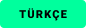

<div align="center">

<p align="center">
  
</p>

# ANTICORE

### Leistungsstarke Open-Source-Suite zur DPI-Umgehung und Netzwerkfreiheit für Windows und macOS ohne Geschwindigkeitsverlust

[](https://github.com/MonarchDevLab/Anticore/releases/latest)
[](https://github.com/MonarchDevLab/Anticore/releases/latest)
[](https://github.com/MonarchDevLab/Anticore/releases/latest)
[](https://github.com/MonarchDevLab/Anticore)
[](https://github.com/MonarchDevLab/Anticore)
[](https://github.com/MonarchDevLab/Anticore)
[](https://github.com/MonarchDevLab/Anticore)
[](https://github.com/MonarchDevLab/Anticore/releases/latest)
[](LICENSE)

<br />

<p align="center">
  <a href="README.md"></a>&nbsp;
  <a href="README.en.md"></a>&nbsp;
  <a href="README.ru.md"></a>&nbsp;
  <a href="README.de.md"></a>&nbsp;
  <a href="README.fr.md"></a>
</p>

<br />

**Lokale Paketmanipulations-Engine der nächsten Generation zur Umgehung von Deep Packet Inspection (DPI)-Filtern und ISP-Zensur. Funktioniert vollständig lokal ohne Umleitung über Drittanbieter-VPN- oder Proxy-Server – 100 % Durchsatz und minimaler Ping bleiben erhalten.**

<br />

<table width="100%" align="center">
  <tr>
    <td width="25%" align="center">
      <a href="#download-optionen-v036"></a>
    </td>
    <td width="25%" align="center">
      <a href="#was-anticore-ist"></a>
    </td>
    <td width="25%" align="center">
      <a href="#hauptmerkmale"></a>
    </td>
    <td width="25%" align="center">
      <a href="#funktionsweise"></a>
    </td>
  </tr>
</table>

</div>

---

## Download-Optionen (v0.3.6)

Alle Binärdateien wurden direkt aus dem Quellcode kompiliert, vollständig von Build-Pfaden bereinigt (Zero Leakage) und mit Minisign digital signiert.

<table width="100%" align="center">
  <thead>
    <tr>
      <th width="33.3%" align="center">
        <br /><br />
        <b>Portables Paket (ZIP)</b><br />
        <small>Keine Installation erforderlich. Läuft direkt aus dem Ordner oder USB-Stick. Keine Registry-Einträge.</small>
      </th>
      <th width="33.3%" align="center">
        <br /><br />
        <b>Standard-Installer (EXE)</b><br />
        <small>Startmenü- und Desktop-Verknüpfung, nahtlose automatische Updates und saubere Deinstallation.</small>
      </th>
      <th width="33.3%" align="center">
        <br /><br />
        <b>Enterprise-Paket (MSI)</b><br />
        <small>Für automatisierte Verteilung über Active Directory GPO, Microsoft Intune oder SCCM.</small>
      </th>
    </tr>
  </thead>
  <tbody>
    <tr>
      <td align="center" valign="middle">
        <a href="https://github.com/MonarchDevLab/Anticore/releases/download/v0.3.6/Anticore_0.3.6_x64-portable.zip"></a>
      </td>
      <td align="center" valign="middle">
        <a href="https://github.com/MonarchDevLab/Anticore/releases/download/v0.3.6/Anticore_0.3.6_x64-setup.exe"></a>
      </td>
      <td align="center" valign="middle">
        <a href="https://github.com/MonarchDevLab/Anticore/releases/download/v0.3.6/Anticore_0.3.6_x64_en-US.msi"></a>
      </td>
    </tr>
    <tr>
      <td align="center" bgcolor="#161b22">
        <a href="https://github.com/MonarchDevLab/Anticore/releases/download/v0.3.6/Anticore.exe"></a>
      </td>
      <td align="center" bgcolor="#161b22">
        <a href="https://github.com/MonarchDevLab/Anticore/releases/download/v0.3.6/anticore-cli.exe"></a>
      </td>
      <td align="center" bgcolor="#161b22">
        <a href="https://github.com/MonarchDevLab/Anticore/releases/latest"></a>
      </td>
    </tr>
  </tbody>
</table>

<br />

### macOS Pakete (Apple Silicon & Intel)

<table width="100%" align="center">
  <thead>
    <tr>
      <th width="50%" align="center"><b>Apple Silicon (arm64)</b></th>
      <th width="50%" align="center"><b>Intel Mac (x64)</b></th>
    </tr>
  </thead>
  <tbody>
    <tr>
      <td align="center">
        <a href="https://github.com/MonarchDevLab/Anticore/releases/download/v0.3.6/Anticore_0.3.6_arm64.pkg"></a>&nbsp;
        <a href="https://github.com/MonarchDevLab/Anticore/releases/download/v0.3.6/Anticore_0.3.6_aarch64.dmg"></a>
      </td>
      <td align="center">
        <a href="https://github.com/MonarchDevLab/Anticore/releases/download/v0.3.6/Anticore_0.3.6_x64.pkg"></a>&nbsp;
        <a href="https://github.com/MonarchDevLab/Anticore/releases/download/v0.3.6/Anticore_0.3.6_x64.dmg"></a>
      </td>
    </tr>
  </tbody>
</table>

#### macOS Schnellinstallation im Terminal (Einzeiler)
```bash
curl -fsSL https://raw.githubusercontent.com/MonarchDevLab/Anticore/main/scripts/macos-quick-install.sh | bash
```

---

## Prüfsummen-Tabelle (SHA-256)

| Datei | Größe | SHA-256 Prüfsumme |
|---|---|---|
| `Anticore_0.3.6_x64-setup.exe` | 4.6 MB | `D4EF2CCA302D4845B49F8F3ED80EFEA28C1F3C8547B9A7B5A317FC72C47CA143` |
| `Anticore_0.3.6_x64-portable.zip` | 6.6 MB | `0964590824FFF5ADFAE04A092F6A5DADA3B76BA1C88B2BF8D984FC98CD87D43A` |
| `Anticore_0.3.6_x64_en-US.msi` | 6.5 MB | `123D83C2A3BE387FE90165602B895B4B2B47E0754EB44F68D63FBF704EB9A9B0` |
| `Anticore.exe` | 16.2 MB | `1234215E55C61CAE9836D6EEF0CBE3725702B7BAB3A3FF050699BD70B3BBB676` |
| `anticore-cli.exe` | 385 KB | `D8D60AEA2FB5A0B2C4EF7FAC7C810A2C49471CE19FA6D4FD499C430E180E0163` |
| `Anticore_0.3.6_arm64.pkg` | 5.8 MB | `A2FB220E4F9C5ECD1109C977903E21FFA16DE5A24B098EF823A8C801B18F837C` |
| `Anticore_0.3.6_aarch64.dmg` | 6.2 MB | `B774324462FA35C9A1B3B2B76BFA2976CE705D174A3CB611C64343D4E2A4152F` |
| `Anticore_0.3.6_x64.pkg` | 6.4 MB | `2EA284E231E7FE4F3A665E40A0E45B2BB8CA534FF430229DC6BF8C1EC73CBBD0` |
| `Anticore_0.3.6_x64.dmg` | 6.8 MB | `2026542CB88BDB22CAE8A6FCC81F1BF38A6B1EA42C2ECF066979890AB7144946` |

---

## Was ist Anticore?

Anticore ist eine moderne Softwarelösung zur DPI-Umgehung, entwickelt in **Rust** mit einer responsiven Benutzeroberfläche auf Basis von **Tauri 2.0 + React 19**. 
Sie modifiziert Pakete direkt im Betriebssystem-Netzwerkstack (WinDivert unter Windows, UTUN/pfctl unter macOS), sodass Zensursysteme (DPI) den angeforderten Hostnamen (SNI) nicht erkennen können.

---

## Hauptmerkmale

1. **Paketfragmentierung:** SNI Mid Split, HTTP-Header-Manipulation, OOB (Out-of-Band)-Bytes.
2. **Passive RST-Unterdrückung:** Verhindert TCP RST-Injektionen durch ISP-Middleboxes.
3. **QUIC-Blockierung (UDP 443):** Erzwingt stabiles TCP TLS 1.3 zur Beseitigung von Video-Wiedergabeproblemen.
4. **LAN-Freigabe & Proxy:** Port `10808` für Konsolen und Smartphones mit Fallback-DNS-Resolver (Cloudflare / Google) gegen DNS-Spoofing.
5. **Integriertes Support-Modul:** Fehler- und Feedback-Meldungen direkt in der App.
6. **5 Sprachen:** Deutsch, Englisch, Türkisch, Russisch, Französisch.

---

## Lizenz

Open-Source unter der MIT-Lizenz.
Alle Rechte liegen bei **Monolith Works**. Veröffentlichung über **MonarchDevLab**.
