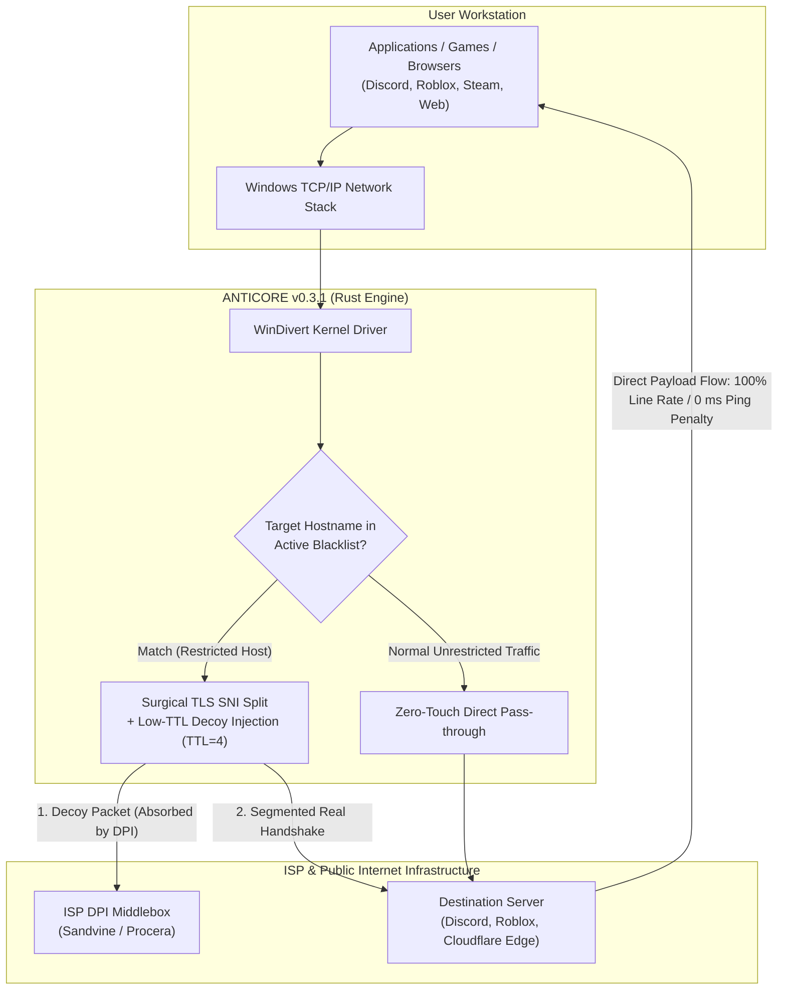

<div align="center">

<p align="center">
  
</p>

# ANTICORE

### Zero-Loss, High-Performance Open Source DPI Circumvention Suite for Windows

[](https://github.com/MonarchDevLab/Anticore/releases/latest)
[](https://github.com/MonarchDevLab/Anticore/releases/latest)
[](https://github.com/MonarchDevLab/Anticore/releases/latest)
[](https://github.com/MonarchDevLab/Anticore)
[](https://github.com/MonarchDevLab/Anticore)
[](https://github.com/MonarchDevLab/Anticore)
[](https://github.com/MonarchDevLab/Anticore)
[](https://github.com/MonarchDevLab/Anticore/releases/latest)
[](LICENSE)

<br />

**Next-generation local packet manipulation engine engineered to circumvent ISP censorship and Deep Packet Inspection (DPI) middleboxes. Operates completely locally without tunneling through third-party remote servers—preserving 100% of your network throughput and ping latency.**

<br />

<p align="center">
  <a href="#download-options-v031"><code>[ Distribution Packages ]</code></a> &nbsp;
  <a href="#what-anticore-is-and-is-not"><code>[ Core Architecture ]</code></a> &nbsp;
  <a href="#key-features"><code>[ Key Features ]</code></a> &nbsp;
  <a href="#how-it-works"><code>[ How It Works ]</code></a> &nbsp;
  <a href="#isp-compatibility--bypass-matrix"><code>[ ISP Matrix ]</code></a> &nbsp;
  <a href="#comprehensive-comparison-matrix"><code>[ Comparison ]</code></a> &nbsp;
  <a href="#frequently-asked-questions-faq"><code>[ FAQ ]</code></a> &nbsp;
  <a href="README.md"><code>[ Türkçe Kılavuz ]</code></a>
</p>

</div>

---

## Download Options (v0.3.1)

All distribution binaries are built cleanly, stripped of developer workstation paths (Zero Leakage), and verified via Minisign.

<table>
<tr>
  <th width="33%" align="center">
    <h3>Portable Edition</h3>
    <em>(Most Popular)</em>
  </th>
  <th width="33%" align="center">
    <h3>Installer (Setup EXE)</h3>
    <em>(Standard User)</em>
  </th>
  <th width="33%" align="center">
    <h3>Enterprise (MSI)</h3>
    <em>(System Admins)</em>
  </th>
</tr>
<tr>
  <td align="center" valign="top">
    No installation required. Extract to any folder or USB drive and run directly. Leaves zero residue on the system.
  </td>
  <td align="center" valign="top">
    Desktop shortcut, Start Menu integration, and silent in-app automatic background update engine support.
  </td>
  <td align="center" valign="top">
    Windows Installer MSI package for silent, centralized deployment across fleet machines via Active Directory, Intune, or GPO.
  </td>
</tr>
<tr>
  <td align="center" valign="middle">
    <a href="https://github.com/MonarchDevLab/Anticore/releases/latest/download/Anticore_0.3.1_x64-portable.zip"></a>
  </td>
  <td align="center" valign="middle">
    <a href="https://github.com/MonarchDevLab/Anticore/releases/latest/download/Anticore_0.3.1_x64-setup.exe"></a>
  </td>
  <td align="center" valign="middle">
    <a href="https://github.com/MonarchDevLab/Anticore/releases/latest/download/Anticore_0.3.1_x64_en-US.msi"></a>
  </td>
</tr>
<tr>
  <td align="center" valign="middle">
    <code>v0.3.1</code> • <code>Windows x64</code><br /><br />
    <code>Zero Residue</code>
  </td>
  <td align="center" valign="middle">
    <code>v0.3.1</code> • <code>Windows x64</code><br /><br />
    <code>Auto Updates</code>
  </td>
  <td align="center" valign="middle">
    <code>v0.3.1</code> • <code>Windows x64</code><br /><br />
    <code>GPO & Intune Ready</code>
  </td>
</tr>
</table>

<p align="center">
  <b>Standalone Binaries:</b> &nbsp;
  <a href="https://github.com/MonarchDevLab/Anticore/releases/latest/download/Anticore.exe"><code>Anticore.exe (GUI, 15.6 MB)</code></a> &nbsp;•&nbsp;
  <a href="https://github.com/MonarchDevLab/Anticore/releases/latest/download/anticore-cli.exe"><code>anticore-cli.exe (CLI, 384 KB)</code></a> &nbsp;•&nbsp;
  <a href="https://github.com/MonarchDevLab/Anticore/releases/latest"><code>Release Archive</code></a>
</p>

<details>
<summary><b>SHA-256 Checksums & Package Integrity (Click to Expand)</b></summary>
<br />

| Package File | Size | SHA-256 Checksum |
|---|:---:|---|
| `Anticore_0.3.1_x64-portable.zip` | 6.3 MB | `40E92F9135E92586FD518AE4581E48D10A5FB365AC9593D02E396868354EF935` |
| `Anticore_0.3.1_x64-setup.exe` | 4.4 MB | `FB4F4C31E3B5B5F1FEA7D88F62ECE3267486DDDD75FEDEB0329980D40299631D` |
| `Anticore_0.3.1_x64_en-US.msi` | 6.1 MB | `7614447CF05BF3E8D7C312EC99D388999E5887CA0C2CEA7EAC42A63556335B85` |
| `Anticore.exe` | 15.6 MB | `057C65D8C6CD6A878C5472767D8A7CC6539386A1DD52B7D58F0DC229994817A6` |
| `anticore-cli.exe` | 384 KB | `16F6313E63250869267FC2BEF58AA99AACD6AAF56D52CE5AB1177DA8C9255E9D` |

```powershell
# Verify downloaded package via PowerShell:
Get-FileHash .\Anticore_0.3.1_x64-portable.zip -Algorithm SHA256
```
</details>

> [!IMPORTANT]
> **Technical Requirement — Administrator Privileges:**
> Intercepting and modifying raw IP packets at the kernel level requires the `WinDivert` driver. Running as **Administrator** is technically required. When launched by a standard user, Anticore alerts you and provides one-click self-elevation.

---

## What Anticore Is and Is Not

When online services like Discord or gaming servers are blocked, users typically resort to VPNs. However, conventional VPN routing severely degrades daily performance:

<table>
<tr>
  <th width="50%" align="center">
    <h3>Traditional VPN Tunneling</h3>
    <sub>(Indirect, Slow &amp; Privacy Risks)</sub>
  </th>
  <th width="50%" align="center">
    <h3>Anticore Surgical DPI Bypass</h3>
    <sub>(Direct, Full Line Speed &amp; Zero Latency)</sub>
  </th>
</tr>
<tr>
  <td align="center" valign="top">
    <br />
    <code>[Client Workstation]</code><br />
    &darr; <i>(Encrypted Tunnel Encapsulation)</i><br />
    <code>[Remote Overseas VPN Server]</code><br />
    &darr; <i>(Bottleneck &amp; Relayed Egress)</i><br />
    <code>[Target Service / Game Server]</code>
    <br /><br />
  </td>
  <td align="center" valign="top">
    <br />
    <code>[Client Workstation]</code><br />
    &darr; <i>(Only Initial TLS ClientHello Fragmented)</i><br />
    <code>[ISP DPI Filter Bypassed]</code><br />
    &darr; <i>(Direct Line via Local ISP Gateway)</i><br />
    <code>[Target Service / Game Server]</code>
    <br /><br />
  </td>
</tr>
<tr>
  <td align="left" valign="top">
    &bull; <b>Bandwidth:</b> <br /><br />
    &bull; <b>Gaming Latency:</b> <br /><br />
    &bull; <b>Data Route:</b> <br /><br />
    &bull; <b>Banking / Local Services:</b> <br /><br />
    &bull; <b>Cost Model:</b> 
  </td>
  <td align="left" valign="top">
    &bull; <b>Bandwidth:</b> <br /><br />
    &bull; <b>Gaming Latency:</b> <br /><br />
    &bull; <b>Data Route:</b> <br /><br />
    &bull; <b>Banking / Local Services:</b> <br /><br />
    &bull; <b>Cost Model:</b> 
  </td>
</tr>
</table>

### Key Differences
- **No Remote Tunnels:** Your internet traffic is never redirected through proxy servers or foreign IP nodes.
- **Zero Bandwidth Loss:** Only the initial handshake packet (**TLS ClientHello SNI**) is manipulated. Once established, all downloads, uploads, video streaming, and gaming flow directly through your ISP at full speed. **If you have a 1 Gbps line, you retain 1 Gbps.**
- **0 ms Ping Overhead:** Because traffic takes the shortest geographical route to game servers, your in-game latency remains unaffected.
- **Banking and Local Portal Safe:** Your real local public IP remains unchanged; banking portals, government sites, and streaming apps will not flag your session.

---

## Key Features

<table>
<tr>
<td width="50%" valign="top">

### 01 // Surgical Packet Manipulation
- **TLS ClientHello SNI Splitting:** Splits the domain tag across TCP boundaries so DPI middleboxes cannot inspect the hostname.
- **Low-TTL Fake Decoys (TTL=4):** Generates expired decoy packets that confuse inspection state machines without reaching destination servers.
- **Passive Defense (RST Drops):** Silently drops spoofed TCP RST packets injected by ISPs to prematurely sever sessions.

</td>
<td width="50%" valign="top">

### 02 // 3D Isometric Telemetry & Reactor
- **3D Canvas Isometric Chart:** Real-time throughput and PPS (packets per second) rendered via isometric columns (`ActivityChart3D`) with dynamic depth shading.
- **Live Status Reactor Orb:** 140 depth-sorted particles, gyroscopic orbital rings, and live pulsing aura when active.
- **Pro Matrix Console:** Microsecond-precision timing telemetry and raw live terminal log streaming.

</td>
</tr>
<tr>
<td width="50%" valign="top">

### 03 // Local Area Network (LAN) Sharing
- **Protect Mobile Devices:** Turn your Windows PC into a local anti-censorship gateway for phones, consoles, and smart TVs.
- **SOCKS5 & HTTP PAC Proxy:** Local proxy listener on `0.0.0.0:10808` accessible by all devices on your Wi-Fi network.
- **Transparent Hotspot Transit:** Routes Windows Mobile Hotspot client packets directly through WinDivert (`outbound or forward`) with zero mobile app setup.

</td>
<td width="50%" valign="top">

### 04 // Winsock & Network Stack Repair
- **One-Click System Recovery:** Built-in repair utility addressing corrupted network adapters, broken TCP/IP stacks, and Discord "Starting..." loops.
- **Netsh & IP Reset:** Execute `netsh winsock reset`, `netsh int ip reset`, and `ipconfig /flushdns`, `/release`, `/renew` in one click.
- **Automated DoH Integration:** Instantly configure encrypted Cloudflare 1.1.1.1 or Google 8.8.8.8 DoH templates.

</td>
</tr>
<tr>
<td width="50%" valign="top">

### 05 // Dynamic In-Memory Blacklist
- **Zero Engine Restarts:** Adding or removing domains updates active engine memory immediately via `Arc<RwLock<Blacklist>>`.
- **2-Column Responsive Grid:** Domain badges, globe icons, quick-delete triggers, and filter pills (All, Gaming, Media, Social).
- **Dual-Layered Hostlists:** Upstream Zapret community mirror with an offline embedded fallback database.

</td>
<td width="50%" valign="top">

### 06 // Post-Quantum Kyber & Modern TLS
- **Kyber / ML-KEM 768 & ECH Support:** Seamlessly reassembles large (1500+ bytes) fragmented ClientHello frames split across TCP MSS boundaries (Chrome 124+, Firefox 128+).
- **Synthetic Handshake Testing:** Synthetic TLS probe calibrated with modern browser extensions prevents false negatives during ISP testing.
- **8 Cyber-Hardware Themes:** Obsidian Emerald, Amber CRT, Cobalt Matrix, Cyberpunk Volt, Quiet Luxury, Crimson Hazard, Amethyst Nebula, Titanium Lab.

</td>
</tr>
</table>

---

## How It Works

The following architecture diagram demonstrates how Anticore inspects and alters packets with surgical precision:



### Four-Layered Defense Engine
1. **Decoy Packet Injection:** Injects a fake preliminary packet with a calibrated Time-To-Live (`TTL=3..4`) that reaches ISP filtering hardware (Sandvine, Procera, etc.) but drops before reaching the destination server. While the DPI middlebox processes the decoy, the real payload passes through unimpeded.
2. **Surgical SNI Splitting:** Breaks the initial ClientHello packet across the hostname (SNI) boundary into two distinct TCP segments. Basic state machines cannot reassemble these segments in real time.
3. **Spoofed RST Dropping:** Intercepts and discards unauthorized TCP RST packets sent by ISP deep packet inspection systems to abort your connection.
4. **QUIC / HTTP3 Downgrade:** Prevents UDP-based QUIC sessions from bypassing TLS filtering, ensuring consistent circumvention in modern browsers.

---

## ISP Compatibility & Bypass Matrix

Common ISP Deep Packet Inspection implementations and Anticore's calibrated mitigation profiles:

| Internet Service Provider | Detected DPI Hardware | Filtering & Restriction Method | Recommended Profile | Success Rate |
|---|---|---|---|:---:|
| **Turkcell Superonline** | Sandvine Policy Traffic Switch (PTS) | SNI Inspection + Spoofed RST + Low-TTL Filter | `Profile 3 (Superonline Aggressive)`<br />*Fake TTL=4 + 2-Byte Segmentation* | **100% Operational** |
| **Türk Telekom (TTNet)** | Procera PacketLogic / Huawei | Standard SNI Block + ISP DNS Poisoning | `Profile 1 (Standard TLS Split)`<br />*SNI Splitting + DoH Resolver* | **100% Operational** |
| **Vodafone Net** | Allot Communications / Sandvine | SNI Block + HTTP Redirect | `Profile 2 (Advanced Fake + RST Drop)`<br />*Decoy Packet + RST Dropping* | **100% Operational** |
| **Türksat Kablonet** | Procera PacketLogic | SNI Filtering + QUIC Restrictions | `Profile 1 (Standard TLS Split)`<br />*SNI Splitting + QUIC Downgrade* | **100% Operational** |
| **TurkNet** | Independent Backbone Filters | DNS Hijacking + Partial SNI | `Profile 1 (Standard TLS Split)`<br />*DoH Resolver + Standard Split* | **100% Operational** |
| **Regional Providers** | Wholesale TT / Superonline Core | Dependent on underlying transit carrier | `Profile 1` or `Profile 3` | **100% Operational** |

---

## Comprehensive Comparison Matrix

| Evaluation Criteria | Traditional VPN | GoodbyeDPI | SplitWire | ANTICORE v0.3.1 |
|---|:---:|:---:|:---:|:---:|
| **Bandwidth & Download Speed** | 50% - 80% Reduction | Full Line Rate (100%) | Full Line Rate (100%) | **Full Line Rate (100% Preserved)** |
| **In-Game Ping Latency** | +50 ms to 200 ms | 0 ms Increase | 0 ms Increase | **0 ms Increase (Direct Transit)** |
| **Modern Graphic Interface (GUI)** | Standard SaaS | None (.cmd Console) | Basic Form GUI | **Dual-Mode Cyber-Hardware Suite** |
| **3D Telemetry & Isometric Chart** | None | None | None | **Yes (Canvas 3D PPS + Reactor Orb)** |
| **LAN Device Sharing (Proxy & Hotspot)** | Complex Routing | None | None | **Yes (SOCKS5 + PAC + Hotspot Transit)** |
| **Winsock & TCP/IP Stack Repair** | None | None | None | **One-Click Native System Repair** |
| **Dynamic In-Memory Blacklist** | Restart Required | Restart Required | Restart Required | **Instant Live Memory Sync** |
| **System Tray Flyout Cockpit** | Partial | None | Basic Menu | **340x460px Floating Mini Dashboard** |
| **Windows Service Background Daemon** | Partial | Manual `sc` Setup | None | **Integrated Service Manager** |
| **Discord DNS & Voice RTC Fix** | None | None | None | **Automated Poisoning & RTC Fix** |
| **RAM Consumption** | 150 - 350 MB | ~10 MB | ~80 MB | **~25 MB (Rust Engine + WebView2)** |
| **In-App Auto Updater** | Yes | None (Manual) | None (Manual) | **Tauri Signed GitHub Updater** |
| **Custom Hardware Themes** | Light / Dark | None | None | **8 Morphological Hardware Themes** |

---

## System Tray Quick Panel

Control your protection without opening the main workspace window:

```text
┌──────────────────────────────────────────────┐
│  ANTICORE TACTICAL QUICK PANEL      [x] [—]  │
├──────────────────────────────────────────────┤
│  STATUS: ENGINE RUNNING                      │
│  [======== ACTIVE REACTOR PULSE ========]    │
│                                              │
│  Profile: [ Profile 3 - Superonline Aggressive]
│  Latency: 0.12 ms        PPS: 1,480 p/s      │
│  Processed: 24,190 pkts  Uptime: 02:45:12    │
│                                              │
│  [   STOP   ]     [ NET REPAIR ]     [ EXIT ]
└──────────────────────────────────────────────┘
```

- **One-Click Access:** Left-click opens a 340x460px floating cockpit. Auto-dismisses on blur or `Esc`.
- **Anti-Flicker Protection:** Debounced asynchronous single/double-click handling prevents window flicker.
- **Live Telemetry:** Feeds real-time throughput metrics directly from the Rust engine.

---

## Frequently Asked Questions (FAQ)

<details>
<summary><b>1. Can Anticore cause bans in anti-cheat protected games (Valorant, CS2, LoL)?</b></summary>
<br />
<b>Strictly no.</b> Anticore never touches game files, process memory, or game server communication. It exclusively manipulates the initial handshake of domains explicitly listed in your target blacklist. UDP and TCP gaming traffic pass through your network stack directly without alteration.
</details>

<details>
<summary><b>2. Why do some antivirus engines trigger alerts?</b></summary>
<br />
Anticore uses the open-source, industry-standard <code>WinDivert</code> driver to capture packets at the network layer. Like other legitimate network diagnostic software (Wireshark, Fiddler, GoodbyeDPI), heuristic scanners may flag kernel driver installations. All Anticore source code is publicly inspectable, GitHub builds are transparent, and binaries are digitally signed.
</details>

<details>
<summary><b>3. Why are Administrator privileges mandatory?</b></summary>
<br />
Under Windows security architecture, loading kernel drivers and binding raw network packet filters is strictly restricted to elevated processes. This is a technical operating system requirement.
</details>

<details>
<summary><b>4. How do I protect mobile devices (iOS / Android) on my Wi-Fi?</b></summary>
<br />
You can choose between two methods:<br />
1. <b>SOCKS5 / PAC Proxy:</b> On your mobile device, enter your PC's local IP address (e.g. <code>192.168.1.50</code>) and port <code>10808</code> in your Wi-Fi HTTP proxy settings.<br />
2. <b>Windows Mobile Hotspot:</b> Enable Hotspot on your PC and connect your mobile device. Anticore automatically intercepts forward transit packets without requiring any configuration on the phone.
</details>

<details>
<summary><b>5. How do I fix Discord stuck at "Starting..."?</b></summary>
<br />
This issue is caused by ISP DNS poisoning directing Discord CDN domains to warning landing pages. Open Anticore's <b>Network Repair</b> tab, click <b>"Apply Secure DNS"</b> and <b>"Reset Network Stack"</b> to flush poisoned resolver caches.
</details>

---

## Security and Integrity Verification

Official distribution binaries can be verified using Minisign and the project public key:

```text
dW50cnVzdGVkIGNvbW1lbnQ6IG1pbmlzaWduIHB1YmxpYyBrZXk6IDE1QTRFREEwMDFGNDFFNTMKUldSVEh2UUJvTzJrRmE3UGFDdG81YWtnYUdYSkhFdWQxVGJ0V2VVdHFKNDJvaGZRWS90TWx3ejMK
```

Verification command:
```powershell
minisign -Vm Anticore_0.3.1_x64-setup.exe -p anticore.key.pub
```

Read our [SECURITY.md](SECURITY.md) for vulnerability disclosure procedures and guidelines.

---

## Building from Source

To compile the binaries from source:

### Prerequisites
- Rust 1.80+ (`rustup toolchain install stable`)
- Node.js 20+ LTS (`npm`)
- Visual Studio 2022 C++ Build Tools (MSVC x64)

```powershell
# 1. Clone the repository
git clone https://github.com/MonarchDevLab/Anticore.git
cd Anticore/antikor

# 2. Run Rust unit and integration tests (52 tests)
cd engine
cargo test --workspace

# 3. Build the release engine binary
cargo build --release --workspace

# 4. Install desktop dependencies and build
cd ../desktop
npm install
npm test
npm run tauri build
```

---

## License & Intellectual Property

This project is licensed under the [MIT License](LICENSE).

- **WinDivert:** Independent open-source network capture driver licensed under [LGPLv3](https://reqrypt.org/windivert.html); dynamically loaded without source modifications.
- **WebView2:** Copyright Microsoft Corporation.
- **Legal Notice:** Anticore is developed for network performance analysis, digital privacy, and unrestricted information access. Users remain responsible for complying with local regulations.

<div align="center">
  <br />
  <sub>Architectural design and copyright strictly held by <b>Monolith Works</b>. Published via official open-source channel <b>MonarchDevLab</b>.</sub>
  <br />
  <br />
</div>
