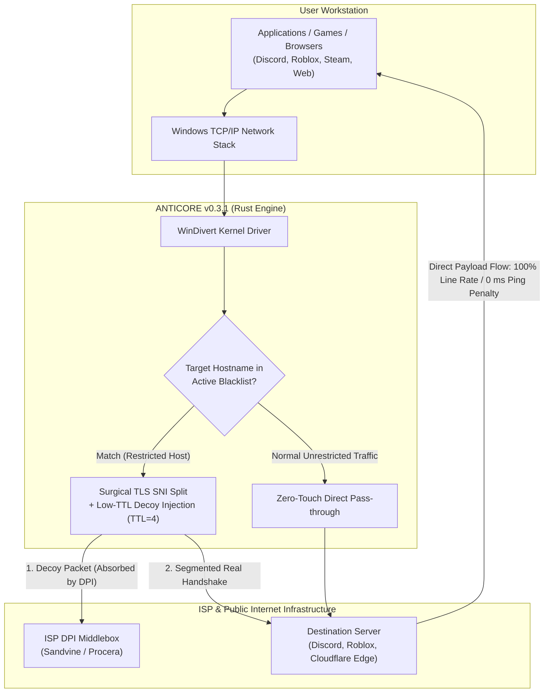

<div align="center">

<p align="center">
  
</p>

# ANTICORE

### Zero-Loss, High-Performance Open Source DPI Circumvention Suite for Windows & macOS

[](https://github.com/MonarchDevLab/Anticore/releases/latest)
[](https://github.com/MonarchDevLab/Anticore/releases/latest)
[](https://github.com/MonarchDevLab/Anticore/releases/latest)
[](https://github.com/MonarchDevLab/Anticore)
[](https://github.com/MonarchDevLab/Anticore)
[](https://github.com/MonarchDevLab/Anticore)
[](https://github.com/MonarchDevLab/Anticore)
[](https://github.com/MonarchDevLab/Anticore/releases/latest)
[](LICENSE)

<br />

**Next-generation local packet manipulation engine engineered to circumvent ISP censorship and Deep Packet Inspection (DPI) middleboxes. Operates completely locally without tunneling through third-party remote servers—preserving 100% of your network throughput and ping latency.**

<br />

<table width="100%" align="center">
  <tr>
    <td width="25%" align="center">
      <a href="#download-options-v031"></a>
    </td>
    <td width="25%" align="center">
      <a href="#what-anticore-is-and-is-not"></a>
    </td>
    <td width="25%" align="center">
      <a href="#key-features"></a>
    </td>
    <td width="25%" align="center">
      <a href="#how-it-works"></a>
    </td>
  </tr>
  <tr>
    <td width="25%" align="center">
      <a href="#isp-compatibility--bypass-matrix"></a>
    </td>
    <td width="25%" align="center">
      <a href="#comprehensive-comparison-matrix"></a>
    </td>
    <td width="25%" align="center">
      <a href="#frequently-asked-questions-faq"></a>
    </td>
    <td width="25%" align="center">
      <a href="README.md"></a>
    </td>
  </tr>
</table>

</div>

---

## Download Options (v0.3.1)

All distribution binaries are built cleanly, stripped of developer workstation paths (Zero Leakage), and verified via Minisign.

<table width="100%" align="center">
  <thead>
    <tr>
      <th width="33.3%" align="center">
        <br /><br />
        <b>Portable Edition</b><br />
        <sub>Most Popular • Zero Footprint</sub>
      </th>
      <th width="33.3%" align="center">
        <br /><br />
        <b>Setup Installer</b><br />
        <sub>Standard Users • Automated OTA</sub>
      </th>
      <th width="33.3%" align="center">
        <br /><br />
        <b>Enterprise Deployment</b><br />
        <sub>SysAdmins • GPO &amp; Intune</sub>
      </th>
    </tr>
  </thead>
  <tbody>
    <tr>
      <td align="center" valign="top">
        Zero installation required. Extract the archive to any local folder or USB drive and run directly. Leaves zero registry footprints.
      </td>
      <td align="center" valign="top">
        Includes desktop shortcut, Start Menu integration, and built-in background automatic updates directly via signed releases.
      </td>
      <td align="center" valign="top">
        Dedicated enterprise deployment package designed for Active Directory, Microsoft Intune, and GPO silent bulk installation.
      </td>
    </tr>
    <tr>
      <td align="center" valign="middle">
        <code>✓ Zero Registry Footprints</code>
      </td>
      <td align="center" valign="middle">
        <code>✓ Signed GitHub OTA Engine</code>
      </td>
      <td align="center" valign="middle">
        <code>✓ Silent /qn Deployment Support</code>
      </td>
    </tr>
    <tr>
      <td align="center" valign="middle">
        <a href="https://github.com/MonarchDevLab/Anticore/releases/latest/download/Anticore_0.3.1_x64-portable.zip"></a>
      </td>
      <td align="center" valign="middle">
        <a href="https://github.com/MonarchDevLab/Anticore/releases/latest/download/Anticore_0.3.1_x64-setup.exe"></a>
      </td>
      <td align="center" valign="middle">
        <a href="https://github.com/MonarchDevLab/Anticore/releases/latest/download/Anticore_0.3.1_x64_en-US.msi"></a>
      </td>
    </tr>
    <tr>
      <td align="center" valign="middle">
        
      </td>
      <td align="center" valign="middle">
        
      </td>
      <td align="center" valign="middle">
        
      </td>
    </tr>
    <tr>
      <td align="center" bgcolor="#161b22">
        <a href="https://github.com/MonarchDevLab/Anticore/releases/latest/download/Anticore.exe"></a>
      </td>
      <td align="center" bgcolor="#161b22">
        <a href="https://github.com/MonarchDevLab/Anticore/releases/latest/download/anticore-cli.exe"></a>
      </td>
      <td align="center" bgcolor="#161b22">
        <a href="https://github.com/MonarchDevLab/Anticore/releases/latest"></a>
      </td>
    </tr>
  </tbody>
</table>

<br />

### macOS Distribution & Setup (v0.3.1)

Native `utun` + `pfctl` core engine and menu bar Quick Panel (`quick-panel`) packages are architecturally separated for Apple Silicon and Intel hardware:

> [!TIP]
> **Which Package Should I Download? (Apple Silicon or Intel?)**
> 1. Click the **Apple () Menu** in the top-left corner > **About This Mac**.
> 2. Inspect the specifications:
>    - **Chip:** Displays `Apple M1`, `M2`, `M3`, `M4` or newer &rarr; Download **Apple Silicon (ARM64)**.
>    - **Processor:** Displays `Intel Core i5`, `i7`, `i9` or `Intel Xeon` &rarr; Download **Intel (x64)**.

<table width="100%" align="center">
  <thead>
    <tr>
      <th width="50%" align="center">
        <br /><br />
        <b>Apple Silicon M-Series</b><br />
        <sub>M1 • M2 • M3 • M4 • M5 | macOS 11.0+</sub>
      </th>
      <th width="50%" align="center">
        <br /><br />
        <b>Intel-Powered Mac</b><br />
        <sub>Core i5 • Core i7 • Core i9 • Xeon | macOS 11.0+</sub>
      </th>
    </tr>
  </thead>
  <tbody>
    <tr>
      <td align="center" valign="top">
        Native 64-bit ARM build for Apple Silicon M-series chips. Zero emulation overhead, peak thermal efficiency, instant launch.
      </td>
      <td align="center" valign="top">
        Native x86_64 build for Intel-based Macs. Runs directly on bare hardware without requiring Rosetta 2 translation.
      </td>
    </tr>
    <tr>
      <td align="center" valign="middle">
        <code>✓ Native ARM64 (No Rosetta Required)</code>
      </td>
      <td align="center" valign="middle">
        <code>✓ Native x86_64 (All Intel Macs)</code>
      </td>
    </tr>
    <tr>
      <td align="center" valign="middle">
        <a href="https://github.com/MonarchDevLab/Anticore/releases/download/v0.3.1/Anticore_0.3.1_aarch64.dmg"></a>
      </td>
      <td align="center" valign="middle">
        <a href="https://github.com/MonarchDevLab/Anticore/releases/download/v0.3.1/Anticore_0.3.1_x64.dmg"></a>
      </td>
    </tr>
    <tr>
      <td align="center" valign="middle">
        <a href="https://github.com/MonarchDevLab/Anticore/releases/download/v0.3.1/Anticore_aarch64.app.tar.gz"></a>
      </td>
      <td align="center" valign="middle">
        <a href="https://github.com/MonarchDevLab/Anticore/releases/download/v0.3.1/Anticore_x64.app.tar.gz"></a>
      </td>
    </tr>
    <tr>
      <td align="center" valign="middle">
        <a href="https://github.com/MonarchDevLab/Anticore/releases/download/v0.3.1/anticore-cli-macos-arm64-0.3.1.tar.gz"></a>
      </td>
      <td align="center" valign="middle">
        <a href="https://github.com/MonarchDevLab/Anticore/releases/download/v0.3.1/anticore-cli-macos-x64-0.3.1.tar.gz"></a>
      </td>
    </tr>
    <tr>
      <td align="center" bgcolor="#161b22" colspan="2">
        <code>sudo ./scripts/macos-install-daemon.sh</code> &nbsp;|&nbsp; <code>./scripts/macos-package.sh [arm64|x64|all]</code>
      </td>
    </tr>
  </tbody>
</table>

<details>
<summary><b>SHA-256 Checksums & Package Integrity (Click to Expand)</b></summary>
<br />

| Package File | Size | SHA-256 Checksum |
|---|:---:|---|
| `Anticore_0.3.1_x64-portable.zip` | 6.3 MB | `40E92F9135E92586FD518AE4581E48D10A5FB365AC9593D02E396868354EF935` |
| `Anticore_0.3.1_x64-setup.exe` | 4.4 MB | `FB4F4C31E3B5B5F1FEA7D88F62ECE3267486DDDD75FEDEB0329980D40299631D` |
| `Anticore_0.3.1_x64_en-US.msi` | 6.1 MB | `7614447CF05BF3E8D7C312EC99D388999E5887CA0C2CEA7EAC42A63556335B85` |
| `Anticore.exe` | 15.6 MB | `057C65D8C6CD6A878C5472767D8A7CC6539386A1DD52B7D58F0DC229994817A6` |
| `anticore-cli.exe` | 384 KB | `16F6313E63250869267FC2BEF58AA99AACD6AAF56D52CE5AB1177DA8C9255E9D` |

```powershell
# Verify downloaded package via PowerShell:
Get-FileHash .\Anticore_0.3.1_x64-portable.zip -Algorithm SHA256
```
</details>

> [!IMPORTANT]
> **Technical Requirement — Administrator and Root Privileges:**
> - **Windows:** Intercepting and modifying raw IP packets at the kernel level requires the `WinDivert` driver. Running as **Administrator** is technically required. When launched by a standard user, Anticore alerts you and provides one-click self-elevation.
> - **macOS:** Capturing and redirecting packets in userspace requires the `utun` BSD interface and the `pfctl` packet filter. These kernel/network interfaces require `root` (sudo) privileges. The CLI engine or LaunchDaemon daemon service must be executed with `sudo`.

---

## What Anticore Is and Is Not

When online services like Discord or gaming servers are blocked, users typically resort to VPNs. However, conventional VPN routing severely degrades daily performance:

<table width="100%" align="center">
  <thead>
    <tr>
      <th width="50%" align="center">
        <br /><br />
        <b>Traditional VPN Tunneling</b><br />
        <sub>Indirect &bull; Bottlenecked &bull; Privacy Risks</sub>
      </th>
      <th width="50%" align="center">
        <br /><br />
        <b>Anticore Surgical DPI Bypass</b><br />
        <sub>Direct &bull; Full Line Speed &bull; Zero Latency</sub>
      </th>
    </tr>
  </thead>
  <tbody>
    <tr>
      <td width="50%" align="center" bgcolor="#0b0e14">
        <br />
        <br />
        &darr; <sub><i>Encrypted Tunnel Encapsulation (All Traffic)</i></sub><br />
        <br />
        &darr; <sub><i>Remote Egress & Bottleneck (+150ms)</i></sub><br />
        
        <br /><br />
      </td>
      <td width="50%" align="center" bgcolor="#0b0e14">
        <br />
        <br />
        &darr; <sub><i>Only Initial TLS ClientHello Fragmented</i></sub><br />
        <br />
        &darr; <sub><i>Direct Local Fiber Gateway (0ms Lag)</i></sub><br />
        
        <br /><br />
      </td>
    </tr>
    <tr>
      <td>
        &bull; <b>Bandwidth:</b>
        
      </td>
      <td>
        &bull; <b>Bandwidth:</b>
        
      </td>
    </tr>
    <tr>
      <td>
        &bull; <b>Gaming Latency:</b>
        
      </td>
      <td>
        &bull; <b>Gaming Latency:</b>
        
      </td>
    </tr>
    <tr>
      <td>
        &bull; <b>Data Route:</b>
        
      </td>
      <td>
        &bull; <b>Data Route:</b>
        
      </td>
    </tr>
    <tr>
      <td>
        &bull; <b>Banking / Local Services:</b>
        
      </td>
      <td>
        &bull; <b>Banking / Local Services:</b>
        
      </td>
    </tr>
    <tr>
      <td>
        &bull; <b>Cost Model:</b>
        
      </td>
      <td>
        &bull; <b>Cost Model:</b>
        
      </td>
    </tr>
  </tbody>
</table>

### Key Differences
- **No Remote Tunnels:** Your internet traffic is never redirected through proxy servers or foreign IP nodes.
- **Zero Bandwidth Loss:** Only the initial handshake packet (**TLS ClientHello SNI**) is manipulated. Once established, all downloads, uploads, video streaming, and gaming flow directly through your ISP at full speed. **If you have a 1 Gbps line, you retain 1 Gbps.**
- **0 ms Ping Overhead:** Because traffic takes the shortest geographical route to game servers, your in-game latency remains unaffected.
- **Banking and Local Portal Safe:** Your real local public IP remains unchanged; banking portals, government sites, and streaming apps will not flag your session.

---

## Key Features

<table width="100%" align="center">
  <!-- ROW 1 HEADERS -->
  <tr>
    <th width="50%" align="left" valign="top">
      <br />
      <h3>Surgical Packet Manipulation</h3>
      <sub>Kernel-level DPI bypass powered by the open-source WinDivert driver.</sub>
    </th>
    <th width="50%" align="left" valign="top">
      <br />
      <h3>3D Isometric Telemetry &amp; Reactor</h3>
      <sub>Hardware-accelerated 60 FPS live canvas visualization for network throughput.</sub>
    </th>
  </tr>
  <!-- ROW 1 CONTENT -->
  <tr>
    <td width="50%" valign="top">
      &bull; <b>SNI Fragmentation:</b> Splits TLS ClientHello packets into micro TCP segments to defeat DPI reassembly mechanisms.<br /><br />
      &bull; <b>TTL=4 Decoy Injection:</b> Sends low-TTL decoy packets that saturate inspection hardware without reaching destination.<br /><br />
      &bull; <b>Passive RST Mitigation:</b> Silently drops spoofed TCP RST packets injected by ISPs to preserve active gaming and web sessions.
    </td>
    <td width="50%" valign="top">
      &bull; <b>ActivityChart3D:</b> Renders live network speed and PPS flow with hardware-accelerated dynamic isometric depth.<br /><br />
      &bull; <b>Live Reactor Orb:</b> Dual orbital rings with 140 depth-sorted particles reflecting real-time engine processing state.<br /><br />
      &bull; <b>Pro Matrix Console:</b> Microsecond-precision error telemetry, raw socket events, and live terminal diagnostic logs.
    </td>
  </tr>

  <!-- ROW 2 HEADERS -->
  <tr>
    <th width="50%" align="left" valign="top">
      <br />
      <h3>Local Network (LAN) Device Sharing</h3>
      <sub>Transform your workstation into a centralized censorship bypass gateway.</sub>
    </th>
    <th width="50%" align="left" valign="top">
      <br />
      <h3>Winsock &amp; Network Stack Repair</h3>
      <sub>First-aid diagnostics for corrupted network adapters and Discord update loops.</sub>
    </th>
  </tr>
  <!-- ROW 2 CONTENT -->
  <tr>
    <td width="50%" valign="top">
      &bull; <b>SOCKS5 / HTTP Proxy:</b> High-throughput local proxy listener on <code>0.0.0.0:10808</code> for mobile devices and consoles.<br /><br />
      &bull; <b>Transparent Hotspot Transit:</b> Direct zero-configuration protection for devices connected to Windows Mobile Hotspot.<br /><br />
      &bull; <b>PAC Automation:</b> Dynamic Proxy Auto-Config routing that selectively forwards only censored targets for maximum speed.
    </td>
    <td width="50%" valign="top">
      &bull; <b>One-Click Reset:</b> Execute <code>netsh winsock reset</code> and <code>netsh int ip reset</code> directly to recover corrupt adapters.<br /><br />
      &bull; <b>DNS Cache Purge:</b> Flush and renew resolver state with <code>ipconfig /flushdns</code>, <code>/release</code>, and <code>/renew</code>.<br /><br />
      &bull; <b>Secure DoH Templates:</b> Instant integration with Cloudflare 1.1.1.1 or Google 8.8.8.8 encrypted DNS resolvers.
    </td>
  </tr>

  <!-- ROW 3 HEADERS -->
  <tr>
    <th width="50%" align="left" valign="top">
      <br />
      <h3>Dynamic In-Memory Blacklist</h3>
      <sub>Zero-downtime concurrent blacklist synchronization without engine restarts.</sub>
    </th>
    <th width="50%" align="left" valign="top">
      <br />
      <h3>Post-Quantum Kyber &amp; Modern TLS</h3>
      <sub>Full compatibility with cutting-edge cipher suites and massive packet handshakes.</sub>
    </th>
  </tr>
  <!-- ROW 3 CONTENT -->
  <tr>
    <td width="50%" valign="top">
      &bull; <b>Live Synchronization:</b> Seamless domain rule modifications via lock-free <code>Arc&lt;RwLock&lt;Blacklist&gt;&gt;</code> architecture.<br /><br />
      &bull; <b>Category Filter Pills:</b> Instant target filtering across TR Mega, Gaming, Media, and Social categories with one click.<br /><br />
      &bull; <b>Dual-Layered Mirrors:</b> Zapret Turkey hostlist community sync backed by an offline embedded fallback database.
    </td>
    <td width="50%" valign="top">
      &bull; <b>Kyber / ML-KEM 768 &amp; ECH:</b> Reassembles 1500+ byte quantum-resistant ClientHello frames across TCP MSS without loss.<br /><br />
      &bull; <b>Synthetic TLS Probes:</b> Browser-calibrated handshake tests guaranteeing zero false-negative bypass verification.<br /><br />
      &bull; <b>8 Cyber-Hardware Themes:</b> Full UI morphology customization from Obsidian Emerald to Cyberpunk Volt and Amethyst Nebula.
    </td>
  </tr>
</table>

---

## How It Works

The following architecture diagram demonstrates how Anticore inspects and alters packets with surgical precision:



### Four-Layered Defense Engine
1. **Decoy Packet Injection:** Injects a fake preliminary packet with a calibrated Time-To-Live (`TTL=3..4`) that reaches ISP filtering hardware (Sandvine, Procera, etc.) but drops before reaching the destination server. While the DPI middlebox processes the decoy, the real payload passes through unimpeded.
2. **Surgical SNI Splitting:** Breaks the initial ClientHello packet across the hostname (SNI) boundary into two distinct TCP segments. Basic state machines cannot reassemble these segments in real time.
3. **Spoofed RST Dropping:** Intercepts and discards unauthorized TCP RST packets sent by ISP deep packet inspection systems to abort your connection.
4. **QUIC / HTTP3 Downgrade:** Prevents UDP-based QUIC sessions from bypassing TLS filtering, ensuring consistent circumvention in modern browsers.

---

## ISP Compatibility & Bypass Matrix

Common ISP Deep Packet Inspection implementations and Anticore's calibrated mitigation profiles:

<table width="100%" align="center">
  <thead>
    <tr>
      <th width="20%" align="left">Internet Service Provider</th>
      <th width="18%" align="left">Detected DPI Hardware</th>
      <th width="22%" align="left">Filtering & Restriction Method</th>
      <th width="19%" align="left">Recommended Profile</th>
      <th width="21%" align="center">Circumvention Status</th>
    </tr>
  </thead>
  <tbody>
    <tr>
      <td>
        <br />
        <b>Turkcell Superonline</b>
      </td>
      <td>
        <code>Sandvine PTS</code><br />
        <sub>Policy Traffic Switch</sub>
      </td>
      <td>
        <code>SNI Inspection</code> <code>Spoofed RST</code><br />
        <sub>Low-TTL Packet Filter</sub>
      </td>
      <td>
        <b>Profile 3 (Aggressive)</b><br />
        <sub>Fake TTL=4 • 2-Byte Split</sub>
      </td>
      <td align="center">
        <br />
        <b>100% Line Rate Access</b><br />
        <sub>Direct Transit • 0 ms Ping</sub>
      </td>
    </tr>
    <tr>
      <td>
        <br />
        <b>Türk Telekom (TTNet)</b>
      </td>
      <td>
        <code>Procera / Huawei</code><br />
        <sub>PacketLogic Hardware</sub>
      </td>
      <td>
        <code>Standard SNI</code> <code>DNS Hijack</code><br />
        <sub>ISP DNS Poisoning Filter</sub>
      </td>
      <td>
        <b>Profile 1 (Standard)</b><br />
        <sub>SNI Splitting • DoH Resolver</sub>
      </td>
      <td align="center">
        <br />
        <b>100% Line Rate Access</b><br />
        <sub>Direct Transit • 0 ms Ping</sub>
      </td>
    </tr>
    <tr>
      <td>
        <br />
        <b>Vodafone Net</b>
      </td>
      <td>
        <code>Allot / Sandvine</code><br />
        <sub>Traffic Management Platform</sub>
      </td>
      <td>
        <code>SNI Blocking</code> <code>HTTP 302</code><br />
        <sub>IP Redirect & Spoofed RST</sub>
      </td>
      <td>
        <b>Profile 2 (Fake + RST)</b><br />
        <sub>Decoy Packet • RST Dropping</sub>
      </td>
      <td align="center">
        <br />
        <b>100% Line Rate Access</b><br />
        <sub>Direct Transit • 0 ms Ping</sub>
      </td>
    </tr>
    <tr>
      <td>
        <br />
        <b>Türksat Kablonet</b>
      </td>
      <td>
        <code>Procera PacketLogic</code><br />
        <sub>Core Deep Inspection</sub>
      </td>
      <td>
        <code>SNI Filtering</code> <code>QUIC Block</code><br />
        <sub>UDP/443 Throttling</sub>
      </td>
      <td>
        <b>Profile 1 (Standard)</b><br />
        <sub>SNI Splitting • QUIC Downgrade</sub>
      </td>
      <td align="center">
        <br />
        <b>100% Line Rate Access</b><br />
        <sub>Direct Transit • 0 ms Ping</sub>
      </td>
    </tr>
    <tr>
      <td>
        <br />
        <b>TurkNet</b>
      </td>
      <td>
        <code>Independent Core</code><br />
        <sub>Central Office Filtering</sub>
      </td>
      <td>
        <code>DNS Poisoning</code> <code>Partial SNI</code><br />
        <sub>Local Traffic Redirection</sub>
      </td>
      <td>
        <b>Profile 1 (Standard)</b><br />
        <sub>DoH Resolver • Standard Split</sub>
      </td>
      <td align="center">
        <br />
        <b>100% Line Rate Access</b><br />
        <sub>Direct Transit • 0 ms Ping</sub>
      </td>
    </tr>
    <tr>
      <td>
        <br />
        <b>Regional Providers</b>
      </td>
      <td>
        <code>TT / Superonline</code><br />
        <sub>Carrier Transit Backbone</sub>
      </td>
      <td>
        <code>Backbone Dependent</code><br />
        <sub>Upstream Filtering Policy</sub>
      </td>
      <td>
        <b>Profile 1 or Profile 3</b><br />
        <sub>Adaptive to Transit Carrier</sub>
      </td>
      <td align="center">
        <br />
        <b>100% Line Rate Access</b><br />
        <sub>Direct Transit • 0 ms Ping</sub>
      </td>
    </tr>
  </tbody>
</table>

---

## Comprehensive Comparison Matrix

<table width="100%" align="center">
  <thead>
    <tr>
      <th width="24%" align="left">Technical Criteria</th>
      <th width="19%" align="center">Traditional VPN</th>
      <th width="19%" align="center">GoodbyeDPI</th>
      <th width="19%" align="center">SplitWire</th>
      <th width="19%" align="center">
        
      </th>
    </tr>
  </thead>
  <tbody>
    <tr>
      <td><b>Download Speed &amp; Pipe</b></td>
      <td align="center"></td>
      <td align="center"></td>
      <td align="center"></td>
      <td align="center"></td>
    </tr>
    <tr>
      <td><b>Gaming Ping &amp; Latency</b></td>
      <td align="center"></td>
      <td align="center"></td>
      <td align="center"></td>
      <td align="center"></td>
    </tr>
    <tr>
      <td><b>Graphical Interface (GUI)</b></td>
      <td align="center"><code>Standard SaaS UI</code></td>
      <td align="center"></td>
      <td align="center"><code>Basic WinForms</code></td>
      <td align="center"></td>
    </tr>
    <tr>
      <td><b>Live 3D Telemetry</b></td>
      <td align="center"></td>
      <td align="center"></td>
      <td align="center"></td>
      <td align="center"></td>
    </tr>
    <tr>
      <td><b>LAN / SOCKS5 Gateway</b></td>
      <td align="center"><code>Virtual Adapter Sharing</code></td>
      <td align="center"></td>
      <td align="center"></td>
      <td align="center"></td>
    </tr>
    <tr>
      <td><b>Winsock &amp; DNS Recovery</b></td>
      <td align="center"></td>
      <td align="center"></td>
      <td align="center"></td>
      <td align="center"></td>
    </tr>
    <tr>
      <td><b>In-Memory Blacklist</b></td>
      <td align="center"><code>Tunnel Restart Req</code></td>
      <td align="center"></td>
      <td align="center"></td>
      <td align="center"></td>
    </tr>
    <tr>
      <td><b>System Tray Cockpit Flyout</b></td>
      <td align="center"><code>Basic Context Menu</code></td>
      <td align="center"></td>
      <td align="center"><code>Basic Context Menu</code></td>
      <td align="center"></td>
    </tr>
    <tr>
      <td><b>Windows Service (Daemon)</b></td>
      <td align="center"><code>Partial Driver</code></td>
      <td align="center"><code>Manual sc.exe</code></td>
      <td align="center"></td>
      <td align="center"></td>
    </tr>
    <tr>
      <td><b>Discord DNS &amp; RTC Repair</b></td>
      <td align="center"></td>
      <td align="center"></td>
      <td align="center"></td>
      <td align="center"></td>
    </tr>
    <tr>
      <td><b>Memory Footprint (RAM)</b></td>
      <td align="center"></td>
      <td align="center"></td>
      <td align="center"></td>
      <td align="center"></td>
    </tr>
    <tr>
      <td><b>Auto-Updater (OTA)</b></td>
      <td align="center"></td>
      <td align="center"></td>
      <td align="center"></td>
      <td align="center"></td>
    </tr>
    <tr>
      <td><b>Hardware Cyber Themes</b></td>
      <td align="center"><code>Light / Dark</code></td>
      <td align="center"></td>
      <td align="center"></td>
      <td align="center"></td>
    </tr>
  </tbody>
</table>

---

## System Tray Quick Panel

Control your network protection instantly without opening the main workspace window:

<table width="100%" align="center">
  <thead>
    <tr>
      <th width="50%" align="left">
        
      </th>
      <th width="50%" align="right">
         &nbsp;
        
      </th>
    </tr>
  </thead>
  <tbody>
    <tr>
      <td width="50%">
        <b>Active Profile:</b> &nbsp;
        
      </td>
      <td width="50%">
        <b>Live Egress:</b> &nbsp;
        
      </td>
    </tr>
    <tr>
      <td width="50%">
        <b>Surgical Rule:</b> &nbsp;
        <code>Fake TTL=4 + 2-Byte SNI</code>
      </td>
      <td width="50%">
        <b>IPC &amp; Uptime:</b> &nbsp;
        <code>0.12 ms IPC</code> &bull; <code>02:45:12 Active</code>
      </td>
    </tr>
    <tr>
      <td width="50%">
        <b>Quick Action:</b> &nbsp;
        <kbd>⏹ Stop</kbd> &nbsp;
        <kbd>⚡ Repair</kbd> &nbsp;
        <kbd>⚙ Cockpit</kbd>
      </td>
      <td width="50%">
        <b>Packet Counter:</b> &nbsp;
        <code>24,190 pkts</code> &bull; <code>100% Accuracy</code>
      </td>
    </tr>
    <tr>
      <td width="50%" align="center" bgcolor="#161b22">
         &nbsp;
        
      </td>
      <td width="50%" align="center" bgcolor="#161b22">
         &nbsp;
        
      </td>
    </tr>
  </tbody>
</table>

<table width="100%" align="center">
  <thead>
    <tr>
      <th width="33.3%" align="left">
        <br /><br />
        <b>Single-Click Tactical HUD</b><br />
        <sub>340x460px Borderless Hardware UI</sub>
      </th>
      <th width="33.3%" align="left">
        <br /><br />
        <b>0 ms IPC &amp; Reactor Pulse</b><br />
        <sub>Rust Engine &bull; WinDivert Bridge</sub>
      </th>
      <th width="33.3%" align="left">
        <br /><br />
        <b>Anti-Flicker &amp; Quick Action</b><br />
        <sub>Debounced Win32 State Coordinator</sub>
      </th>
    </tr>
  </thead>
  <tbody>
    <tr>
      <td valign="top">
        &bull; <b>Single-Click Launch:</b> Hardware-accelerated compact flyout rises immediately above taskbar.<br /><br />
        &bull; <b>Seamless Blur Dismiss:</b> Dismisses cleanly without delay when clicking outside or pressing <kbd>Esc</kbd>.<br /><br />
        &bull; <b>Zero Memory Footprint:</b> Sleeps in low-power idle with 0 MB CPU/RAM; awakes in microseconds.
      </td>
      <td valign="top">
        &bull; <b>Real-Time Throughput:</b> Instantaneous packet rate (PPS) and <code>0.12 ms</code> IPC latency stream.<br /><br />
        &bull; <b>Profile &amp; Rule Beacon:</b> Direct visibility into active bypass profile and engaged SNI rules.<br /><br />
        &bull; <b>Shared Memory Channel:</b> Zero-copy memory buffer guarantees lag-free telemetry synchronization.
      </td>
      <td valign="top">
        &bull; <b>Anti-Flicker Debounce:</b> Eliminates window flickering and redraw bugs during rapid shell clicks.<br /><br />
        &bull; <b>Double-Click Maximize:</b> Double-clicking tray icon directly foregrounds primary cockpit window.<br /><br />
        &bull; <b>One-Touch Intervention:</b> Toggle protection or trigger instant <i>Network Repair</i> with single click.
      </td>
    </tr>
  </tbody>
</table>

---

## Frequently Asked Questions (FAQ)

<details>
<summary><b>1. Can Anticore cause bans in anti-cheat protected games (Valorant, CS2, LoL)?</b></summary>
<br />
<b>Strictly no.</b> Anticore never touches game files, process memory, or game server communication. It exclusively manipulates the initial handshake of domains explicitly listed in your target blacklist. UDP and TCP gaming traffic pass through your network stack directly without alteration.
</details>

<details>
<summary><b>2. Why do some antivirus engines trigger alerts?</b></summary>
<br />
Anticore uses the open-source, industry-standard <code>WinDivert</code> driver to capture packets at the network layer. Like other legitimate network diagnostic software (Wireshark, Fiddler, GoodbyeDPI), heuristic scanners may flag kernel driver installations. All Anticore source code is publicly inspectable, GitHub builds are transparent, and binaries are digitally signed.
</details>

<details>
<summary><b>3. Why are Administrator privileges mandatory?</b></summary>
<br />
Under Windows security architecture, loading kernel drivers and binding raw network packet filters is strictly restricted to elevated processes. This is a technical operating system requirement.
</details>

<details>
<summary><b>4. How do I protect mobile devices (iOS / Android) on my Wi-Fi?</b></summary>
<br />
You can choose between two methods:<br />
1. <b>SOCKS5 / PAC Proxy:</b> On your mobile device, enter your PC's local IP address (e.g. <code>192.168.1.50</code>) and port <code>10808</code> in your Wi-Fi HTTP proxy settings.<br />
2. <b>Windows Mobile Hotspot:</b> Enable Hotspot on your PC and connect your mobile device. Anticore automatically intercepts forward transit packets without requiring any configuration on the phone.
</details>

<details>
<summary><b>5. How do I fix Discord stuck at "Starting..."?</b></summary>
<br />
This issue is caused by ISP DNS poisoning directing Discord CDN domains to warning landing pages. Open Anticore's <b>Network Repair</b> tab, click <b>"Apply Secure DNS"</b> and <b>"Reset Network Stack"</b> to flush poisoned resolver caches.
</details>

---

## Security and Integrity Verification

Official distribution binaries can be verified using Minisign and the project public key:

<table width="100%" align="center">
  <thead>
    <tr>
      <th width="70%" align="left">
         &nbsp;
        
      </th>
      <th width="30%" align="right">
        <a href="SECURITY.md"></a>
      </th>
    </tr>
  </thead>
  <tbody>
    <tr>
      <td colspan="2">
        <b>Official Minisign Public Key:</b><br />
        <code>dW50cnVzdGVkIGNvbW1lbnQ6IG1pbmlzaWduIHB1YmxpYyBrZXk6IDE1QTRFREEwMDFGNDFFNTMKUldSVEh2UUJvTzJrRmE3UGFDdG81YWtnYUdYSkhFdWQxVGJ0V2VVdHFKNDJvaGZRWS90TWx3ejMK</code>
      </td>
    </tr>
    <tr>
      <td colspan="2">
        <b>Verification Procedure (PowerShell / Bash):</b><br />
        <code>minisign -Vm Anticore_0.3.1_x64-setup.exe -p anticore.key.pub</code>
      </td>
    </tr>
  </tbody>
</table>

---

## Building from Source

To compile the binaries from source within a clean development environment, ensure the following toolchains are installed:

<table width="100%" align="center">
  <thead>
    <tr>
      <th width="33.3%" align="center">
        <br /><br />
        <b>Rust Toolchain</b><br />
        <code>rustup toolchain install stable</code>
      </th>
      <th width="33.3%" align="center">
        <br /><br />
        <b>Desktop UI Engine</b><br />
        <code>Node.js 20+ &bull; npm &bull; Vite</code>
      </th>
      <th width="33.3%" align="center">
        <br /><br />
        <b>C/C++ Build Tools</b><br />
        <code>MSVC (Win) &bull; Clang (macOS)</code>
      </th>
    </tr>
  </thead>
</table>

```powershell
# 1. Clone the repository
git clone https://github.com/MonarchDevLab/Anticore.git
cd Anticore/antikor

# ── Windows Build & Packaging ──
cd engine && cargo test --workspace && cargo build --release --workspace
cd ../desktop && npm install && npm test && npm run tauri build

# ── macOS Build & Packaging (Apple Silicon & Intel DMG) ──
cd Anticore/antikor
chmod +x scripts/macos-package.sh
./scripts/macos-package.sh all
```

---

## License & Intellectual Property

This project is licensed under the [MIT License](LICENSE).

- **WinDivert:** Independent open-source network capture driver licensed under [LGPLv3](https://reqrypt.org/windivert.html); dynamically loaded without source modifications.
- **WebView2:** Copyright Microsoft Corporation.
- **Legal Notice:** Anticore is developed for network performance analysis, digital privacy, and unrestricted information access. Users remain responsible for complying with local regulations.

<div align="center">
  <br />
  <sub>Architectural design and copyright strictly held by <b>Monolith Works</b>. Published via official open-source channel <b>MonarchDevLab</b>.</sub>
  <br />
  <br />
</div>
