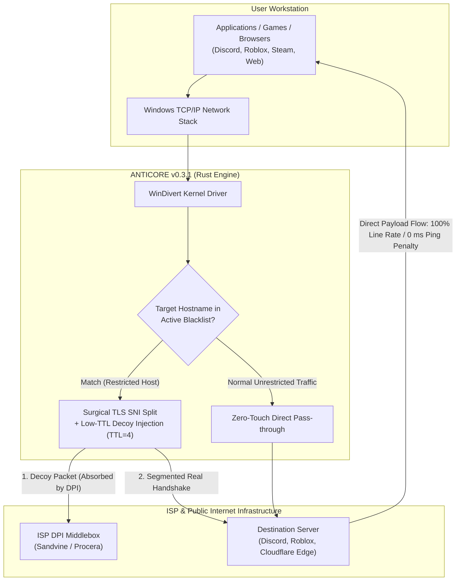

<div align="center">

<p align="center">
  
</p>

# ANTICORE

### Zero-Loss, High-Performance Open Source DPI Circumvention Suite for Windows

[](https://github.com/MonarchDevLab/Anticore/releases/latest)
[](https://github.com/MonarchDevLab/Anticore/releases/latest)
[](https://github.com/MonarchDevLab/Anticore/releases/latest)
[](https://github.com/MonarchDevLab/Anticore)
[](https://github.com/MonarchDevLab/Anticore)
[](https://github.com/MonarchDevLab/Anticore)
[](https://github.com/MonarchDevLab/Anticore)
[](https://github.com/MonarchDevLab/Anticore/releases/latest)
[](LICENSE)

<br />

**Next-generation local packet manipulation engine engineered to circumvent ISP censorship and Deep Packet Inspection (DPI) middleboxes. Operates completely locally without tunneling through third-party remote servers—preserving 100% of your network throughput and ping latency.**

<br />

<p align="center">
  <a href="#download-options-v031"><code>[ Distribution Packages ]</code></a> &nbsp;
  <a href="#what-anticore-is-and-is-not"><code>[ Core Architecture ]</code></a> &nbsp;
  <a href="#key-features"><code>[ Key Features ]</code></a> &nbsp;
  <a href="#how-it-works"><code>[ How It Works ]</code></a> &nbsp;
  <a href="#isp-compatibility--bypass-matrix"><code>[ ISP Matrix ]</code></a> &nbsp;
  <a href="#comprehensive-comparison-matrix"><code>[ Comparison ]</code></a> &nbsp;
  <a href="#frequently-asked-questions-faq"><code>[ FAQ ]</code></a> &nbsp;
  <a href="README.md"><code>[ Türkçe Kılavuz ]</code></a>
</p>

</div>

---

## Download Options (v0.3.1)

All distribution binaries are built cleanly, stripped of developer workstation paths (Zero Leakage), and verified via Minisign.

<table width="100%" align="center">
<tr>
  <th width="340" align="center">
    <h3>Portable Edition</h3>
    <em>(Most Popular)</em>
  </th>
  <th width="340" align="center">
    <h3>Installer (Setup EXE)</h3>
    <em>(Standard User)</em>
  </th>
  <th width="340" align="center">
    <h3>Enterprise (MSI)</h3>
    <em>(System Admins)</em>
  </th>
</tr>
<tr>
  <td align="center" valign="top">
    No installation required. Extract to any folder or USB drive and run directly. Leaves zero residue on the system.
  </td>
  <td align="center" valign="top">
    Desktop shortcut, Start Menu integration, and silent in-app automatic background update engine support.
  </td>
  <td align="center" valign="top">
    Windows Installer MSI package for silent, centralized deployment across fleet machines via Active Directory, Intune, or GPO.
  </td>
</tr>
<tr>
  <td align="center" valign="middle">
    <a href="https://github.com/MonarchDevLab/Anticore/releases/latest/download/Anticore_0.3.1_x64-portable.zip"></a>
  </td>
  <td align="center" valign="middle">
    <a href="https://github.com/MonarchDevLab/Anticore/releases/latest/download/Anticore_0.3.1_x64-setup.exe"></a>
  </td>
  <td align="center" valign="middle">
    <a href="https://github.com/MonarchDevLab/Anticore/releases/latest/download/Anticore_0.3.1_x64_en-US.msi"></a>
  </td>
</tr>
<tr>
  <td align="center" valign="middle">
    <code>v0.3.1</code> • <code>Windows x64</code><br /><br />
    <code>Zero Residue</code>
  </td>
  <td align="center" valign="middle">
    <code>v0.3.1</code> • <code>Windows x64</code><br /><br />
    <code>Auto Updates</code>
  </td>
  <td align="center" valign="middle">
    <code>v0.3.1</code> • <code>Windows x64</code><br /><br />
    <code>GPO & Intune Ready</code>
  </td>
</tr>
</table>

<p align="center">
  <b>Standalone Binaries:</b> &nbsp;
  <a href="https://github.com/MonarchDevLab/Anticore/releases/latest/download/Anticore.exe"><code>Anticore.exe (GUI, 15.6 MB)</code></a> &nbsp;•&nbsp;
  <a href="https://github.com/MonarchDevLab/Anticore/releases/latest/download/anticore-cli.exe"><code>anticore-cli.exe (CLI, 384 KB)</code></a> &nbsp;•&nbsp;
  <a href="https://github.com/MonarchDevLab/Anticore/releases/latest"><code>Release Archive</code></a>
</p>

<details>
<summary><b>SHA-256 Checksums & Package Integrity (Click to Expand)</b></summary>
<br />

| Package File | Size | SHA-256 Checksum |
|---|:---:|---|
| `Anticore_0.3.1_x64-portable.zip` | 6.3 MB | `40E92F9135E92586FD518AE4581E48D10A5FB365AC9593D02E396868354EF935` |
| `Anticore_0.3.1_x64-setup.exe` | 4.4 MB | `FB4F4C31E3B5B5F1FEA7D88F62ECE3267486DDDD75FEDEB0329980D40299631D` |
| `Anticore_0.3.1_x64_en-US.msi` | 6.1 MB | `7614447CF05BF3E8D7C312EC99D388999E5887CA0C2CEA7EAC42A63556335B85` |
| `Anticore.exe` | 15.6 MB | `057C65D8C6CD6A878C5472767D8A7CC6539386A1DD52B7D58F0DC229994817A6` |
| `anticore-cli.exe` | 384 KB | `16F6313E63250869267FC2BEF58AA99AACD6AAF56D52CE5AB1177DA8C9255E9D` |

```powershell
# Verify downloaded package via PowerShell:
Get-FileHash .\Anticore_0.3.1_x64-portable.zip -Algorithm SHA256
```
</details>

> [!IMPORTANT]
> **Technical Requirement — Administrator Privileges:**
> Intercepting and modifying raw IP packets at the kernel level requires the `WinDivert` driver. Running as **Administrator** is technically required. When launched by a standard user, Anticore alerts you and provides one-click self-elevation.

---

## What Anticore Is and Is Not

When online services like Discord or gaming servers are blocked, users typically resort to VPNs. However, conventional VPN routing severely degrades daily performance:

<table width="100%" align="center">
<tr>
  <th width="500" align="center">
    <h3>Traditional VPN Tunneling</h3>
    <sub>(Indirect, Slow &amp; Privacy Risks)</sub>
  </th>
  <th width="500" align="center">
    <h3>Anticore Surgical DPI Bypass</h3>
    <sub>(Direct, Full Line Speed &amp; Zero Latency)</sub>
  </th>
</tr>
<tr>
  <td width="500" align="center" valign="top">
    <br />
    <code>[Client Workstation]</code><br />
    &darr; <i>(Encrypted Tunnel Encapsulation)</i><br />
    <code>[Remote Overseas VPN Server]</code><br />
    &darr; <i>(Bottleneck &amp; Relayed Egress)</i><br />
    <code>[Target Service / Game Server]</code>
    <br /><br />
  </td>
  <td width="500" align="center" valign="top">
    <br />
    <code>[Client Workstation]</code><br />
    &darr; <i>(Only Initial TLS ClientHello Fragmented)</i><br />
    <code>[ISP DPI Filter Bypassed]</code><br />
    &darr; <i>(Direct Line via Local ISP Gateway)</i><br />
    <code>[Target Service / Game Server]</code>
    <br /><br />
  </td>
</tr>
<tr>
  <td width="500" align="left" valign="top">
    &bull; <b>Bandwidth:</b> <br /><br />
    &bull; <b>Gaming Latency:</b> <br /><br />
    &bull; <b>Data Route:</b> <br /><br />
    &bull; <b>Banking / Local Services:</b> <br /><br />
    &bull; <b>Cost Model:</b> 
  </td>
  <td width="500" align="left" valign="top">
    &bull; <b>Bandwidth:</b> <br /><br />
    &bull; <b>Gaming Latency:</b> <br /><br />
    &bull; <b>Data Route:</b> <br /><br />
    &bull; <b>Banking / Local Services:</b> <br /><br />
    &bull; <b>Cost Model:</b> 
  </td>
</tr>
</table>

### Key Differences
- **No Remote Tunnels:** Your internet traffic is never redirected through proxy servers or foreign IP nodes.
- **Zero Bandwidth Loss:** Only the initial handshake packet (**TLS ClientHello SNI**) is manipulated. Once established, all downloads, uploads, video streaming, and gaming flow directly through your ISP at full speed. **If you have a 1 Gbps line, you retain 1 Gbps.**
- **0 ms Ping Overhead:** Because traffic takes the shortest geographical route to game servers, your in-game latency remains unaffected.
- **Banking and Local Portal Safe:** Your real local public IP remains unchanged; banking portals, government sites, and streaming apps will not flag your session.

---

## Key Features

<table width="100%" align="center">
<tr>
<td width="500" valign="top">


### Surgical Packet Manipulation
*Kernel-level DPI bypass powered by the open-source WinDivert driver.*

---

- `SNI Fragmentation` &mdash; Splits TLS ClientHello packets into micro TCP segments to defeat DPI reassembly.
- `TTL=4 Decoy Injection` &mdash; Sends expired decoy packets that saturate inspection state machines.
- `Passive RST Mitigation` &mdash; Silently drops spoofed TCP RST packets injected by ISPs to preserve sessions.

</td>
<td width="500" valign="top">


### 3D Isometric Telemetry & Reactor
*Hardware-accelerated 60 FPS live canvas visualization for network throughput.*

---

- `ActivityChart3D` &mdash; Renders live network speed and PPS flow with dynamic depth shading.
- `Live Reactor Orb` &mdash; Gyroscopic orbital rings with 140 depth-sorted particles showing reactor pulse.
- `Pro Matrix Console` &mdash; Microsecond-precision timing telemetry and raw live terminal log streaming.

</td>
</tr>
<tr>
<td width="500" valign="top">


### Local Network (LAN) Device Sharing
*Transform your workstation into a centralized censorship bypass gateway.*

---

- `SOCKS5 / HTTP Proxy` &mdash; Local proxy listener on `0.0.0.0:10808` for phones, consoles, and Smart TVs.
- `Transparent Hotspot Transit` &mdash; Direct zero-config protection for devices connected to Mobile Hotspot.
- `PAC Automation` &mdash; Proxy Auto-Config routing that directs only censored domains through the engine.

</td>
<td width="500" valign="top">


### Winsock & Network Stack Repair
*First-aid diagnostics for corrupted network adapters and Discord update loops.*

---

- `One-Click Reset` &mdash; Run `netsh winsock reset` and `netsh int ip reset` directly from the interface.
- `DNS Cache Purge` &mdash; Clear IP conflicts instantly with `ipconfig /flushdns`, `/release`, and `/renew`.
- `Secure DoH Templates` &mdash; Cloudflare 1.1.1.1 or Google 8.8.8.8 encrypted DNS integration.

</td>
</tr>
<tr>
<td width="500" valign="top">


### Dynamic In-Memory Blacklist
*Zero-downtime concurrent blacklist synchronization without engine restarts.*

---

- `Live Synchronization` &mdash; Seamless domain additions and removals via `Arc<RwLock<Blacklist>>`.
- `Category Filter Pills` &mdash; Instant target grouping across Mega, Gaming, Media, and Social tiers.
- `Dual-Layered Mirrors` &mdash; Community hostlist sync backed by an offline embedded fallback database.

</td>
<td width="500" valign="top">


### Post-Quantum Kyber & Modern TLS
*Full compatibility with cutting-edge cipher suites and massive packet handshakes.*

---

- `Kyber / ML-KEM 768 & ECH` &mdash; Reassembles 1500+ byte quantum-resistant ClientHello frames across TCP MSS.
- `Synthetic TLS Probes` &mdash; Browser-calibrated handshake tests ensuring zero false negative ISP checks.
- `8 Cyber-Hardware Themes` &mdash; From Obsidian Emerald to Cyberpunk Volt, Amethyst Nebula, and Titanium Lab.

</td>
</tr>
</table>

---

## How It Works

The following architecture diagram demonstrates how Anticore inspects and alters packets with surgical precision:



### Four-Layered Defense Engine
1. **Decoy Packet Injection:** Injects a fake preliminary packet with a calibrated Time-To-Live (`TTL=3..4`) that reaches ISP filtering hardware (Sandvine, Procera, etc.) but drops before reaching the destination server. While the DPI middlebox processes the decoy, the real payload passes through unimpeded.
2. **Surgical SNI Splitting:** Breaks the initial ClientHello packet across the hostname (SNI) boundary into two distinct TCP segments. Basic state machines cannot reassemble these segments in real time.
3. **Spoofed RST Dropping:** Intercepts and discards unauthorized TCP RST packets sent by ISP deep packet inspection systems to abort your connection.
4. **QUIC / HTTP3 Downgrade:** Prevents UDP-based QUIC sessions from bypassing TLS filtering, ensuring consistent circumvention in modern browsers.

---

## ISP Compatibility & Bypass Matrix

Common ISP Deep Packet Inspection implementations and Anticore's calibrated mitigation profiles:

<table width="100%" align="center">
  <thead>
    <tr>
      <th width="22%" align="left">Internet Service Provider</th>
      <th width="20%" align="left">Detected DPI Hardware</th>
      <th width="26%" align="left">Filtering & Restriction Method</th>
      <th width="20%" align="left">Recommended Profile</th>
      <th width="12%" align="center">Success Rate</th>
    </tr>
  </thead>
  <tbody>
    <tr>
      <td>
        <br />
        <b>Turkcell Superonline</b>
      </td>
      <td>
        <code>Sandvine PTS</code><br />
        <sub>Policy Traffic Switch</sub>
      </td>
      <td>
        <code>SNI Inspection</code> <code>Spoofed RST</code><br />
        <sub>Low-TTL Packet Filter</sub>
      </td>
      <td>
        <b>Profile 3 (Aggressive)</b><br />
        <sub>Fake TTL=4 • 2-Byte Split</sub>
      </td>
      <td align="center">
        
      </td>
    </tr>
    <tr>
      <td>
        <br />
        <b>Türk Telekom (TTNet)</b>
      </td>
      <td>
        <code>Procera / Huawei</code><br />
        <sub>PacketLogic Hardware</sub>
      </td>
      <td>
        <code>Standard SNI</code> <code>DNS Hijack</code><br />
        <sub>ISP DNS Poisoning Filter</sub>
      </td>
      <td>
        <b>Profile 1 (Standard)</b><br />
        <sub>SNI Splitting • DoH Resolver</sub>
      </td>
      <td align="center">
        
      </td>
    </tr>
    <tr>
      <td>
        <br />
        <b>Vodafone Net</b>
      </td>
      <td>
        <code>Allot / Sandvine</code><br />
        <sub>Traffic Management Platform</sub>
      </td>
      <td>
        <code>SNI Blocking</code> <code>HTTP 302</code><br />
        <sub>IP Redirect & Spoofed RST</sub>
      </td>
      <td>
        <b>Profile 2 (Fake + RST)</b><br />
        <sub>Decoy Packet • RST Dropping</sub>
      </td>
      <td align="center">
        
      </td>
    </tr>
    <tr>
      <td>
        <br />
        <b>Türksat Kablonet</b>
      </td>
      <td>
        <code>Procera PacketLogic</code><br />
        <sub>Core Deep Inspection</sub>
      </td>
      <td>
        <code>SNI Filtering</code> <code>QUIC Block</code><br />
        <sub>UDP/443 Throttling</sub>
      </td>
      <td>
        <b>Profile 1 (Standard)</b><br />
        <sub>SNI Splitting • QUIC Downgrade</sub>
      </td>
      <td align="center">
        
      </td>
    </tr>
    <tr>
      <td>
        <br />
        <b>TurkNet</b>
      </td>
      <td>
        <code>Independent Core</code><br />
        <sub>Central Office Filtering</sub>
      </td>
      <td>
        <code>DNS Poisoning</code> <code>Partial SNI</code><br />
        <sub>Local Traffic Redirection</sub>
      </td>
      <td>
        <b>Profile 1 (Standard)</b><br />
        <sub>DoH Resolver • Standard Split</sub>
      </td>
      <td align="center">
        
      </td>
    </tr>
    <tr>
      <td>
        <br />
        <b>Regional Providers</b>
      </td>
      <td>
        <code>TT / Superonline</code><br />
        <sub>Carrier Transit Backbone</sub>
      </td>
      <td>
        <code>Backbone Dependent</code><br />
        <sub>Upstream Filtering Policy</sub>
      </td>
      <td>
        <b>Profile 1 or Profile 3</b><br />
        <sub>Adaptive to Transit Carrier</sub>
      </td>
      <td align="center">
        
      </td>
    </tr>
  </tbody>
</table>

---

## Comprehensive Comparison Matrix

<table width="100%" align="center">
  <thead>
    <tr>
      <th width="28%" align="left">Evaluation Criteria</th>
      <th width="18%" align="center">Traditional VPN</th>
      <th width="18%" align="center">GoodbyeDPI</th>
      <th width="18%" align="center">SplitWire</th>
      <th width="18%" align="center" bgcolor="#0d231a">
        
      </th>
    </tr>
  </thead>
  <tbody>
    <tr>
      <td>
        <b>Bandwidth & Download Speed</b><br />
        <sub>Throughput penalty or tunnel throttling</sub>
      </td>
      <td align="center">
        <br />
        <sub>Encryption Tunnel Overhead</sub>
      </td>
      <td align="center">
        <br />
        <sub>100% Line Speed</sub>
      </td>
      <td align="center">
        <br />
        <sub>100% Line Speed</sub>
      </td>
      <td align="center">
        <br />
        <b>100% Line Rate (Zero Loss)</b>
      </td>
    </tr>
    <tr>
      <td>
        <b>In-Game Ping Latency</b><br />
        <sub>Latency impact on Valorant, CS2, LoL, Steam</sub>
      </td>
      <td align="center">
        <br />
        <sub>Remote Server Routing</sub>
      </td>
      <td align="center">
        <br />
        <sub>Direct Transit</sub>
      </td>
      <td align="center">
        <br />
        <sub>Direct Transit</sub>
      </td>
      <td align="center">
        <br />
        <b>Zero Ping Penalty (Direct)</b>
      </td>
    </tr>
    <tr>
      <td>
        <b>Modern Graphic Interface (GUI)</b><br />
        <sub>User-friendly control cockpit and status telemetry</sub>
      </td>
      <td align="center">
        <code>Standard SaaS UI</code><br />
        <sub>Generic Web Wrapper</sub>
      </td>
      <td align="center">
        <br />
        <sub>.cmd Terminal Console</sub>
      </td>
      <td align="center">
        <code>Basic Form UI</code><br />
        <sub>WinForms / WPF Interface</sub>
      </td>
      <td align="center">
        <br />
        <b>Dual-Mode Hardware HUD</b>
      </td>
    </tr>
    <tr>
      <td>
        <b>3D Telemetry & Isometric Chart</b><br />
        <sub>Real-time interactive rendering and reactor orb</sub>
      </td>
      <td align="center">
        
      </td>
      <td align="center">
        
      </td>
      <td align="center">
        
      </td>
      <td align="center">
        <br />
        <b>Active Gyroscopic Reactor</b>
      </td>
    </tr>
    <tr>
      <td>
        <b>LAN Device Sharing (Hotspot / Proxy)</b><br />
        <sub>Network gateway for phones, consoles, Smart TVs</sub>
      </td>
      <td align="center">
        <code>Complex Routing</code><br />
        <sub>Virtual Adapter Bridging</sub>
      </td>
      <td align="center">
        
      </td>
      <td align="center">
        
      </td>
      <td align="center">
        <br />
        <b>Hotspot Transit Gateway</b>
      </td>
    </tr>
    <tr>
      <td>
        <b>Winsock & TCP/IP Stack Repair</b><br />
        <sub>One-click diagnosis and adapter restoration</sub>
      </td>
      <td align="center">
        
      </td>
      <td align="center">
        
      </td>
      <td align="center">
        
      </td>
      <td align="center">
        <br />
        <b>One-Click Stack Repair</b>
      </td>
    </tr>
    <tr>
      <td>
        <b>Dynamic In-Memory Blacklist</b><br />
        <sub>Live domain sync without restarting core engine</sub>
      </td>
      <td align="center">
        <code>Reconnect Required</code><br />
        <sub>Tunnel Restart Needed</sub>
      </td>
      <td align="center">
        <br />
        <sub>Service Restart Required</sub>
      </td>
      <td align="center">
        <br />
        <sub>Service Restart Required</sub>
      </td>
      <td align="center">
        <br />
        <b>Arc&lt;RwLock&gt; Atomic Cache</b>
      </td>
    </tr>
    <tr>
      <td>
        <b>System Tray Flyout Cockpit</b><br />
        <sub>Lightweight taskbar quick command console</sub>
      </td>
      <td align="center">
        <code>Basic Tray Menu</code><br />
        <sub>Simple Connect/Disconnect</sub>
      </td>
      <td align="center">
        
      </td>
      <td align="center">
        <code>Basic Context Menu</code><br />
        <sub>Standard Right-Click Items</sub>
      </td>
      <td align="center">
        <br />
        <b>340x460px Floating Cockpit</b>
      </td>
    </tr>
    <tr>
      <td>
        <b>Windows Service Background Daemon</b><br />
        <sub>Silent background operation on boot</sub>
      </td>
      <td align="center">
        <code>Partial Service</code><br />
        <sub>Background Driver</sub>
      </td>
      <td align="center">
        <code>Manual sc.exe</code><br />
        <sub>CLI Configuration Required</sub>
      </td>
      <td align="center">
        
      </td>
      <td align="center">
        <br />
        <b>One-Click Daemon Control</b>
      </td>
    </tr>
    <tr>
      <td>
        <b>Discord DNS & Voice RTC Fix</b><br />
        <sub>Remediates update loops and voice connect failure</sub>
      </td>
      <td align="center">
        
      </td>
      <td align="center">
        
      </td>
      <td align="center">
        
      </td>
      <td align="center">
        <br />
        <b>RTC & DNS Poisoning Remedy</b>
      </td>
    </tr>
    <tr>
      <td>
        <b>RAM Consumption</b><br />
        <sub>Memory footprint under active load</sub>
      </td>
      <td align="center">
        <br />
        <sub>Bloated Electron/SaaS</sub>
      </td>
      <td align="center">
        <br />
        <sub>Pure C Binary</sub>
      </td>
      <td align="center">
        <br />
        <sub>.NET Runtime</sub>
      </td>
      <td align="center">
        <br />
        <b>Rust Engine + WebView2</b>
      </td>
    </tr>
    <tr>
      <td>
        <b>In-App Auto Updater</b><br />
        <sub>Cryptographic seamless delta releases</sub>
      </td>
      <td align="center">
        
      </td>
      <td align="center">
        <br />
        <sub>Manual Archive Extraction</sub>
      </td>
      <td align="center">
        <br />
        <sub>Manual Tracking</sub>
      </td>
      <td align="center">
        <br />
        <b>Signed GitHub Updater</b>
      </td>
    </tr>
    <tr>
      <td>
        <b>Hardware Themes</b><br />
        <sub>Visual morphology and tactile theme presets</sub>
      </td>
      <td align="center">
        <code>Light / Dark</code>
      </td>
      <td align="center">
        
      </td>
      <td align="center">
        
      </td>
      <td align="center">
        <br />
        <b>Morphological Hardware Deck</b>
      </td>
    </tr>
  </tbody>
</table>

---

## System Tray Quick Panel

Control your network protection instantly without opening the main workspace window:

<table width="100%" align="center">
  <tr>
    <td width="55%" valign="top">

<pre><code>┌────────────────────────────────────────────────────────┐
│  ANTICORE v0.3.1 // QUICK COMMAND COCKPIT      [—] [×] │
├────────────────────────────────────────────────────────┤
│  ENGINE STATUS: ● ENGINE RUNNING (KERNEL ATTACHED)     │
│  [================ ACTIVE REACTOR PULSE ===============] │
│                                                        │
│  Active Profile: [ Profile 3 — Superonline Aggressive ]│
│  Latency      : 0.12 ms       Throughput  : 1,480 p/s  │
│  Processed    : 24,190 pkts   Uptime      : 02:45:12   │
│  Active Rule  : Fake TTL=4 + 2-Byte SNI Segmentation   │
│                                                        │
│  [ ⏹ STOP ]         [ 🔧 NET REPAIR ]       [ ⚙ COCKPIT ]│
└────────────────────────────────────────────────────────┘</code></pre>
<br />
<div align="center">
  
  
  
</div>

</td>
<td width="45%" valign="top">


### Desktop Rapid Command Cockpit
*Instant access directly from the Windows taskbar with zero window overhead.*

---

- `Left-Click Flyout` &mdash; Left-clicking the tray icon invokes a 340x460px hardware-accelerated mini interface anchored above the taskbar. Auto-dismisses seamlessly when clicking outside or pressing `Esc`.
- `Anti-Flicker Double-Click Guard` &mdash; Smart debounced click-event coordinator prevents window flickering caused by rapid clicks, elevating directly to the main workspace on double click.
- `Rust IPC Live Telemetry` &mdash; Streams live packet counts, throughput rates, and reactor pulse directly from the Rust engine with zero background CPU penalty.

</td>
</tr>
</table>

---

## Frequently Asked Questions (FAQ)

<details>
<summary><b>1. Can Anticore cause bans in anti-cheat protected games (Valorant, CS2, LoL)?</b></summary>
<br />
<b>Strictly no.</b> Anticore never touches game files, process memory, or game server communication. It exclusively manipulates the initial handshake of domains explicitly listed in your target blacklist. UDP and TCP gaming traffic pass through your network stack directly without alteration.
</details>

<details>
<summary><b>2. Why do some antivirus engines trigger alerts?</b></summary>
<br />
Anticore uses the open-source, industry-standard <code>WinDivert</code> driver to capture packets at the network layer. Like other legitimate network diagnostic software (Wireshark, Fiddler, GoodbyeDPI), heuristic scanners may flag kernel driver installations. All Anticore source code is publicly inspectable, GitHub builds are transparent, and binaries are digitally signed.
</details>

<details>
<summary><b>3. Why are Administrator privileges mandatory?</b></summary>
<br />
Under Windows security architecture, loading kernel drivers and binding raw network packet filters is strictly restricted to elevated processes. This is a technical operating system requirement.
</details>

<details>
<summary><b>4. How do I protect mobile devices (iOS / Android) on my Wi-Fi?</b></summary>
<br />
You can choose between two methods:<br />
1. <b>SOCKS5 / PAC Proxy:</b> On your mobile device, enter your PC's local IP address (e.g. <code>192.168.1.50</code>) and port <code>10808</code> in your Wi-Fi HTTP proxy settings.<br />
2. <b>Windows Mobile Hotspot:</b> Enable Hotspot on your PC and connect your mobile device. Anticore automatically intercepts forward transit packets without requiring any configuration on the phone.
</details>

<details>
<summary><b>5. How do I fix Discord stuck at "Starting..."?</b></summary>
<br />
This issue is caused by ISP DNS poisoning directing Discord CDN domains to warning landing pages. Open Anticore's <b>Network Repair</b> tab, click <b>"Apply Secure DNS"</b> and <b>"Reset Network Stack"</b> to flush poisoned resolver caches.
</details>

---

## Security and Integrity Verification

Official distribution binaries can be verified using Minisign and the project public key:

```text
dW50cnVzdGVkIGNvbW1lbnQ6IG1pbmlzaWduIHB1YmxpYyBrZXk6IDE1QTRFREEwMDFGNDFFNTMKUldSVEh2UUJvTzJrRmE3UGFDdG81YWtnYUdYSkhFdWQxVGJ0V2VVdHFKNDJvaGZRWS90TWx3ejMK
```

Verification command:
```powershell
minisign -Vm Anticore_0.3.1_x64-setup.exe -p anticore.key.pub
```

Read our [SECURITY.md](SECURITY.md) for vulnerability disclosure procedures and guidelines.

---

## Building from Source

To compile the binaries from source:

### Prerequisites
- Rust 1.80+ (`rustup toolchain install stable`)
- Node.js 20+ LTS (`npm`)
- Visual Studio 2022 C++ Build Tools (MSVC x64)

```powershell
# 1. Clone the repository
git clone https://github.com/MonarchDevLab/Anticore.git
cd Anticore/antikor

# 2. Run Rust unit and integration tests (52 tests)
cd engine
cargo test --workspace

# 3. Build the release engine binary
cargo build --release --workspace

# 4. Install desktop dependencies and build
cd ../desktop
npm install
npm test
npm run tauri build
```

---

## License & Intellectual Property

This project is licensed under the [MIT License](LICENSE).

- **WinDivert:** Independent open-source network capture driver licensed under [LGPLv3](https://reqrypt.org/windivert.html); dynamically loaded without source modifications.
- **WebView2:** Copyright Microsoft Corporation.
- **Legal Notice:** Anticore is developed for network performance analysis, digital privacy, and unrestricted information access. Users remain responsible for complying with local regulations.

<div align="center">
  <br />
  <sub>Architectural design and copyright strictly held by <b>Monolith Works</b>. Published via official open-source channel <b>MonarchDevLab</b>.</sub>
  <br />
  <br />
</div>
