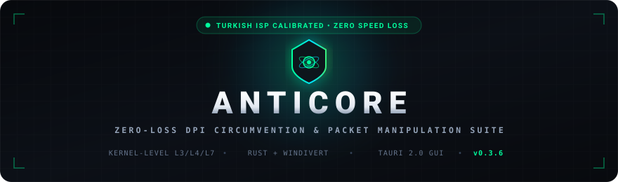
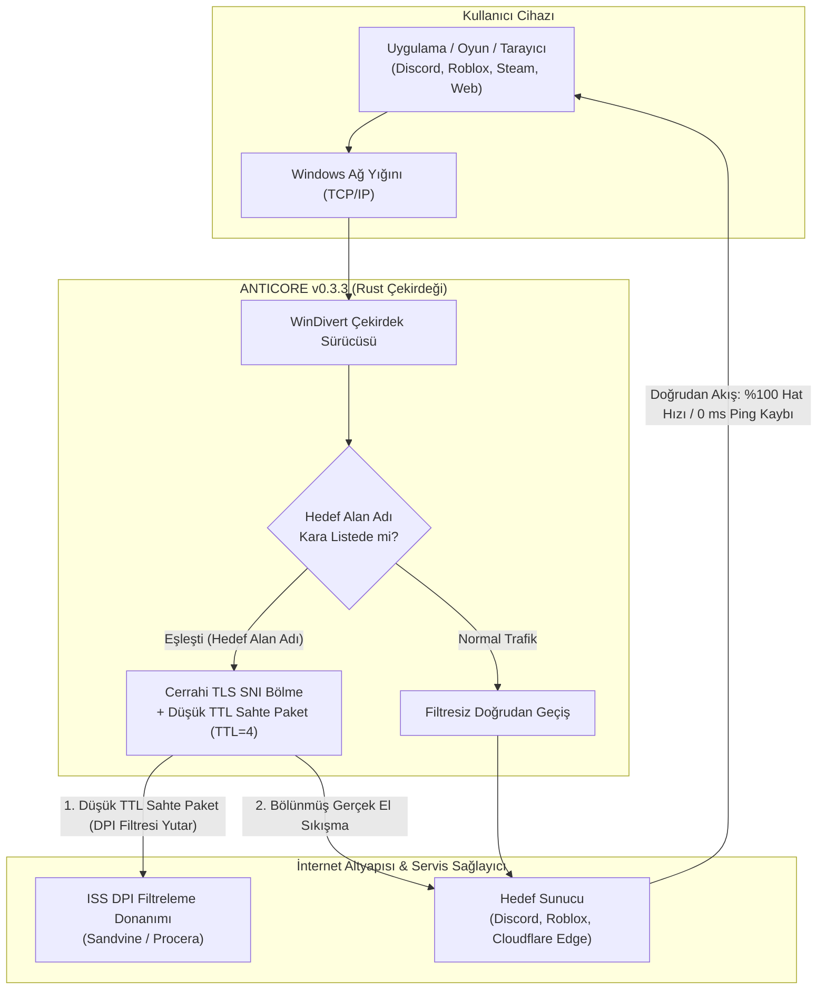

<div align="center">

<p align="center">
  
</p>

# ANTICORE

### Windows ve macOS İçin Sıfır Hız Kayıplı Açık Kaynak DPI Aşma ve Ağ Özgürlüğü Motoru

[](https://github.com/MonarchDevLab/Anticore/releases/latest)
[](https://github.com/MonarchDevLab/Anticore/releases/latest)
[](https://github.com/MonarchDevLab/Anticore/releases/latest)
[](https://github.com/MonarchDevLab/Anticore)
[](https://github.com/MonarchDevLab/Anticore)
[](https://github.com/MonarchDevLab/Anticore)
[](https://github.com/MonarchDevLab/Anticore)
[](https://github.com/MonarchDevLab/Anticore/releases/latest)
[](LICENSE)

<br />

**İnternet servis sağlayıcılarının uyguladığı derin paket inceleme (DPI) filtreleme ve kısıtlamalarına karşı geliştirilmiş; trafiği üçüncü taraf uzak sunuculara yönlendirmeden, internet hızınızı ve ping değerinizi %100 koruyarak çalışan yeni nesil yerel paket manipülasyon yazılımı.**

<br />

<table width="100%" align="center">
  <tr>
    <td width="25%" align="center">
      <a href="#indirme-seçenekleri-v031"></a>
    </td>
    <td width="25%" align="center">
      <a href="#anticore-nedir-ve-ne-değildir"></a>
    </td>
    <td width="25%" align="center">
      <a href="#öne-çıkan-yetenekler"></a>
    </td>
    <td width="25%" align="center">
      <a href="#nasıl-çalışır"></a>
    </td>
  </tr>
  <tr>
    <td width="25%" align="center">
      <a href="#türkiye-iss-uyumluluk-ve-atlatma-matrisi"></a>
    </td>
    <td width="25%" align="center">
      <a href="#kapsamlı-karşılaştırma-tablosu"></a>
    </td>
    <td width="25%" align="center">
      <a href="#sıkça-sorulan-sorular-sss"></a>
    </td>
    <td width="25%" align="center">
      <a href="README.en.md"></a>
    </td>
  </tr>
</table>

</div>

---

## İndirme Seçenekleri (v0.3.4)

Tüm ikili paketler doğrudan derlenmiş, yerel geliştirici yollarından arındırılmış (Zero Leakage) ve Minisign ile doğrulanmıştır.

<table width="100%" align="center">
  <thead>
    <tr>
      <th width="33.3%" align="center">
        <br /><br />
        <b>Taşınabilir / Kurulumsuz</b><br />
        <small>USB bellek veya doğrudan klasörden çalıştırma. Yönetici haklarıyla anında çalışır; kayıt defterine dokunmaz.</small>
      </th>
      <th width="33.3%" align="center">
        <br /><br />
        <b>NSIS Standart Kurulum</b><br />
        <small>Başlat menüsü kısayolu, masaüstü ikonu, otomatik güncelleme entegrasyonu ve temiz kaldırma desteği.</small>
      </th>
      <th width="33.3%" align="center">
        <br /><br />
        <b>Kurumsal Dağıtım Paketi</b><br />
        <small>Active Directory GPO, Microsoft Intune ve SCCM üzerinden sessiz (silent) toplu şirket dağıtımı.</small>
      </th>
    </tr>
  </thead>
  <tbody>
    <tr>
      <td align="center" valign="middle">
        <a href="https://github.com/MonarchDevLab/Anticore/releases/download/v0.3.4/Anticore_0.3.4_x64-portable.zip"></a>
      </td>
      <td align="center" valign="middle">
        <a href="https://github.com/MonarchDevLab/Anticore/releases/download/v0.3.4/Anticore_0.3.4_x64-setup.exe"></a>
      </td>
      <td align="center" valign="middle">
        <a href="https://github.com/MonarchDevLab/Anticore/releases/download/v0.3.4/Anticore_0.3.4_x64_en-US.msi"></a>
      </td>
    </tr>
    <tr>
      <td align="center" valign="middle">
        
      </td>
      <td align="center" valign="middle">
        
      </td>
      <td align="center" valign="middle">
        
      </td>
    </tr>
    <tr>
      <td align="center" bgcolor="#161b22">
        <a href="https://github.com/MonarchDevLab/Anticore/releases/download/v0.3.4/Anticore.exe"></a>
      </td>
      <td align="center" bgcolor="#161b22">
        <a href="https://github.com/MonarchDevLab/Anticore/releases/download/v0.3.4/anticore-cli.exe"></a>
      </td>
      <td align="center" bgcolor="#161b22">
        <a href="https://github.com/MonarchDevLab/Anticore/releases/latest"></a>
      </td>
    </tr>
  </tbody>
</table>

<br />

### macOS Dağıtım İstasyonu (v0.3.4)

macOS (11.0 Big Sur ve üzeri) için yerel `utun` + `pfctl` çekirdek motoru ve üst menü çubuğu Hızlı Panel (`quick-panel`) paketleri mimarilerine göre ayrıştırılmıştır:

> [!TIP]
> **Hangi Paketi İndirmeliyim? (Apple Silicon mu, Intel mi?)**
> 1. Sol üst köşedeki **Apple () Menüsü** > **Bu Mac Hakkında (About This Mac)** seçeneğine tıklayın.
> 2. Açılan pencerede:
>    - **Çip (Chip):** `Apple M1`, `M2`, `M3`, `M4` veya daha yenisi yazıyorsa &rarr; **Apple Silicon (ARM64)** paketini indirin.
>    - **İşlemci (Processor):** `Intel Core i5`, `i7`, `i9` veya `Intel Xeon` yazıyorsa &rarr; **Intel (x64)** paketini indirin.

<table width="100%" align="center">
  <thead>
    <tr>
      <th width="50%" align="center">
        <br /><br />
        <b>Apple Silicon (arm64 / aarch64)</b><br />
        <small>Tüm M-serisi Mac'ler için yerel ARM64 derlemesi. Maksimum enerji verimliliği ve donanım hızlandırmalı paket işleme.</small>
      </th>
      <th width="50%" align="center">
        <br /><br />
        <b>Intel Tabanlı Mac (x86_64)</b><br />
        <small>Intel Core işlemcili Mac modelleri için optimize edilmiş 64-bit saf x64 ikili paketi.</small>
      </th>
    </tr>
  </thead>
  <tbody>
    <tr>
      <td align="center" valign="middle">
        <a href="https://github.com/MonarchDevLab/Anticore/releases/download/v0.3.4/Anticore_0.3.4_arm64.pkg"></a>
      </td>
      <td align="center" valign="middle">
        <a href="https://github.com/MonarchDevLab/Anticore/releases/download/v0.3.4/Anticore_0.3.4_x64.pkg"></a>
      </td>
    </tr>
    <tr>
      <td align="center" valign="middle">
        <a href="https://github.com/MonarchDevLab/Anticore/releases/download/v0.3.4/Anticore_0.3.4_aarch64.dmg"></a>
      </td>
      <td align="center" valign="middle">
        <a href="https://github.com/MonarchDevLab/Anticore/releases/download/v0.3.4/Anticore_0.3.4_x64.dmg"></a>
      </td>
    </tr>
    <tr>
      <td align="center" valign="middle">
        <a href="https://github.com/MonarchDevLab/Anticore/releases/download/v0.3.4/Anticore_aarch64.app.tar.gz"></a>
      </td>
      <td align="center" valign="middle">
        <a href="https://github.com/MonarchDevLab/Anticore/releases/download/v0.3.4/Anticore_x64.app.tar.gz"></a>
      </td>
    </tr>
    <tr>
      <td align="center" valign="middle">
        <a href="https://github.com/MonarchDevLab/Anticore/releases/download/v0.3.4/anticore-cli-macos-arm64-0.3.4.tar.gz"></a>
      </td>
      <td align="center" valign="middle">
        <a href="https://github.com/MonarchDevLab/Anticore/releases/download/v0.3.4/anticore-cli-macos-x64-0.3.4.tar.gz"></a>
      </td>
    </tr>
    <tr>
      <td align="center" bgcolor="#161b22" colspan="2">
        <code>sudo ./scripts/macos-install-daemon.sh</code> &nbsp;|&nbsp; <code>./scripts/macos-package.sh [arm64|x64|all]</code>
      </td>
    </tr>
  </tbody>
</table>

#### macOS Terminal ile Hızlı Kurulum Seçenekleri (Kod ile Yükleme)

##### Yöntem 1 — Tek Satırda Otomatik Kurulum (Önerilen)
Terminal uygulamasını açıp aşağıdaki komutu yapıştırın. Sistem mimarinizi otomatik algılar, doğru paketi çeker, karantinayı kaldırır ve uygulamayı başlatır:

```bash
curl -fsSL https://raw.githubusercontent.com/MonarchDevLab/Anticore/main/scripts/macos-quick-install.sh | bash
```

##### Yöntem 2 — Doğrudan PKG Installer Komutları
Paketi Terminal üzerinden doğrudan indirip macOS yerel yükleyicisiyle kurmak için:

```bash
# Apple Silicon Mac (M1 / M2 / M3 / M4)
curl -LO https://github.com/MonarchDevLab/Anticore/releases/download/v0.3.4/Anticore_0.3.4_arm64.pkg && sudo installer -pkg Anticore_0.3.4_arm64.pkg -target /

# Intel Tabanlı Mac
curl -LO https://github.com/MonarchDevLab/Anticore/releases/download/v0.3.4/Anticore_0.3.4_x64.pkg && sudo installer -pkg Anticore_0.3.4_x64.pkg -target /
```

> [!IMPORTANT]
> **macOS "Hasar Görmüş Olduğu İçin Çöpe Taşıyın" Uyarısı Neden Çıkar ve Nasıl Aşılır?**
> Apple, ticari geliştirici sertifikası ($99/yıl) içermeyen tüm açık kaynak DMG ve uygulamalara `com.apple.quarantine` etiketi koyar ve kullanıcıları lisanslı mağazaya yönlendirmek amacıyla yanıltıcı olarak "hasar görmüş" uyarısı verir. Dosya fiziksel olarak kesinlikle hasarlı değildir.
> 
> - **Çözüm A (Önerilen — .pkg Kullanımı):** Yukarıdaki **`.pkg`** paketini indirin veya Terminal komutunu çalıştırın. `.pkg` yükleyicisi karantinayı arka planda otomatik temizler.
> - **Çözüm B (Sistem Ayarları — Terminalsiz):** DMG'den uygulamayı açmaya çalıştıktan sonra `Sistem Ayarları` > `Gizlilik ve Güvenlik` bölümüne gidin. Sayfanın altındaki `"Anticore" engellendi` uyarısının yanındaki **[Yine de Aç] (Open Anyway)** butonuna tıklayın.
> - **Çözüm C (Terminal ile Karantina Temizliği):**
>   ```bash
>   sudo xattr -cr /Applications/Anticore.app
>   ```

> [!NOTE]
> **macOS Ağ Yönlendirme ve Yönetici (Root) Yetkisi:**
> macOS işletim sistemi yapısı gereği, ağ paketlerinin filtrelenmesi ve yerel tünel yönlendirmesi (`utun` arayüzü ve `pfctl` kuralları) yönetici (`root`) yetkisi gerektirir. Uygulama standart kullanıcı olarak açıldığında motoru başlatmak istediğinizde beliren **"Yönetici Olarak Yeniden Başlat"** butonuna basarak Touch ID / şifrenizle tek tıkla onay verebilir veya Terminal üzerinden doğrudan `sudo /Applications/Anticore.app/Contents/MacOS/Anticore &` komutuyla çalıştırabilirsiniz.

<details>
<summary><b>SHA-256 Paket Bütünlük Özetleri (Tıklayıp Genişletin)</b></summary>
<br />

| Paket Dosyası | Boyut | SHA-256 Kriptografik Özeti |
|---|:---:|---|
| `Anticore_0.3.3_x64-portable.zip` | 6.7 MB | `8433A3CE2F71F4FD9BA8DD2127B94CE62B018A482FF969B9C49928C6DDC9499A` |
| `Anticore_0.3.3_x64-setup.exe` | 4.5 MB | `A785F285FF76FE1ED6D6EE8EC4F3677CAB133A0D3826ACB967EDC19F9F9F524A` |
| `Anticore_0.3.3_x64_en-US.msi` | 6.5 MB | `9C8713017006120B63A9C214EBBA827A1C36C995D6ADF09E65B819192FE2DBBE` |
| `Anticore.exe` | 16.6 MB | `4D7AEE3B870CE1C804762845E2D33312A1DFDD1E053994A100CE9D784C5992DB` |
| `anticore-cli.exe` | 385 KB | `8BAF91276F13FB59922AE361EA8AB3737ABF7AE91C439AF2C1C1BD2C4B4F49F0` |
| `Anticore_0.3.3_aarch64.dmg` | 6.7 MB | `B4CA9A4A2904EFC82EBF76DA1C02A2BAD0D973EE3BE55D6702A2668A2393764A` |
| `Anticore_0.3.3_x64.dmg` | 6.9 MB | `CDB811EB77515122C99F2220A8CB39C7D586EEB6363D41AEF96B61922011CA4E` |

```powershell
# İndirdiğiniz paketi PowerShell ile doğrulamak için:
Get-FileHash .\Anticore_0.3.3_x64-portable.zip -Algorithm SHA256
```
</details>

> [!IMPORTANT]
> **Teknik Zorunluluk — Yönetici ve Root İzni (Administrator / Root Privilege):**
> - **Windows:** Ağ kartından geçen ham paketleri çekirdek katmanında yakalamak için `WinDivert` sürücüsü kullanılır. Bu nedenle uygulamanın **Yönetici Olarak Çalıştırılması** gereklidir. Standart kullanıcı olarak başlatıldığında Anticore sizi uyarır ve tek tıkla yetkili modda yeniden başlar.
> - **macOS:** Paketleri kullanıcı alanında yakalamak ve yönlendirmek için `utun` BSD arayüzü ve `pfctl` paket filtresi kullanılır. Bu sistem arabirimleri `root` (sudo) yetkisi gerektirir. CLI motoru veya LaunchDaemon arka plan servisi `sudo` ile başlatılmalıdır.

---

## Anticore Nedir ve Ne Değildir?

Discord kapatıldığında, Roblox engellendiğinde veya bilgiye erişim kısıtlandığında kullanıcıların başvurduğu klasik çözüm VPN tünelleridir. Ancak VPN protokolleri modern internet kullanımını aksatır:

<table width="100%" align="center">
  <thead>
    <tr>
      <th width="50%" align="center">
        <br /><br />
        <b>Geleneksel VPN Tünelleme</b><br />
        <sub>Dolaylı &bull; Yavaş &bull; Veri Güvenliği Riskli</sub>
      </th>
      <th width="50%" align="center">
        <br /><br />
        <b>Anticore Cerrahi DPI Bypass</b><br />
        <sub>Doğrudan &bull; Tam Hat Hızı &bull; Sıfır Gecikme</sub>
      </th>
    </tr>
  </thead>
  <tbody>
    <tr>
      <td width="50%" align="center" bgcolor="#0b0e14">
        <br />
        <br />
        &darr; <sub><i>Şifreli Tünel Kapsülleme (Tüm Trafik)</i></sub><br />
        <br />
        &darr; <sub><i>Uzak Çıkış & Ağ Darboğazı (+150ms)</i></sub><br />
        
        <br /><br />
      </td>
      <td width="50%" align="center" bgcolor="#0b0e14">
        <br />
        <br />
        &darr; <sub><i>Yalnızca İlk TLS ClientHello Parçalanır</i></sub><br />
        <br />
        &darr; <sub><i>Doğrudan Kendi Fiber Santraliniz (0ms)</i></sub><br />
        
        <br /><br />
      </td>
    </tr>
    <tr>
      <td>
        &bull; <b>Hat Hızı:</b>
        
      </td>
      <td>
        &bull; <b>Hat Hızı:</b>
        
      </td>
    </tr>
    <tr>
      <td>
        &bull; <b>Oyun Gecikmesi:</b>
        
      </td>
      <td>
        &bull; <b>Oyun Gecikmesi:</b>
        
      </td>
    </tr>
    <tr>
      <td>
        &bull; <b>Veri Rotası:</b>
        
      </td>
      <td>
        &bull; <b>Veri Rotası:</b>
        
      </td>
    </tr>
    <tr>
      <td>
        &bull; <b>Banka / e-Devlet:</b>
        
      </td>
      <td>
        &bull; <b>Banka / e-Devlet:</b>
        
      </td>
    </tr>
    <tr>
      <td>
        &bull; <b>Maliyet:</b>
        
      </td>
      <td>
        &bull; <b>Maliyet:</b>
        
      </td>
    </tr>
  </tbody>
</table>

### Anticore'un Temel Farkları
- **Tünelleme Yok:** Trafiğinizi asla üçüncü taraf bir ara sunucuya veya yurt dışı IP adresine yönlendirmez.
- **Sıfır Hız Kaybı:** Yalnızca engelli hedefe yönelik ilk bağlantı el sıkışmasını (**TLS ClientHello SNI**) manipüle eder. Bağlantı kurulduğu andan itibaren dosya indirme, oyun paketleri ve video akışı doğrudan kendi internet servis sağlayıcınız üzerinden akar. **1000 Mbps bağlantınız varsa, 1000 Mbps almaya devam edersiniz.**
- **Oyunlarda 0 ms Ping Artışı:** Doğrudan santral çıkışınızı kullandığı için oyun sunucularına olan gecikme değeriniz 1 milisaniye dahi yükselmez.
- **Banka ve e-Devlet Uyumlu:** Gerçek Türkiye IP adresiniz değişmediği için bankacılık uygulamaları, e-Devlet veya yerli yayın platformları güvenlik doğrulaması istemez ya da hesabınızı kilitlemez.

---

## Öne Çıkan Yetenekler

<table width="100%" align="center">
  <!-- ROW 1 HEADERS -->
  <tr>
    <th width="50%" align="left" valign="top">
      <br />
      <h3>Cerrahi Paket Manipülasyonu</h3>
      <sub>Kernel düzeyinde WinDivert sürücüsü ile ISS DPI filtrelemelerini aşma.</sub>
    </th>
    <th width="50%" align="left" valign="top">
      <br />
      <h3>3D İzometrik Telemetri &amp; Reaktör</h3>
      <sub>Donanım hızlandırmalı Canvas mimarisiyle saniyede 60 FPS canlı ağ izleme.</sub>
    </th>
  </tr>
  <!-- ROW 1 CONTENT -->
  <tr>
    <td width="50%" valign="top">
      &bull; <b>SNI Parçalama:</b> TLS ClientHello paketlerini mikroskobik TCP segmentlerine bölerek DPI kutularının paketleri birleştirmesini engeller.<br /><br />
      &bull; <b>TTL=4 Sahte Paket:</b> Filtreleme donanımını doyuma ulaştırıp gerçek veri akışını gizleyen düşük ömürlü paket enjeksiyonu.<br /><br />
      &bull; <b>RST Düşürme &amp; QUIC:</b> ISS kaynaklı sahte TCP RST bağlantı koparma paketlerini sessizce filtreler ve UDP akışını korur.
    </td>
    <td width="50%" valign="top">
      &bull; <b>ActivityChart3D:</b> Ağ verimi ve PPS (paket/sn) akışını donanım hızlandırmalı dinamik izometrik derinlikle çizer.<br /><br />
      &bull; <b>Canlı Reaktör Küresi:</b> Çift uydulu, 140 derinlik parçacıklı jiroskopik küre ile çekirdek durumunu görselleştirir.<br /><br />
      &bull; <b>Pro Matrix Konsolu:</b> Mikrosaniye hassasiyetinde hata telemetrisi, soket olayları ve canlı terminal teşhis logları.
    </td>
  </tr>

  <!-- ROW 2 HEADERS -->
  <tr>
    <th width="50%" align="left" valign="top">
      <br />
      <h3>Yerel Ağ (LAN) Cihaz Paylaşımı</h3>
      <sub>Bilgisayarınızı tüm ev ve ofis için merkezi yerel DPI ağ geçidine çevirin.</sub>
    </th>
    <th width="50%" align="left" valign="top">
      <br />
      <h3>Winsock &amp; Ağ Yığını Onarımı</h3>
      <sub>Çöken ağ adaptörleri ve kilitlenen Discord güncellemeleri için cerrahi ilk yardım.</sub>
    </th>
  </tr>
  <!-- ROW 2 CONTENT -->
  <tr>
    <td width="50%" valign="top">
      &bull; <b>SOCKS5 / HTTP Proxy:</b> Mobil cihazlar, tabletler ve akıllı TV'ler için yerel ağda <code>0.0.0.0:10808</code> vekil sunucu servisi.<br /><br />
      &bull; <b>Şeffaf Hotspot Transit:</b> Windows Mobil Etkin Noktası üzerinden bağlı tüm cihazlara ek ayar gerektirmeden tam koruma.<br /><br />
      &bull; <b>PAC Otomasyonu:</b> Yalnızca hedeflenen alan adlarını yönlendiren dinamik Proxy Auto-Config desteği ile optimum hat kullanımı.
    </td>
    <td width="50%" valign="top">
      &bull; <b>Tek Tıkla Sıfırlama:</b> Bozulan ağ yığınını <code>netsh winsock reset</code> ve <code>netsh int ip reset</code> ile anında onarma.<br /><br />
      &bull; <b>DNS Önbellek Boşaltma:</b> <code>ipconfig /flushdns</code>, <code>/release</code> ve <code>/renew</code> komutlarıyla DNS zehirlenmesini temizleme.<br /><br />
      &bull; <b>Güvenli DoH Aktivasyonu:</b> Cloudflare 1.1.1.1 veya Google 8.8.8.8 şifreli DNS motoruyla doğrudan güvenli çözümleme.
    </td>
  </tr>

  <!-- ROW 3 HEADERS -->
  <tr>
    <th width="50%" align="left" valign="top">
      <br />
      <h3>Dinamik Bellek Kara Listesi</h3>
      <sub>Motoru yeniden başlatmadan anında güncellenen eşzamanlı bellek mimarisi.</sub>
    </th>
    <th width="50%" align="left" valign="top">
      <br />
      <h3>Post-Quantum Kyber &amp; Modern TLS</h3>
      <sub>En yeni nesil şifreleme standartları ve devasa paket yapılarıyla tam uyumluluk.</sub>
    </th>
  </tr>
  <!-- ROW 3 CONTENT -->
  <tr>
    <td width="50%" valign="top">
      &bull; <b>Canlı Senkronizasyon:</b> <code>Arc&lt;RwLock&lt;Blacklist&gt;&gt;</code> mimarisiyle motor durdurulmadan sıfır kesintiyle alan adı yönetimi.<br /><br />
      &bull; <b>Kategori Filtre Hapları:</b> TR Mega, Oyun, Medya ve Sosyal kategorilerine göre tek tıkla anında filtreleme.<br /><br />
      &bull; <b>Yedekli Topluluk Aynası:</b> Zapret Türkiye hostlist aynası ve yerleşik çevrimdışı yedek veritabanı desteği.
    </td>
    <td width="50%" valign="top">
      &bull; <b>Kyber / ML-KEM 768 &amp; ECH:</b> Chrome/Firefox 1500+ baytlık kuantum sonrası el sıkışma paketlerini kusursuz işler.<br /><br />
      &bull; <b>Sentetik Test Sondaları:</b> Modern tarayıcı uzantılarıyla birebir uyumlu testlerle sıfır sahte negatif sonuç garantisi.<br /><br />
      &bull; <b>Kriptografik Güvenlik:</b> TLS bütünlüğünü bozmadan yalnızca hedefli SNI segmentasyonu ile veri gizliliğini tam koruma.
    </td>
  </tr>

  <!-- ROW 4 HEADERS -->
  <tr>
    <th width="50%" align="left" valign="top">
      <br />
      <h3>Kalıntısız Sistem Temizliği (Zero-Trace Purge)</h3>
      <sub>Tek tıkla tüm servisleri, çekirdek sürücüleri, DNS kayıtlarını ve izleri kalıcı olarak silme.</sub>
    </th>
    <th width="50%" align="left" valign="top">
      <br />
      <h3>10 Morfolojik Tema &amp; Çift Platform Sihirbazı</h3>
      <sub>Derinlikli donanım karakteri ve macOS/Windows için tam pariteli kurulum deneyimi.</sub>
    </th>
  </tr>
  <!-- ROW 4 CONTENT -->
  <tr>
    <td width="50%" valign="top">
      &bull; <b>Tam Kapsamlı Kaldırma:</b> Windows servisini durdurup siler (<code>sc delete</code>), WinDivert sürücüsünü bellekten boşaltır ve artık bırakmaz.<br /><br />
      &bull; <b>Ağ &amp; Başlangıç Sıfırlama:</b> DNS ve DoH kayıtlarını fabrika ayarlarına döndürür, Görev Zamanlayıcı ve Kayıt Defteri girdilerini tamamen yok eder.<br /><br />
      &bull; <b>Kalıntısız Dosya Silme:</b> Kısayolları, AppData önbelleğini ve uygulama ikililerini tek operasyonla sistemden tamamen temizler.
    </td>
    <td width="50%" valign="top">
      &bull; <b>10 Morfolojik Tema:</b> <code>#020617</code> void zemin, <code>#ff642b</code> akkor turuncu ve <code>#00edff</code> elektrik siyanı ile 10 bağımsız donanım karakteri.<br /><br />
      &bull; <b>Çift Platform Kurulum Sihirbazı:</b> Windows servisi veya macOS LaunchDaemon olarak kalıcı kurulum ya da tek seferlik taşınabilir mod seçimi.<br /><br />
      &bull; <b>Pencere &amp; Tepsi Özgürlüğü:</b> Tepsi simgesi gizleme, Her Zaman Üstte sabitleme ve arka planda sessiz çalışma kontrolleri.
    </td>
  </tr>
</table>

---

## Nasıl Çalışır?

Aşağıdaki mimari akış şeması, kullanıcının başlattığı bir istekte Anticore motorunun paketleri nasıl cerrahi bir hassasiyetle işlediğini özetler:



### Dört Kademeli Savunma Mimarisi
1. **Sahte Paket Enjeksiyonu (Fake Decoy Packet):** ISS omurgasındaki filtre donanımına (Sandvine, Procera vb.) ulaşacak kadar yaşam süresine (TTL=3..4) sahip, fakat hedef sunucuya asla ulaşamayacak bir öncü paket fırlatılır. Filtre cihazı bu sahte veriyi analiz ederken arkadan gelen gerçek paketi denetlemeden geçirir.
2. **Cerrahi SNI Parçalama (SNI Splitting):** Gerçek ClientHello paketi, alan adı etiketinin (SNI) tam ortasından iki bağımsız TCP segmentine bölünür. Basit denetleyiciler paketleri bellekte birleştiremediği için hedefi tespit edemez.
3. **Sahte RST Düşürme (RST Mitigation):** Servis sağlayıcının bağlantıyı sabote etmek amacıyla enjekte ettiği yetkisiz TCP RST paketleri çekirdek sürücüsü düzeyinde yakalanıp yok edilir.
4. **QUIC / HTTP3 TLS Düşürme:** UDP tabanlı QUIC el sıkışmaları standart TLS'e düşürülerek paket kurallarının tarayıcılarda kesintisiz devrede kalması sağlanır.

---

## Türkiye İSS Uyumluluk ve Atlatma Matrisi

Türkiye'deki ana internet servis sağlayıcılarının kullandığı derin paket inceleme (DPI) donanımları ve Anticore'un optimize edilmiş çözüm stratejileri:

<table width="100%" align="center">
  <thead>
    <tr>
      <th width="20%" align="left">İnternet Servis Sağlayıcı</th>
      <th width="18%" align="left">Tespit Edilen DPI Donanımı</th>
      <th width="22%" align="left">DPI Trafik Sınıflandırma Yöntemi</th>
      <th width="19%" align="left">Varsayılan Uyumlu Profil</th>
      <th width="21%" align="center">Başarı Durumu</th>
    </tr>
  </thead>
  <tbody>
    <tr>
      <td>
        <br />
        <b>Turkcell Superonline</b>
      </td>
      <td>
        <code>Sandvine PTS</code><br />
        <sub>Policy Traffic Switch</sub>
      </td>
      <td>
        <code>SNI İnceleme</code> <code>Sahte RST</code><br />
        <sub>Düşük TTL Paket Filtresi</sub>
      </td>
      <td>
        <b>Profil 3 (Agresif)</b><br />
        <sub>Fake TTL=4 • 2-Bayt Split</sub>
      </td>
      <td align="center">
        <br />
        <b>%100 Tam Hat Erişimi</b><br />
        <sub>Doğrudan Çıkış • 0 ms Ping</sub>
      </td>
    </tr>
    <tr>
      <td>
        <br />
        <b>Türk Telekom (TTNet)</b>
      </td>
      <td>
        <code>Procera / Huawei</code><br />
        <sub>PacketLogic Donanımı</sub>
      </td>
      <td>
        <code>Standart SNI</code> <code>DNS Hijack</code><br />
        <sub>ISP DNS Zehirleme Filtresi</sub>
      </td>
      <td>
        <b>Profil 1 (Standart)</b><br />
        <sub>SNI Parçalama • DoH Çözümleyici</sub>
      </td>
      <td align="center">
        <br />
        <b>%100 Tam Hat Erişimi</b><br />
        <sub>Doğrudan Çıkış • 0 ms Ping</sub>
      </td>
    </tr>
    <tr>
      <td>
        <br />
        <b>Vodafone Net</b>
      </td>
      <td>
        <code>Allot / Sandvine</code><br />
        <sub>Trafik Yönetim Platformu</sub>
      </td>
      <td>
        <code>SNI Blokajı</code> <code>HTTP 302</code><br />
        <sub>IP Yönlendirme & Sahte RST</sub>
      </td>
      <td>
        <b>Profil 2 (Fake + RST)</b><br />
        <sub>Sahte Paket • RST Düşürme</sub>
      </td>
      <td align="center">
        <br />
        <b>%100 Tam Hat Erişimi</b><br />
        <sub>Doğrudan Çıkış • 0 ms Ping</sub>
      </td>
    </tr>
    <tr>
      <td>
        <br />
        <b>Türksat Kablonet</b>
      </td>
      <td>
        <code>Procera PacketLogic</code><br />
        <sub>Omurga Denetim Sistemi</sub>
      </td>
      <td>
        <code>SNI Filtreleme</code> <code>QUIC Engeli</code><br />
        <sub>UDP/443 Kısıtlaması</sub>
      </td>
      <td>
        <b>Profil 1 (Standart)</b><br />
        <sub>SNI Parçalama • QUIC Düşürme</sub>
      </td>
      <td align="center">
        <br />
        <b>%100 Tam Hat Erişimi</b><br />
        <sub>Doğrudan Çıkış • 0 ms Ping</sub>
      </td>
    </tr>
    <tr>
      <td>
        <br />
        <b>TurkNet</b>
      </td>
      <td>
        <code>Bağımsız Omurga</code><br />
        <sub>Santral Düzeyi Filtreleme</sub>
      </td>
      <td>
        <code>DNS Zehirleme</code> <code>Kısmi SNI</code><br />
        <sub>Yerel Yönlendirme</sub>
      </td>
      <td>
        <b>Profil 1 (Standart)</b><br />
        <sub>DoH Entegrasyonu • Standart Split</sub>
      </td>
      <td align="center">
        <br />
        <b>%100 Tam Hat Erişimi</b><br />
        <sub>Doğrudan Çıkış • 0 ms Ping</sub>
      </td>
    </tr>
    <tr>
      <td>
        <br />
        <b>Millenicom & Diğerleri</b>
      </td>
      <td>
        <code>TT / Superonline</code><br />
        <sub>Taşıyıcı Altyapı Omurgası</sub>
      </td>
      <td>
        <code>Omurga Bağımlı</code><br />
        <sub>Ana Taşıyıcı Filtreleme Kuralları</sub>
      </td>
      <td>
        <b>Profil 1 veya Profil 3</b><br />
        <sub>Altyapı Tipine Göre Seçim</sub>
      </td>
      <td align="center">
        <br />
        <b>%100 Tam Hat Erişimi</b><br />
        <sub>Doğrudan Çıkış • 0 ms Ping</sub>
      </td>
    </tr>
  </tbody>
</table>

---

## Kapsamlı Karşılaştırma Tablosu

<table width="100%" align="center">
  <thead>
    <tr>
      <th width="24%" align="left">Teknik Kriter</th>
      <th width="19%" align="center">Geleneksel VPN</th>
      <th width="19%" align="center">GoodbyeDPI</th>
      <th width="19%" align="center">SplitWire</th>
      <th width="19%" align="center">
        
      </th>
    </tr>
  </thead>
  <tbody>
    <tr>
      <td><b>İndirme Hızı &amp; Hat</b></td>
      <td align="center"></td>
      <td align="center"></td>
      <td align="center"></td>
      <td align="center"></td>
    </tr>
    <tr>
      <td><b>Oyun Pingi &amp; Gecikme</b></td>
      <td align="center"></td>
      <td align="center"></td>
      <td align="center"></td>
      <td align="center"></td>
    </tr>
    <tr>
      <td><b>Kullanıcı Arayüzü (GUI)</b></td>
      <td align="center"><code>Standart SaaS UI</code></td>
      <td align="center"></td>
      <td align="center"><code>Temel WinForms</code></td>
      <td align="center"></td>
    </tr>
    <tr>
      <td><b>Canlı 3D Telemetri</b></td>
      <td align="center"></td>
      <td align="center"></td>
      <td align="center"></td>
      <td align="center"></td>
    </tr>
    <tr>
      <td><b>LAN / SOCKS5 Ağ Geçidi</b></td>
      <td align="center"><code>Sanal Adaptör Paylaşımı</code></td>
      <td align="center"></td>
      <td align="center"></td>
      <td align="center"></td>
    </tr>
    <tr>
      <td><b>Winsock &amp; DNS Onarımı</b></td>
      <td align="center"></td>
      <td align="center"></td>
      <td align="center"></td>
      <td align="center"></td>
    </tr>
    <tr>
      <td><b>Dinamik Bellek Kara Listesi</b></td>
      <td align="center"><code>Tünel Yeniden Başlatma</code></td>
      <td align="center"></td>
      <td align="center"></td>
      <td align="center"></td>
    </tr>
    <tr>
      <td><b>Sistem Tepsisi (Tray Flyout)</b></td>
      <td align="center"><code>Basit Sağ Tık</code></td>
      <td align="center"></td>
      <td align="center"><code>Temel Sağ Tık</code></td>
      <td align="center"></td>
    </tr>
    <tr>
      <td><b>Windows Servis (Daemon)</b></td>
      <td align="center"><code>Kısmi Servis</code></td>
      <td align="center"><code>Manuel sc.exe</code></td>
      <td align="center"></td>
      <td align="center"></td>
    </tr>
    <tr>
      <td><b>Discord DNS &amp; RTC Çözümü</b></td>
      <td align="center"></td>
      <td align="center"></td>
      <td align="center"></td>
      <td align="center"></td>
    </tr>
    <tr>
      <td><b>Bellek Tüketimi (RAM)</b></td>
      <td align="center"></td>
      <td align="center"></td>
      <td align="center"></td>
      <td align="center"></td>
    </tr>
    <tr>
      <td><b>Otomatik Güncelleyici</b></td>
      <td align="center"></td>
      <td align="center"></td>
      <td align="center"></td>
      <td align="center"></td>
    </tr>
    <tr>
      <td><b>Donanım Temaları</b></td>
      <td align="center"><code>Açık / Koyu</code></td>
      <td align="center"></td>
      <td align="center"></td>
      <td align="center"></td>
    </tr>
  </tbody>
</table>

---

## Sistem Tepsisi (Tray Quick Panel)

Ana uygulama penceresini açmadan, Windows görev çubuğunun sağ alt köşesinden tek tıklamayla tam operasyonel kontrol sağlayabilirsiniz:

<table width="100%" align="center">
  <thead>
    <tr>
      <th width="50%" align="left">
        
      </th>
      <th width="50%" align="right">
         &nbsp;
        
      </th>
    </tr>
  </thead>
  <tbody>
    <tr>
      <td width="50%">
        <b>Aktif Profil:</b> &nbsp;
        
      </td>
      <td width="50%">
        <b>Ağ Verimi:</b> &nbsp;
        
      </td>
    </tr>
    <tr>
      <td width="50%">
        <b>Cerrahi Kural:</b> &nbsp;
        <code>Fake TTL=4 + 2-Byte SNI</code>
      </td>
      <td width="50%">
        <b>IPC &amp; Çalışma:</b> &nbsp;
        <code>0.12 ms IPC</code> &bull; <code>02:45:12 Aktif</code>
      </td>
    </tr>
    <tr>
      <td width="50%">
        <b>Hızlı Müdahale:</b> &nbsp;
        <kbd>Durdur</kbd> &nbsp;
        <kbd>Onarım</kbd> &nbsp;
        <kbd>Kokpit</kbd>
      </td>
      <td width="50%">
        <b>Paket Sayacı:</b> &nbsp;
        <code>24,190 paket</code> &bull; <code>%100 Doğruluk</code>
      </td>
    </tr>
    <tr>
      <td width="50%" align="center" bgcolor="#161b22">
         &nbsp;
        
      </td>
      <td width="50%" align="center" bgcolor="#161b22">
         &nbsp;
        
      </td>
    </tr>
  </tbody>
</table>

<table width="100%" align="center">
  <thead>
    <tr>
      <th width="33.3%" align="left">
        <br /><br />
        <b>Tek Tıkla Komuta Paneli</b><br />
        <sub>340x460px Kenarlıksız Donanım UI</sub>
      </th>
      <th width="33.3%" align="left">
        <br /><br />
        <b>0 ms IPC &amp; Reaktör Nabzı</b><br />
        <sub>Rust Motoru &bull; WinDivert Köprüsü</sub>
      </th>
      <th width="33.3%" align="left">
        <br /><br />
        <b>Anti-Flicker &amp; Hızlı Eylem</b><br />
        <sub>Debounced Win32 Durum Yönetimi</sub>
      </th>
    </tr>
  </thead>
  <tbody>
    <tr>
      <td valign="top">
        &bull; <b>Tek Tıkla Açılış:</b> Görev çubuğundan anında yükselen donanım hızlandırmalı kompakt flyout.<br /><br />
        &bull; <b>Pürüzsüz Odak:</b> Boşluğa tıklandığında veya <kbd>Esc</kbd> ile kendiliğinden pürüzsüzce kapanır.<br /><br />
        &bull; <b>Sıfır Bellek Yükü:</b> Arka planda 0 MB ek CPU/RAM; tıklandığı an mikrosaniyede uyanır.
      </td>
      <td valign="top">
        &bull; <b>Gerçek Zamanlı Verim:</b> Saniyelik PPS akışı ve <code>0.12 ms</code> ağ gecikme telemetrisi.<br /><br />
        &bull; <b>Profil &amp; Kural Monitörü:</b> Aktif bypass profilini ve cerrahi SNI kuralını doğrudan yansıtır.<br /><br />
        &bull; <b>Çekirdek Paylaşımı:</b> WinDivert çekirdek kanalı üzerinden sıfır gecikmeli veri aktarımı.
      </td>
      <td valign="top">
        &bull; <b>Anti-Flicker Debounce:</b> Seri tıklamalardaki arayüz titremesini ve çift tık çakışmasını engeller.<br /><br />
        &bull; <b>5 Öğeli Taktik Menü:</b> Aç, Başlat, Durdur, Güncellemeleri Kontrol Et ve Kapat seçenekleriyle tam kontrol.<br /><br />
        &bull; <b>Pencere &amp; Tepsi Yönetimi:</b> Tepsi simgesini gizleme/gösterme, Her Zaman Üstte ve Kapatınca Tepsiye Küçültme.
      </td>
    </tr>
  </tbody>
</table>

---

## Sıkça Sorulan Sorular (SSS)

<details>
<summary><b>1. Anticore çevrimiçi oyunlarda (Valorant, CS2, LoL) ban sebebi midir?</b></summary>
<br />
<b>Kesinlikle hayır.</b> Anticore oyun dosyalarına, oyun süreçlerinin belleğine (RAM) veya sunucu paketlerine müdahale etmez. Yalnızca kara listenizde bulunan engelli web adreslerinin ilk TLS el sıkışmasını parçalar. Oyun sunucuları ile aranızdaki UDP/TCP trafiği hiçbir filtreye uğramadan doğrudan akar.
</details>

<details>
<summary><b>2. Antivirüs yazılımları neden uyarı verebilir?</b></summary>
<br />
Anticore, paketleri ağ kartı seviyesinde yakalayabilmek için açık kaynaklı ve dünyaca kabul görmüş <code>WinDivert</code> sürücüsünü kullanır. Çekirdek düzeyinde paket yönlendiren tüm meşru güvenlik araçları (Wireshark, GoodbyeDPI vb.) gibi, bazı antivirüs motorları bu sürücüyü "Heuristic" olarak işaretleyebilir. Anticore'un tüm kaynak kodları açıktır, GitHub Actions derlemeleri şeffaftır ve ikili dosyalar dijital olarak imzalanmıştır.
</details>

<details>
<summary><b>3. Neden Yönetici (Administrator) izni gerekiyor?</b></summary>
<br />
Windows işletim sisteminde ağ sürücüsü başlatmak (Kernel Driver Load) ve ham soket paketlerini manipüle etmek Microsoft tarafından yalnızca Yönetici yetkisine sahip süreçlere izin verilen bir güvenlik kuralıdır. Bu durum teknik bir zorunluluktur.
</details>

<details>
<summary><b>4. Mobil cihazımı (iOS / Android) nasıl korumaya alabilirim?</b></summary>
<br />
İki pratik yöntem mevcuttur:<br />
1. <b>SOCKS5 / PAC Proxy:</b> Bilgisayarınızda Anticore çalışırken telefonunuzun Wi-Fi ayarlarından HTTP Vekil Sunucu kısmına bilgisayarınızın yerel IP adresini (örn: <code>192.168.1.50</code>) ve port olarak <code>10808</code> yazın.<br />
2. <b>Windows Mobil Etkin Nokta (Hotspot):</b> Bilgisayarınızdan interneti paylaşıp telefonunuzla bu ağa bağlandığınızda, Anticore transit geçişi otomatik devreye girer ve telefonda ek hiçbir ayar yapmadan engeller aşılır.
</details>

<details>
<summary><b>5. Discord "Starting..." döngüsünde kalıyor, ne yapmalıyım?</b></summary>
<br />
Servis sağlayıcınızın Discord CDN alan adlarını hatalı yönlendirme IP'sine yönlendirmesinden (DNS zehirlemesi) kaynaklanır. Anticore içerisindeki <b>Ağ Onarımı</b> sekmesine gidin; <b>"Güvenli DNS Uygula"</b> ve <b>"Ağ Yığınını Sıfırla"</b> butonlarına basarak DNS önbelleğinizi temizleyin.
</details>

---

## Güvenlik ve Bütünlük Doğrulama

Resmi GitHub Releases sayfasından indirdiğiniz kurulum ve taşınabilir paketleri aşağıdaki açık anahtar ile Minisign kullanarak doğrulayabilirsiniz:

<table width="100%" align="center">
  <thead>
    <tr>
      <th width="70%" align="left">
         &nbsp;
        
      </th>
      <th width="30%" align="right">
        <a href="SECURITY.md"></a>
      </th>
    </tr>
  </thead>
  <tbody>
    <tr>
      <td colspan="2">
        <b>Resmi Minisign Açık Anahtarı (Public Key):</b><br />
        <code>dW50cnVzdGVkIGNvbW1lbnQ6IG1pbmlzaWduIHB1YmxpYyBrZXk6IDE1QTRFREEwMDFGNDFFNTMKUldSVEh2UUJvTzJrRmE3UGFDdG81YWtnYUdYSkhFdWQxVGJ0V2VVdHFKNDJvaGZRWS90TWx3ejMK</code>
      </td>
    </tr>
    <tr>
      <td colspan="2">
        <b>Doğrulama Komutu (PowerShell / Bash):</b><br />
        <code>minisign -Vm Anticore_0.3.3_x64-setup.exe -p anticore.key.pub</code>
      </td>
    </tr>
  </tbody>
</table>

---

## Kaynak Koddan Derleme

Kendi ikili dosyalarınızı temiz bir ortamda derlemek isterseniz aşağıdaki derleme altyapısını kurabilirsiniz:

<table width="100%" align="center">
  <thead>
    <tr>
      <th width="33.3%" align="center">
        <br /><br />
        <b>Rust Toolchain</b><br />
        <code>rustup toolchain install stable</code>
      </th>
      <th width="33.3%" align="center">
        <br /><br />
        <b>Masaüstü UI Motoru</b><br />
        <code>Node.js 20+ &bull; npm &bull; Vite</code>
      </th>
      <th width="33.3%" align="center">
        <br /><br />
        <b>C/C++ Derleme Araçları</b><br />
        <code>MSVC (Win) &bull; Clang (macOS)</code>
      </th>
    </tr>
  </thead>
</table>

```powershell
# 1. Depoyu klonlayın
git clone https://github.com/MonarchDevLab/Anticore.git
cd Anticore/antikor

# ── Windows Derleme & Paketleme ──
cd engine && cargo test --workspace && cargo build --release --workspace
cd ../desktop && npm install && npm test && npm run tauri build

# ── macOS Derleme & Paketleme (Apple Silicon & Intel DMG) ──
cd Anticore/antikor
chmod +x scripts/macos-package.sh
./scripts/macos-package.sh all
```

---

## Lisans ve Yasal Bildirim

Bu proje [MIT Lisansı](LICENSE) altında açık kaynak olarak sunulmaktadır.

- **WinDivert:** [LGPLv3](https://reqrypt.org/windivert.html) lisansına sahip bağımsız ağ filtreleme sürücüsüdür; dinamik bağlantı ile harici olarak yüklenir.
- **WebView2:** Microsoft Corporation mülkiyetindedir.
- **Yasal Sorumluluk:** Anticore; ağ performansı analizi, kişisel veri mahremiyeti, ağ tarafsızlığı ve paket bütünlüğü ilkeleri doğrultusunda geliştirilmiştir. Kullanıcıların yerel yasal düzenlemelere uygun hareket etmesi kendi sorumluluğundadır.

<div align="center">
  <br />
  <sub>Kod mimarisi ve fikri haklar istisnasız <b>Monolith Works</b>'e aittir. Resmi açık kaynak dağıtım kanalı <b>MonarchDevLab</b>'dir.</sub>
  <br />
  <br />
</div>
