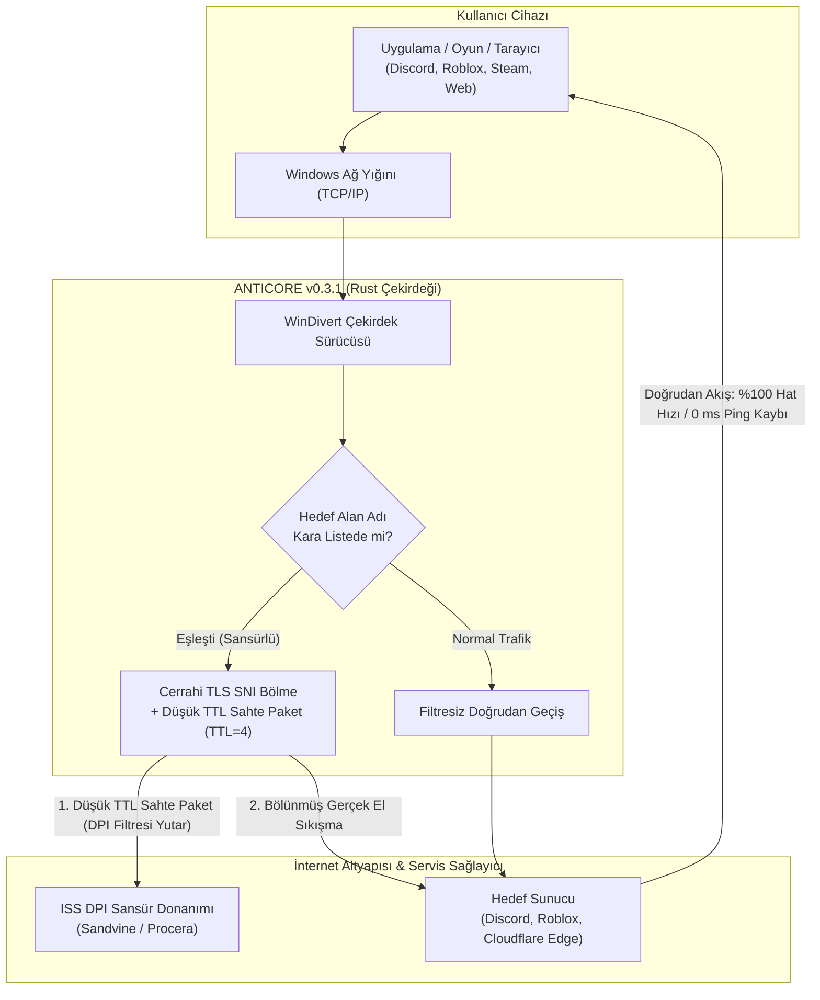

<div align="center">

<p align="center">
  
</p>

# ANTICORE

### Windows İçin Sıfır Hız Kayıplı Açık Kaynak DPI Aşma ve Ağ Özgürlüğü Motoru

[](https://github.com/MonarchDevLab/Anticore/releases/latest)
[](https://github.com/MonarchDevLab/Anticore/releases/latest)
[](https://github.com/MonarchDevLab/Anticore/releases/latest)
[](https://github.com/MonarchDevLab/Anticore)
[](https://github.com/MonarchDevLab/Anticore)
[](https://github.com/MonarchDevLab/Anticore)
[](https://github.com/MonarchDevLab/Anticore)
[](https://github.com/MonarchDevLab/Anticore/releases/latest)
[](LICENSE)

<br />

**Türkiye internet servis sağlayıcılarının sansür ve derin paket inceleme (DPI) altyapılarına karşı geliştirilmiş; trafiği üçüncü taraf uzak sunuculara yönlendirmeden, internet hızınızı ve ping değerinizi %100 koruyarak çalışan yeni nesil yerel paket manipülasyon yazılımı.**

<br />

<p align="center">
  <a href="#indirme-seçenekleri-v031"><code>[ Dağıtım Paketleri ]</code></a> &nbsp;
  <a href="#anticore-nedir-ve-ne-değildir"><code>[ Temel Mimari ]</code></a> &nbsp;
  <a href="#öne-çıkan-yetenekler"><code>[ Öne Çıkan Yetenekler ]</code></a> &nbsp;
  <a href="#nasıl-çalışır"><code>[ Çalışma Prensibi ]</code></a> &nbsp;
  <a href="#türkiye-iss-uyumluluk-ve-atlatma-matrisi"><code>[ İSS Matrisi ]</code></a> &nbsp;
  <a href="#kapsamlı-karşılaştırma-tablosu"><code>[ Karşılaştırma ]</code></a> &nbsp;
  <a href="#sıkça-sorulan-sorular-sss"><code>[ SSS ]</code></a> &nbsp;
  <a href="README.en.md"><code>[ English ]</code></a>
</p>

</div>

---

## İndirme Seçenekleri (v0.3.1)

Tüm ikili paketler doğrudan derlenmiş, yerel geliştirici yollarından arındırılmış (Zero Leakage) ve Minisign ile doğrulanmıştır.

<table>
<tr>
  <th width="33%" align="center">
    <h3>Taşınabilir (Portable)</h3>
    <em>(En Çok Tercih Edilen)</em>
  </th>
  <th width="33%" align="center">
    <h3>Kurulumlu (Setup EXE)</h3>
    <em>(Standart Kullanıcı)</em>
  </th>
  <th width="33%" align="center">
    <h3>Kurumsal (MSI)</h3>
    <em>(Sistem Yöneticileri)</em>
  </th>
</tr>
<tr>
  <td align="center" valign="top">
    Kurulum gerektirmez. Arşivi klasöre veya USB diske çıkartıp doğrudan çalıştırın. Sistemde hiçbir kayıt bırakmaz.
  </td>
  <td align="center" valign="top">
    Masaüstü kısayolu, Başlat menüsü entegrasyonu ve dahili otomatik arka plan güncelleme desteği sunar.
  </td>
  <td align="center" valign="top">
    Active Directory, Microsoft Intune veya GPO üzerinden çoklu bilgisayara sessiz ve merkezi kurulum paketi.
  </td>
</tr>
<tr>
  <td align="center" valign="middle">
    <a href="https://github.com/MonarchDevLab/Anticore/releases/latest/download/Anticore_0.3.1_x64-portable.zip"></a>
  </td>
  <td align="center" valign="middle">
    <a href="https://github.com/MonarchDevLab/Anticore/releases/latest/download/Anticore_0.3.1_x64-setup.exe"></a>
  </td>
  <td align="center" valign="middle">
    <a href="https://github.com/MonarchDevLab/Anticore/releases/latest/download/Anticore_0.3.1_x64_en-US.msi"></a>
  </td>
</tr>
<tr>
  <td align="center" valign="middle">
    <code>v0.3.1</code> • <code>Windows x64</code><br /><br />
    <code>Sıfır Kalıntı</code>
  </td>
  <td align="center" valign="middle">
    <code>v0.3.1</code> • <code>Windows x64</code><br /><br />
    <code>Otomatik Güncelleme</code>
  </td>
  <td align="center" valign="middle">
    <code>v0.3.1</code> • <code>Windows x64</code><br /><br />
    <code>GPO & Intune Uyumlu</code>
  </td>
</tr>
</table>

<p align="center">
  <b>Bağımsız İkililer:</b> &nbsp;
  <a href="https://github.com/MonarchDevLab/Anticore/releases/latest/download/Anticore.exe"><code>Anticore.exe (GUI, 15.6 MB)</code></a> &nbsp;•&nbsp;
  <a href="https://github.com/MonarchDevLab/Anticore/releases/latest/download/anticore-cli.exe"><code>anticore-cli.exe (CLI, 384 KB)</code></a> &nbsp;•&nbsp;
  <a href="https://github.com/MonarchDevLab/Anticore/releases/latest"><code>Tüm Dağıtım Arşivi</code></a>
</p>

<details>
<summary><b>SHA-256 Paket Bütünlük Özetleri (Tıklayıp Genişletin)</b></summary>
<br />

| Paket Dosyası | Boyut | SHA-256 Kriptografik Özeti |
|---|:---:|---|
| `Anticore_0.3.1_x64-portable.zip` | 6.3 MB | `40E92F9135E92586FD518AE4581E48D10A5FB365AC9593D02E396868354EF935` |
| `Anticore_0.3.1_x64-setup.exe` | 4.4 MB | `FB4F4C31E3B5B5F1FEA7D88F62ECE3267486DDDD75FEDEB0329980D40299631D` |
| `Anticore_0.3.1_x64_en-US.msi` | 6.1 MB | `7614447CF05BF3E8D7C312EC99D388999E5887CA0C2CEA7EAC42A63556335B85` |
| `Anticore.exe` | 15.6 MB | `057C65D8C6CD6A878C5472767D8A7CC6539386A1DD52B7D58F0DC229994817A6` |
| `anticore-cli.exe` | 384 KB | `16F6313E63250869267FC2BEF58AA99AACD6AAF56D52CE5AB1177DA8C9255E9D` |

```powershell
# İndirdiğiniz paketi PowerShell ile doğrulamak için:
Get-FileHash .\Anticore_0.3.1_x64-portable.zip -Algorithm SHA256
```
</details>

> [!IMPORTANT]
> **Teknik Zorunluluk — Yönetici İzni (Administrator Privilege):**
> Windows ağ kartından geçen ham ağ paketlerini çekirdek katmanında dinlemek ve manipüle etmek için açık kaynaklı `WinDivert` çekirdek sürücüsü kullanılır. Bu nedenle uygulamanın **Yönetici Olarak Çalıştırılması** gereklidir. Standart kullanıcı olarak başlatıldığında Anticore sizi uyarır ve tek tıkla kendini yetkili modda yeniden başlatabilir.

---

## Anticore Nedir ve Ne Değildir?

Discord kapatıldığında, Roblox engellendiğinde veya bilgiye erişim kısıtlandığında kullanıcıların başvurduğu klasik çözüm VPN tünelleridir. Ancak VPN protokolleri modern internet kullanımını aksatır:

<table>
<tr>
  <th width="50%" align="center">
    <h3>Geleneksel VPN Tünelleme</h3>
    <sub>(Dolaylı, Yavaş &amp; Veri Güvenliği Riskli)</sub>
  </th>
  <th width="50%" align="center">
    <h3>Anticore Cerrahi DPI Bypass</h3>
    <sub>(Doğrudan, Tam Hat Hızı &amp; Sıfır Gecikme)</sub>
  </th>
</tr>
<tr>
  <td align="center" valign="top">
    <br />
    <code>[İstemci PC]</code><br />
    &darr; <i>(Şifreli Tünel Encapsulation)</i><br />
    <code>[Yurtdışı VPN Ara Sunucusu]</code><br />
    &darr; <i>(Uzak Çıkış &amp; Ağ Darboğazı)</i><br />
    <code>[Hedef Servis / Oyun Sunucusu]</code>
    <br /><br />
  </td>
  <td align="center" valign="top">
    <br />
    <code>[İstemci PC]</code><br />
    &darr; <i>(Yalnızca İlk TLS ClientHello Parçalanır)</i><br />
    <code>[ISS Sansür / DPI Filtresi Atlatılır]</code><br />
    &darr; <i>(Doğrudan Kendi Fiber Santraliniz)</i><br />
    <code>[Hedef Servis / Oyun Sunucusu]</code>
    <br /><br />
  </td>
</tr>
<tr>
  <td align="left" valign="top">
    &bull; <b>Hat Hızı:</b> <br /><br />
    &bull; <b>Oyun Gecikmesi:</b> <br /><br />
    &bull; <b>Veri Rotası:</b> <br /><br />
    &bull; <b>Banka / e-Devlet:</b> <br /><br />
    &bull; <b>Maliyet:</b> 
  </td>
  <td align="left" valign="top">
    &bull; <b>Hat Hızı:</b> <br /><br />
    &bull; <b>Oyun Gecikmesi:</b> <br /><br />
    &bull; <b>Veri Rotası:</b> <br /><br />
    &bull; <b>Banka / e-Devlet:</b> <br /><br />
    &bull; <b>Maliyet:</b> 
  </td>
</tr>
</table>

### Anticore'un Temel Farkları
- **Tünelleme Yok:** Trafiğinizi asla üçüncü taraf bir ara sunucuya veya yurt dışı IP adresine yönlendirmez.
- **Sıfır Hız Kaybı:** Yalnızca engelli hedefe yönelik ilk bağlantı el sıkışmasını (**TLS ClientHello SNI**) manipüle eder. Bağlantı kurulduğu andan itibaren dosya indirme, oyun paketleri ve video akışı doğrudan kendi internet servis sağlayıcınız üzerinden akar. **1000 Mbps bağlantınız varsa, 1000 Mbps almaya devam edersiniz.**
- **Oyunlarda 0 ms Ping Artışı:** Doğrudan santral çıkışınızı kullandığı için oyun sunucularına olan gecikme değeriniz 1 milisaniye dahi yükselmez.
- **Banka ve e-Devlet Uyumlu:** Gerçek Türkiye IP adresiniz değişmediği için bankacılık uygulamaları, e-Devlet veya yerli yayın platformları güvenlik doğrulaması istemez ya da hesabınızı kilitlemez.

---

## Öne Çıkan Yetenekler

<table>
<tr>
<td width="50%" valign="top">


### Cerrahi Paket Manipülasyonu
*Kernel düzeyinde WinDivert sürücüsü ile ISS sansür donanımlarını atlatma.*

---

- `SNI Parçalama` &mdash; TLS ClientHello paketlerini mikroskobik TCP segmentlerine bölerek DPI birleşimini engeller.
- `TTL=4 Sahte Paket` &mdash; Filtreleme kutusunu doyuma ulaştırıp gerçek trafiği gizleyen düşük ömürlü enjeksiyon.
- `RST Düşürme & QUIC` &mdash; ISS kaynaklı sahte TCP RST koparma paketlerini sessizce filtreler.

</td>
<td width="50%" valign="top">


### 3D İzometrik Telemetri & Reaktör
*Donanım hızlandırmalı Canvas mimarisiyle saniyede 60 FPS canlı ağ izleme.*

---

- `ActivityChart3D` &mdash; Ağ verimi ve PPS (paket/sn) akışını dinamik izometrik derinlikle çizer.
- `Canlı Reaktör Küresi` &mdash; Çift uydulu, 140 derinlik parçacıklı jiroskopik durum reaktörü.
- `Pro Matrix Konsolu` &mdash; Mikrosaniye hassasiyetinde hata telemetrisi ve canlı terminal logları.

</td>
</tr>
<tr>
<td width="50%" valign="top">


### Yerel Ağ (LAN) Cihaz Paylaşımı
*Bilgisayarınızı tüm ev ve ofis için merkezi sansür atlatma ağ geçidine çevirin.*

---

- `SOCKS5 / HTTP Proxy` &mdash; Mobil, tablet ve akıllı TV'ler için `0.0.0.0:10808` yerel proxy servisi.
- `Şeffaf Hotspot Transit` &mdash; Windows Mobil Etkin Noktası üzerinden bağlı cihazlara sıfır ayarla doğrudan koruma.
- `PAC Otomasyonu` &mdash; Yalnızca yasaklı hedefleri yönlendiren dinamik Proxy Auto-Config desteği.

</td>
<td width="50%" valign="top">


### Winsock & Ağ Yığını Onarımı
*Çöken ağ adaptörleri ve kilitlenen Discord güncellemeleri için cerrahi ilk yardım.*

---

- `Tek Tıkla Sıfırlama` &mdash; `netsh winsock reset` ve `netsh int ip reset` komutlarını arayüzden çalıştırma.
- `DNS Önbellek Boşaltma` &mdash; `ipconfig /flushdns`, `/release` ve `/renew` ile ağ çakışmalarını giderme.
- `Güvenli DoH Aktivasyonu` &mdash; Cloudflare 1.1.1.1 veya Google 8.8.8.8 şifreli DNS motoru.

</td>
</tr>
<tr>
<td width="50%" valign="top">


### Dinamik Bellek Kara Listesi
*Motoru yeniden başlatmadan anında güncellenen eşzamanlı bellek mimarisi.*

---

- `Canlı Senkronizasyon` &mdash; `Arc<RwLock<Blacklist>>` yapısıyla sıfır kesintiyle anlık alan adı yönetimi.
- `Kategori Filtre Hapları` &mdash; TR Mega, Oyun, Medya ve Sosyal kategorilerine göre anında filtreleme.
- `Yedekli Topluluk Aynası` &mdash; Zapret Türkiye hostlist aynası ve yerleşik çevrimdışı yedek veritabanı.

</td>
<td width="50%" valign="top">


### Post-Quantum Kyber & Modern TLS
*En yeni nesil şifreleme standartları ve devasa paket yapılarıyla tam uyumluluk.*

---

- `Kyber / ML-KEM 768 & ECH` &mdash; Chrome/Firefox 1500+ baytlık kuantum sonrası el sıkışmalarını destekler.
- `Sentetik Test Sondaları` &mdash; Modern tarayıcı uzantılarıyla birebir uyumlu testlerle sıfır sahte negatif.
- `8 Özel Donanım Teması` &mdash; Obsidian Emerald'dan Cyberpunk Volt ve Amethyst Nebula'ya tam kişiselleştirme.

</td>
</tr>
</table>

---

## Nasıl Çalışır?

Aşağıdaki mimari akış şeması, kullanıcının başlattığı bir istekte Anticore motorunun paketleri nasıl cerrahi bir hassasiyetle işlediğini özetler:



### Dört Kademeli Savunma Mimarisi
1. **Sahte Paket Enjeksiyonu (Fake Decoy Packet):** ISS omurgasındaki filtre donanımına (Sandvine, Procera vb.) ulaşacak kadar yaşam süresine (TTL=3..4) sahip, fakat hedef sunucuya asla ulaşamayacak bir öncü paket fırlatılır. Filtre cihazı bu sahte veriyi analiz ederken arkadan gelen gerçek paketi denetlemeden geçirir.
2. **Cerrahi SNI Parçalama (SNI Splitting):** Gerçek ClientHello paketi, alan adı etiketinin (SNI) tam ortasından iki bağımsız TCP segmentine bölünür. Basit denetleyiciler paketleri bellekte birleştiremediği için hedefi tespit edemez.
3. **Sahte RST Düşürme (RST Mitigation):** Servis sağlayıcının bağlantıyı sabote etmek amacıyla enjekte ettiği yetkisiz TCP RST paketleri çekirdek sürücüsü düzeyinde yakalanıp yok edilir.
4. **QUIC / HTTP3 TLS Düşürme:** UDP tabanlı QUIC el sıkışmaları standart TLS'e düşürülerek paket kurallarının tarayıcılarda kesintisiz devrede kalması sağlanır.

---

## Türkiye İSS Uyumluluk ve Atlatma Matrisi

Türkiye'deki ana internet servis sağlayıcılarının kullandığı derin paket inceleme (DPI) donanımları ve Anticore'un optimize edilmiş çözüm stratejileri:

<table width="100%" align="center">
  <thead>
    <tr>
      <th width="22%" align="left">İnternet Servis Sağlayıcı</th>
      <th width="20%" align="left">Tespit Edilen DPI Donanımı</th>
      <th width="25%" align="left">Sansür & Filtreleme Yöntemi</th>
      <th width="21%" align="left">Varsayılan Uyumlu Profil</th>
      <th width="12%" align="center">Başarı Durumu</th>
    </tr>
  </thead>
  <tbody>
    <tr>
      <td>
        <br />
        <b>Turkcell Superonline</b>
      </td>
      <td>
        <code>Sandvine PTS</code><br />
        <sub>Policy Traffic Switch</sub>
      </td>
      <td>
        <code>SNI İnceleme</code> <code>Sahte RST</code><br />
        <sub>Düşük TTL Paket Filtresi</sub>
      </td>
      <td>
        <b>Profil 3 (Agresif)</b><br />
        <sub>Fake TTL=4 • 2-Bayt Split</sub>
      </td>
      <td align="center">
        
      </td>
    </tr>
    <tr>
      <td>
        <br />
        <b>Türk Telekom (TTNet)</b>
      </td>
      <td>
        <code>Procera / Huawei</code><br />
        <sub>PacketLogic Donanımı</sub>
      </td>
      <td>
        <code>Standart SNI</code> <code>DNS Hijack</code><br />
        <sub>ISP DNS Zehirleme Filtresi</sub>
      </td>
      <td>
        <b>Profil 1 (Standart)</b><br />
        <sub>SNI Parçalama • DoH Çözümleyici</sub>
      </td>
      <td align="center">
        
      </td>
    </tr>
    <tr>
      <td>
        <br />
        <b>Vodafone Net</b>
      </td>
      <td>
        <code>Allot / Sandvine</code><br />
        <sub>Trafik Yönetim Platformu</sub>
      </td>
      <td>
        <code>SNI Blokajı</code> <code>HTTP 302</code><br />
        <sub>IP Yönlendirme & Sahte RST</sub>
      </td>
      <td>
        <b>Profil 2 (Fake + RST)</b><br />
        <sub>Sahte Paket • RST Düşürme</sub>
      </td>
      <td align="center">
        
      </td>
    </tr>
    <tr>
      <td>
        <br />
        <b>Türksat Kablonet</b>
      </td>
      <td>
        <code>Procera PacketLogic</code><br />
        <sub>Omurga Denetim Sistemi</sub>
      </td>
      <td>
        <code>SNI Filtreleme</code> <code>QUIC Engeli</code><br />
        <sub>UDP/443 Kısıtlaması</sub>
      </td>
      <td>
        <b>Profil 1 (Standart)</b><br />
        <sub>SNI Parçalama • QUIC Düşürme</sub>
      </td>
      <td align="center">
        
      </td>
    </tr>
    <tr>
      <td>
        <br />
        <b>TurkNet</b>
      </td>
      <td>
        <code>Bağımsız Omurga</code><br />
        <sub>Santral Düzeyi Filtreleme</sub>
      </td>
      <td>
        <code>DNS Zehirleme</code> <code>Kısmi SNI</code><br />
        <sub>Yerel Yönlendirme</sub>
      </td>
      <td>
        <b>Profil 1 (Standart)</b><br />
        <sub>DoH Entegrasyonu • Standart Split</sub>
      </td>
      <td align="center">
        
      </td>
    </tr>
    <tr>
      <td>
        <br />
        <b>Millenicom & Diğerleri</b>
      </td>
      <td>
        <code>TT / Superonline</code><br />
        <sub>Taşıyıcı Altyapı Omurgası</sub>
      </td>
      <td>
        <code>Omurga Bağımlı</code><br />
        <sub>Ana Taşıyıcı Filtreleme Kuralları</sub>
      </td>
      <td>
        <b>Profil 1 veya Profil 3</b><br />
        <sub>Altyapı Tipine Göre Seçim</sub>
      </td>
      <td align="center">
        
      </td>
    </tr>
  </tbody>
</table>

---

## Kapsamlı Karşılaştırma Tablosu

<table width="100%" align="center">
  <thead>
    <tr>
      <th width="28%" align="left">Değerlendirme Kriteri</th>
      <th width="18%" align="center">Geleneksel VPN</th>
      <th width="18%" align="center">GoodbyeDPI</th>
      <th width="18%" align="center">SplitWire</th>
      <th width="18%" align="center" bgcolor="#0d231a">
        
      </th>
    </tr>
  </thead>
  <tbody>
    <tr>
      <td>
        <b>Bant Genişliği & İndirme Hızı</b><br />
        <sub>Ağ çıkışında hız sınırlaması veya paket kaybı</sub>
      </td>
      <td align="center">
        <br />
        <sub>Şifreleme Tüneli Kaybı</sub>
      </td>
      <td align="center">
        <br />
        <sub>%100 Hat Hızı</sub>
      </td>
      <td align="center">
        <br />
        <sub>%100 Hat Hızı</sub>
      </td>
      <td align="center">
        <br />
        <b>%100 Koruma (Sıfır Kayıp)</b>
      </td>
    </tr>
    <tr>
      <td>
        <b>Oyun İçi Ping & Gecikme</b><br />
        <sub>Valorant, CS2, LoL ve Steam gecikme etkisi</sub>
      </td>
      <td align="center">
        <br />
        <sub>Yüksek Sunucu Gecikmesi</sub>
      </td>
      <td align="center">
        <br />
        <sub>Doğrudan Çıkış</sub>
      </td>
      <td align="center">
        <br />
        <sub>Doğrudan Çıkış</sub>
      </td>
      <td align="center">
        <br />
        <b>Sıfır Ek Ping (Doğrudan)</b>
      </td>
    </tr>
    <tr>
      <td>
        <b>Modern Grafik Arayüz (GUI)</b><br />
        <sub>Kullanıcı dostu yönetim ve durum paneli</sub>
      </td>
      <td align="center">
        <code>Standart SaaS UI</code><br />
        <sub>Klasik Web Formu</sub>
      </td>
      <td align="center">
        <br />
        <sub>.cmd Siyah Ekran</sub>
      </td>
      <td align="center">
        <code>Temel Form UI</code><br />
        <sub>WinForms / WPF Arayüz</sub>
      </td>
      <td align="center">
        <br />
        <b>Çift Modlu Donanım Paneli</b>
      </td>
    </tr>
    <tr>
      <td>
        <b>3D Telemetri & İzometrik Grafik</b><br />
        <sub>Gerçek zamanlı görsel veri akışı ve reaktör</sub>
      </td>
      <td align="center">
        
      </td>
      <td align="center">
        
      </td>
      <td align="center">
        
      </td>
      <td align="center">
        <br />
        <b>Canlı Reaktör Orbu</b>
      </td>
    </tr>
    <tr>
      <td>
        <b>Yerel Ağ (LAN) Paylaşımı</b><br />
        <sub>Mobil cihazlar, konsol ve TV'ler için ağ geçidi</sub>
      </td>
      <td align="center">
        <code>Karmaşık Yönlendirme</code><br />
        <sub>Sanal Adaptör Paylaşımı</sub>
      </td>
      <td align="center">
        
      </td>
      <td align="center">
        
      </td>
      <td align="center">
        <br />
        <b>Hotspot Transit Geçişi</b>
      </td>
    </tr>
    <tr>
      <td>
        <b>Winsock & TCP/IP Yığını Onarımı</b><br />
        <sub>Ağ arızaları ve kilitlenmelerini tek tıkla çözme</sub>
      </td>
      <td align="center">
        
      </td>
      <td align="center">
        
      </td>
      <td align="center">
        
      </td>
      <td align="center">
        <br />
        <b>Tek Tıkla Ağ Onarımı</b>
      </td>
    </tr>
    <tr>
      <td>
        <b>Dinamik Bellek İçi Kara Liste</b><br />
        <sub>Uygulamayı kapatmadan anında alan adı ekleme</sub>
      </td>
      <td align="center">
        <code>Yeniden Bağlantı</code><br />
        <sub>Tünel Sıfırlama Şart</sub>
      </td>
      <td align="center">
        <br />
        <sub>Servis Yeniden Başlatma</sub>
      </td>
      <td align="center">
        <br />
        <sub>Servis Yeniden Başlatma</sub>
      </td>
      <td align="center">
        <br />
        <b>Arc&lt;RwLock&gt; Canlı Bellek</b>
      </td>
    </tr>
    <tr>
      <td>
        <b>Sistem Tepsisi (Tray) Flyout Paneli</b><br />
        <sub>Görev çubuğundan kompakt hızlı erişim</sub>
      </td>
      <td align="center">
        <code>Kısmi Menü</code><br />
        <sub>Basit Bağlan/Kop Menüsü</sub>
      </td>
      <td align="center">
        
      </td>
      <td align="center">
        <code>Temel Menü</code><br />
        <sub>Sağ Tık Menü Öğeleri</sub>
      </td>
      <td align="center">
        <br />
        <b>340x460px Komuta Kokpiti</b>
      </td>
    </tr>
    <tr>
      <td>
        <b>Windows Hizmet (Service) Modu</b><br />
        <sub>Arka planda sessiz daemon olarak çalışma</sub>
      </td>
      <td align="center">
        <code>Kısmi Hizmet</code><br />
        <sub>Arka Plan Sürücüsü</sub>
      </td>
      <td align="center">
        <code>Manuel sc.exe</code><br />
        <sub>Konsol Komutları Gerekli</sub>
      </td>
      <td align="center">
        
      </td>
      <td align="center">
        <br />
        <b>Arayüzden Tek Tık Yönetim</b>
      </td>
    </tr>
    <tr>
      <td>
        <b>Discord DNS & RTC Onarımı</b><br />
        <sub>Kilitlenen güncellemeler ve ses kanalı hataları</sub>
      </td>
      <td align="center">
        
      </td>
      <td align="center">
        
      </td>
      <td align="center">
        
      </td>
      <td align="center">
        <br />
        <b>RTC & Zehirlenme Çözümü</b>
      </td>
    </tr>
    <tr>
      <td>
        <b>Bellek Tüketimi (RAM)</b><br />
        <sub>Çalışma esnasında tüketilen bellek miktarı</sub>
      </td>
      <td align="center">
        <br />
        <sub>Ağır SaaS Katmanı</sub>
      </td>
      <td align="center">
        <br />
        <sub>Salt C Konsolu</sub>
      </td>
      <td align="center">
        <br />
        <sub>.NET Çalışma Zamanı</sub>
      </td>
      <td align="center">
        <br />
        <b>Rust Çekirdeği + WebView2</b>
      </td>
    </tr>
    <tr>
      <td>
        <b>Dahili Otomatik Güncelleme</b><br />
        <sub>Yeni sürümleri güvenle denetleme ve kurma</sub>
      </td>
      <td align="center">
        
      </td>
      <td align="center">
        <br />
        <sub>Manuel Zip İndirme</sub>
      </td>
      <td align="center">
        <br />
        <sub>Manuel Takip</sub>
      </td>
      <td align="center">
        <br />
        <b>İmzalı GitHub Updater</b>
      </td>
    </tr>
    <tr>
      <td>
        <b>Donanım Temaları</b><br />
        <sub>Görsel morfoloji ve arayüz kişiselleştirme</sub>
      </td>
      <td align="center">
        <code>Açık / Koyu</code>
      </td>
      <td align="center">
        
      </td>
      <td align="center">
        
      </td>
      <td align="center">
        <br />
        <b>Cyber-Hardware Morfoloji</b>
      </td>
    </tr>
  </tbody>
</table>

---

## Sistem Tepsisi (Tray Quick Panel)

Ana uygulama penceresini açmadan, Windows görev çubuğunun sağ alt köşesinden tek tıklamayla tam operasyonel kontrol sağlayabilirsiniz:

<table width="100%" align="center">
  <tr>
    <td width="55%" valign="top">

<pre><code>┌────────────────────────────────────────────────────────┐
│  ANTICORE v0.3.1 // QUICK COMMAND COCKPIT      [—] [×] │
├────────────────────────────────────────────────────────┤
│  MOTOR DURUMU : ● KORUMA AKTİF (KERNEL ATTACHED)       │
│  [================ CANLI REAKTÖR NABZI ================] │
│                                                        │
│  Aktif Profil : [ Profil 3 — Superonline Agresif ]    │
│  Ağ Gecikmesi : 0.12 ms       Verim (PPS) : 1,480 p/s  │
│  İşlenen Paket: 24,190 pkts   Çalışma     : 02:45:12   │
│  Aktif Kural  : Fake TTL=4 + 2-Byte SNI Segmentation   │
│                                                        │
│  [ ⏹ DURDUR ]       [ 🔧 AĞ ONARIMI ]       [ ⚙ KOKPİT ] │
└────────────────────────────────────────────────────────┘</code></pre>
<br />
<div align="center">
  
  
  
</div>

</td>
<td width="45%" valign="top">


### Masaüstü Hızlı Komuta İstasyonu
*Ana pencere yükü olmadan doğrudan görev çubuğu üzerinden anında müdahale.*

---

- `Sol Tık Hızlı Flyout` &mdash; Görev çubuğunun bildirim alanına sol tıklandığında 340x460px boyutunda donanım hızlandırmalı mini arayüz açılır. Odak dışı bir yere tıklandığında veya `Esc` tuşuna basıldığında kendiliğinden pürüzsüzce kapanır.
- `Anti-Flicker Çift Tık Koruması` &mdash; Windows kabuğunun ardışık tıklamalarında oluşan pencere titremesini (flicker) engelleyen debounced durum yönetimi; çift tıklandığında doğrudan ana kontrol merkezini öne getirir.
- `Rust IPC Canlı Telemetri` &mdash; Arka planda çalışan WinDivert sürücüsü ve Rust motorundan saniyelik paket telemetrisini ve reaktör nabzını sıfır CPU ek yüküyle kokpite yansıtır.

</td>
</tr>
</table>

---

## Sıkça Sorulan Sorular (SSS)

<details>
<summary><b>1. Anticore çevrimiçi oyunlarda (Valorant, CS2, LoL) ban sebebi midir?</b></summary>
<br />
<b>Kesinlikle hayır.</b> Anticore oyun dosyalarına, oyun süreçlerinin belleğine (RAM) veya sunucu paketlerine müdahale etmez. Yalnızca kara listenizde bulunan engelli web adreslerinin ilk TLS el sıkışmasını parçalar. Oyun sunucuları ile aranızdaki UDP/TCP trafiği hiçbir filtreye uğramadan doğrudan akar.
</details>

<details>
<summary><b>2. Antivirüs yazılımları neden uyarı verebilir?</b></summary>
<br />
Anticore, paketleri ağ kartı seviyesinde yakalayabilmek için açık kaynaklı ve dünyaca kabul görmüş <code>WinDivert</code> sürücüsünü kullanır. Çekirdek düzeyinde paket yönlendiren tüm meşru güvenlik araçları (Wireshark, GoodbyeDPI vb.) gibi, bazı antivirüs motorları bu sürücüyü "Heuristic" olarak işaretleyebilir. Anticore'un tüm kaynak kodları açıktır, GitHub Actions derlemeleri şeffaftır ve ikili dosyalar dijital olarak imzalanmıştır.
</details>

<details>
<summary><b>3. Neden Yönetici (Administrator) izni gerekiyor?</b></summary>
<br />
Windows işletim sisteminde ağ sürücüsü başlatmak (Kernel Driver Load) ve ham soket paketlerini manipüle etmek Microsoft tarafından yalnızca Yönetici yetkisine sahip süreçlere izin verilen bir güvenlik kuralıdır. Bu durum teknik bir zorunluluktur.
</details>

<details>
<summary><b>4. Mobil cihazımı (iOS / Android) nasıl korumaya alabilirim?</b></summary>
<br />
İki pratik yöntem mevcuttur:<br />
1. <b>SOCKS5 / PAC Proxy:</b> Bilgisayarınızda Anticore çalışırken telefonunuzun Wi-Fi ayarlarından HTTP Vekil Sunucu kısmına bilgisayarınızın yerel IP adresini (örn: <code>192.168.1.50</code>) ve port olarak <code>10808</code> yazın.<br />
2. <b>Windows Mobil Etkin Nokta (Hotspot):</b> Bilgisayarınızdan interneti paylaşıp telefonunuzla bu ağa bağlandığınızda, Anticore transit geçişi otomatik devreye girer ve telefonda ek hiçbir ayar yapmadan engeller aşılır.
</details>

<details>
<summary><b>5. Discord "Starting..." döngüsünde kalıyor, ne yapmalıyım?</b></summary>
<br />
Servis sağlayıcınızın Discord CDN alan adlarını yanlış IP'ye (BTK uyarı sayfası) yönlendirmesinden (DNS zehirlemesi) kaynaklanır. Anticore içerisindeki <b>Ağ Onarımı</b> sekmesine gidin; <b>"Güvenli DNS Uygula"</b> ve <b>"Ağ Yığınını Sıfırla"</b> butonlarına basarak DNS önbelleğinizi temizleyin.
</details>

---

## Güvenlik ve Bütünlük Doğrulama

Resmi GitHub Releases sayfasından indirdiğiniz kurulum ve taşınabilir paketleri aşağıdaki açık anahtar ile Minisign kullanarak doğrulayabilirsiniz:

```text
dW50cnVzdGVkIGNvbW1lbnQ6IG1pbmlzaWduIHB1YmxpYyBrZXk6IDE1QTRFREEwMDFGNDFFNTMKUldSVEh2UUJvTzJrRmE3UGFDdG81YWtnYUdYSkhFdWQxVGJ0V2VVdHFKNDJvaGZRWS90TWx3ejMK
```

Doğrulama komutu:
```powershell
minisign -Vm Anticore_0.3.1_x64-setup.exe -p anticore.key.pub
```

Güvenlik politikamız ve açık bildirim süreçlerimiz için [SECURITY.md](SECURITY.md) belgesini inceleyebilirsiniz.

---

## Kaynak Koddan Derleme

Kendi ikili dosyalarınızı temiz bir ortamda derlemek isterseniz:

### Önkoşullar
- Rust 1.80+ (`rustup toolchain install stable`)
- Node.js 20+ LTS (`npm`)
- Visual Studio 2022 C++ Derleme Araçları (MSVC x64)

```powershell
# 1. Depoyu klonlayın
git clone https://github.com/MonarchDevLab/Anticore.git
cd Anticore/antikor

# 2. Rust çekirdek birim ve entegrasyon testlerini çalıştırın
cd engine
cargo test --workspace

# 3. Bağımsız motor ikilisini derleyin
cargo build --release --workspace

# 4. Masaüstü arayüzünü test edin ve paketleyin
cd ../desktop
npm install
npm test
npm run tauri build
```

---

## Lisans ve Yasal Bildirim

Bu proje [MIT Lisansı](LICENSE) altında açık kaynak olarak sunulmaktadır.

- **WinDivert:** [LGPLv3](https://reqrypt.org/windivert.html) lisansına sahip bağımsız ağ filtreleme sürücüsüdür; dinamik bağlantı ile harici olarak yüklenir.
- **WebView2:** Microsoft Corporation mülkiyetindedir.
- **Yasal Sorumluluk:** Anticore; ağ performansı analizi, kişisel veri mahremiyeti ve sansürsüz bilgiye erişim ilkeleri doğrultusunda geliştirilmiştir. Kullanıcıların yerel yasal düzenlemelere uygun hareket etmesi kendi sorumluluğundadır.

<div align="center">
  <br />
  <sub>Kod mimarisi ve fikri haklar istisnasız <b>Monolith Works</b>'e aittir. Resmi açık kaynak dağıtım kanalı <b>MonarchDevLab</b>'dir.</sub>
  <br />
  <br />
</div>
