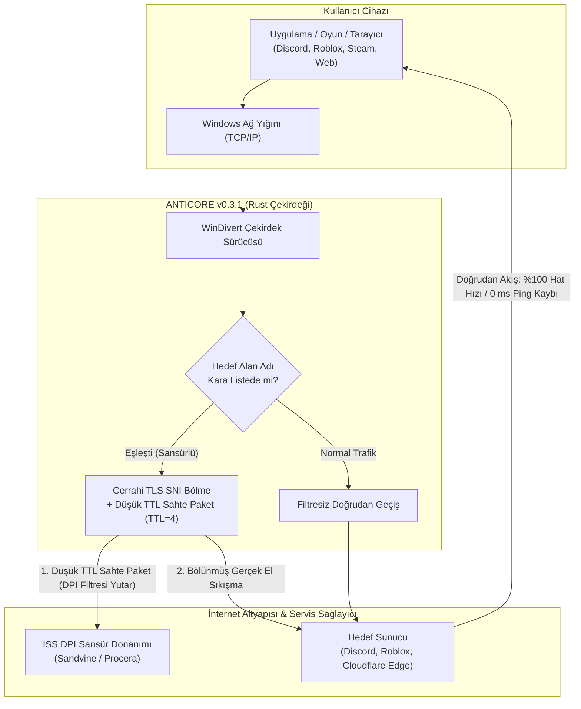

<div align="center">

<p align="center">
  
</p>

# ANTICORE

### Windows İçin Sıfır Hız Kayıplı Açık Kaynak DPI Aşma ve Ağ Özgürlüğü Motoru

[](https://github.com/MonarchDevLab/Anticore/releases/latest)
[](https://github.com/MonarchDevLab/Anticore/releases/latest)
[](https://github.com/MonarchDevLab/Anticore/releases/latest)
[](https://github.com/MonarchDevLab/Anticore)
[](https://github.com/MonarchDevLab/Anticore)
[](https://github.com/MonarchDevLab/Anticore)
[](https://github.com/MonarchDevLab/Anticore)
[](https://github.com/MonarchDevLab/Anticore/releases/latest)
[](LICENSE)

<br />

**Türkiye internet servis sağlayıcılarının sansür ve derin paket inceleme (DPI) altyapılarına karşı geliştirilmiş; trafiği üçüncü taraf uzak sunuculara yönlendirmeden, internet hızınızı ve ping değerinizi %100 koruyarak çalışan yeni nesil yerel paket manipülasyon yazılımı.**

<br />

<p align="center">
  <a href="#indirme-seçenekleri-v031"><code>[ Dağıtım Paketleri ]</code></a> &nbsp;
  <a href="#anticore-nedir-ve-ne-değildir"><code>[ Temel Mimari ]</code></a> &nbsp;
  <a href="#öne-çıkan-yetenekler"><code>[ Öne Çıkan Yetenekler ]</code></a> &nbsp;
  <a href="#nasıl-çalışır"><code>[ Çalışma Prensibi ]</code></a> &nbsp;
  <a href="#türkiye-iss-uyumluluk-ve-atlatma-matrisi"><code>[ İSS Matrisi ]</code></a> &nbsp;
  <a href="#kapsamlı-karşılaştırma-tablosu"><code>[ Karşılaştırma ]</code></a> &nbsp;
  <a href="#sıkça-sorulan-sorular-sss"><code>[ SSS ]</code></a> &nbsp;
  <a href="README.en.md"><code>[ English ]</code></a>
</p>

</div>

---

## İndirme Seçenekleri (v0.3.1)

Tüm ikili paketler doğrudan derlenmiş, yerel geliştirici yollarından arındırılmış (Zero Leakage) ve Minisign ile doğrulanmıştır.

<table>
<tr>
  <th width="33%" align="center">
    <h3>Taşınabilir (Portable)</h3>
    <em>(En Çok Tercih Edilen)</em>
  </th>
  <th width="33%" align="center">
    <h3>Kurulumlu (Setup EXE)</h3>
    <em>(Standart Kullanıcı)</em>
  </th>
  <th width="33%" align="center">
    <h3>Kurumsal (MSI)</h3>
    <em>(Sistem Yöneticileri)</em>
  </th>
</tr>
<tr>
  <td align="center" valign="top">
    Kurulum gerektirmez. Arşivi klasöre veya USB diske çıkartıp doğrudan çalıştırın. Sistemde hiçbir kayıt bırakmaz.
  </td>
  <td align="center" valign="top">
    Masaüstü kısayolu, Başlat menüsü entegrasyonu ve dahili otomatik arka plan güncelleme desteği sunar.
  </td>
  <td align="center" valign="top">
    Active Directory, Microsoft Intune veya GPO üzerinden çoklu bilgisayara sessiz ve merkezi kurulum paketi.
  </td>
</tr>
<tr>
  <td align="center" valign="middle">
    <a href="https://github.com/MonarchDevLab/Anticore/releases/latest/download/Anticore_0.3.1_x64-portable.zip"></a>
  </td>
  <td align="center" valign="middle">
    <a href="https://github.com/MonarchDevLab/Anticore/releases/latest/download/Anticore_0.3.1_x64-setup.exe"></a>
  </td>
  <td align="center" valign="middle">
    <a href="https://github.com/MonarchDevLab/Anticore/releases/latest/download/Anticore_0.3.1_x64_en-US.msi"></a>
  </td>
</tr>
<tr>
  <td align="center" valign="middle">
    <code>v0.3.1</code> • <code>Windows x64</code><br /><br />
    <code>Sıfır Kalıntı</code>
  </td>
  <td align="center" valign="middle">
    <code>v0.3.1</code> • <code>Windows x64</code><br /><br />
    <code>Otomatik Güncelleme</code>
  </td>
  <td align="center" valign="middle">
    <code>v0.3.1</code> • <code>Windows x64</code><br /><br />
    <code>GPO & Intune Uyumlu</code>
  </td>
</tr>
</table>

<p align="center">
  <b>Bağımsız İkililer:</b> &nbsp;
  <a href="https://github.com/MonarchDevLab/Anticore/releases/latest/download/Anticore.exe"><code>Anticore.exe (GUI, 15.6 MB)</code></a> &nbsp;•&nbsp;
  <a href="https://github.com/MonarchDevLab/Anticore/releases/latest/download/anticore-cli.exe"><code>anticore-cli.exe (CLI, 384 KB)</code></a> &nbsp;•&nbsp;
  <a href="https://github.com/MonarchDevLab/Anticore/releases/latest"><code>Tüm Dağıtım Arşivi</code></a>
</p>

<details>
<summary><b>SHA-256 Paket Bütünlük Özetleri (Tıklayıp Genişletin)</b></summary>
<br />

| Paket Dosyası | Boyut | SHA-256 Kriptografik Özeti |
|---|:---:|---|
| `Anticore_0.3.1_x64-portable.zip` | 6.3 MB | `40E92F9135E92586FD518AE4581E48D10A5FB365AC9593D02E396868354EF935` |
| `Anticore_0.3.1_x64-setup.exe` | 4.4 MB | `FB4F4C31E3B5B5F1FEA7D88F62ECE3267486DDDD75FEDEB0329980D40299631D` |
| `Anticore_0.3.1_x64_en-US.msi` | 6.1 MB | `7614447CF05BF3E8D7C312EC99D388999E5887CA0C2CEA7EAC42A63556335B85` |
| `Anticore.exe` | 15.6 MB | `057C65D8C6CD6A878C5472767D8A7CC6539386A1DD52B7D58F0DC229994817A6` |
| `anticore-cli.exe` | 384 KB | `16F6313E63250869267FC2BEF58AA99AACD6AAF56D52CE5AB1177DA8C9255E9D` |

```powershell
# İndirdiğiniz paketi PowerShell ile doğrulamak için:
Get-FileHash .\Anticore_0.3.1_x64-portable.zip -Algorithm SHA256
```
</details>

> [!IMPORTANT]
> **Teknik Zorunluluk — Yönetici İzni (Administrator Privilege):**
> Windows ağ kartından geçen ham ağ paketlerini çekirdek katmanında dinlemek ve manipüle etmek için açık kaynaklı `WinDivert` çekirdek sürücüsü kullanılır. Bu nedenle uygulamanın **Yönetici Olarak Çalıştırılması** gereklidir. Standart kullanıcı olarak başlatıldığında Anticore sizi uyarır ve tek tıkla kendini yetkili modda yeniden başlatabilir.

---

## Anticore Nedir ve Ne Değildir?

Discord kapatıldığında, Roblox engellendiğinde veya bilgiye erişim kısıtlandığında kullanıcıların başvurduğu klasik çözüm VPN tünelleridir. Ancak VPN protokolleri modern internet kullanımını aksatır:

<table>
<tr>
  <th width="50%" align="center">
    <h3>Geleneksel VPN Tünelleme</h3>
    <sub>(Dolaylı, Yavaş &amp; Veri Güvenliği Riskli)</sub>
  </th>
  <th width="50%" align="center">
    <h3>Anticore Cerrahi DPI Bypass</h3>
    <sub>(Doğrudan, Tam Hat Hızı &amp; Sıfır Gecikme)</sub>
  </th>
</tr>
<tr>
  <td align="center" valign="top">
    <br />
    <code>[İstemci PC]</code><br />
    &darr; <i>(Şifreli Tünel Encapsulation)</i><br />
    <code>[Yurtdışı VPN Ara Sunucusu]</code><br />
    &darr; <i>(Uzak Çıkış &amp; Ağ Darboğazı)</i><br />
    <code>[Hedef Servis / Oyun Sunucusu]</code>
    <br /><br />
  </td>
  <td align="center" valign="top">
    <br />
    <code>[İstemci PC]</code><br />
    &darr; <i>(Yalnızca İlk TLS ClientHello Parçalanır)</i><br />
    <code>[ISS Sansür / DPI Filtresi Atlatılır]</code><br />
    &darr; <i>(Doğrudan Kendi Fiber Santraliniz)</i><br />
    <code>[Hedef Servis / Oyun Sunucusu]</code>
    <br /><br />
  </td>
</tr>
<tr>
  <td align="left" valign="top">
    &bull; <b>Hat Hızı:</b> <br /><br />
    &bull; <b>Oyun Gecikmesi:</b> <br /><br />
    &bull; <b>Veri Rotası:</b> <br /><br />
    &bull; <b>Banka / e-Devlet:</b> <br /><br />
    &bull; <b>Maliyet:</b> 
  </td>
  <td align="left" valign="top">
    &bull; <b>Hat Hızı:</b> <br /><br />
    &bull; <b>Oyun Gecikmesi:</b> <br /><br />
    &bull; <b>Veri Rotası:</b> <br /><br />
    &bull; <b>Banka / e-Devlet:</b> <br /><br />
    &bull; <b>Maliyet:</b> 
  </td>
</tr>
</table>

### Anticore'un Temel Farkları
- **Tünelleme Yok:** Trafiğinizi asla üçüncü taraf bir ara sunucuya veya yurt dışı IP adresine yönlendirmez.
- **Sıfır Hız Kaybı:** Yalnızca engelli hedefe yönelik ilk bağlantı el sıkışmasını (**TLS ClientHello SNI**) manipüle eder. Bağlantı kurulduğu andan itibaren dosya indirme, oyun paketleri ve video akışı doğrudan kendi internet servis sağlayıcınız üzerinden akar. **1000 Mbps bağlantınız varsa, 1000 Mbps almaya devam edersiniz.**
- **Oyunlarda 0 ms Ping Artışı:** Doğrudan santral çıkışınızı kullandığı için oyun sunucularına olan gecikme değeriniz 1 milisaniye dahi yükselmez.
- **Banka ve e-Devlet Uyumlu:** Gerçek Türkiye IP adresiniz değişmediği için bankacılık uygulamaları, e-Devlet veya yerli yayın platformları güvenlik doğrulaması istemez ya da hesabınızı kilitlemez.

---

## Öne Çıkan Yetenekler

<table>
<tr>
<td width="50%" valign="top">

### 01 // Cerrahi Paket Manipülasyonu
- **TLS ClientHello SNI Parçalama:** Alan adı taşıyan ilk paket, DPI kutularının birleştiremeyeceği mikro parçalara ayrılır.
- **TTL=4 Sahte Paket Enjeksiyonu:** Filtre cihazını meşgul edip gerçek paketi görmesini engelleyen düşük ömürlü sahte paketler üretilir.
- **RST Düşürme & QUIC Bypass:** ISS tarafından gönderilen sahte bağlantı koparma (TCP RST) paketleri sisteme ulaşmadan sessizce düşürülür.

</td>
<td width="50%" valign="top">

### 02 // 3D İzometrik Telemetri & Reaktör
- **3D Canvas İzometrik Grafik:** Canlı ağ verimini ve saniye başına paket sayısını (PPS) dinamik derinlik ve gölgelendirmeyle görselleştiren `ActivityChart3D`.
- **Canlı Reaktör Durum Küresi:** Çift uydulu, 140 derinlik sıralı parçacıklı ve jiroskopik yörünge halkalı interaktif durum göstergesi.
- **Pro Matrix Konsolu:** Mikrosaniye hassasiyetinde hata telemetrisi ve terminal log akışı.

</td>
</tr>
<tr>
<td width="50%" valign="top">

### 03 // Yerel Ağ (LAN) Cihaz Paylaşımı
- **Tüm Ev Ağına DPI Koruması:** Bilgisayarınızı yerel sansür atlatma ağ geçidine dönüştürün.
- **SOCKS5 & HTTP PAC Proxy:** Wi-Fi ağındaki telefon, tablet ve televizyonlar için `0.0.0.0:10808` üzerinden yerel vekil sunucu.
- **Şeffaf Hotspot Transit:** Windows Mobil Etkin Noktası açıldığında bağlı cihazların paketlerini doğrudan WinDivert motorundan geçirerek mobil cihazda sıfır konfigürasyonla DPI aşma.

</td>
<td width="50%" valign="top">

### 04 // Winsock & Ağ Yığını Onarımı
- **Tek Tıkla Sistem Kurtarma:** Bozulan ağ adaptörleri, çöken TCP/IP yığınları ve kilitlenen Discord güncellemeleri ("Starting...") için yerleşik onarım paneli.
- **Netsh & IP Reset:** Doğrudan arayüz üzerinden `netsh winsock reset`, `netsh int ip reset` ve `ipconfig /flushdns`, `/release`, `/renew` çalıştırma.
- **Otomatik DNS Yapılandırması:** Cloudflare 1.1.1.1 veya Google 8.8.8.8 ile şifreli DoH aktivasyonu.

</td>
</tr>
<tr>
<td width="50%" valign="top">

### 05 // Dinamik Bellek Kara Listesi
- **Kesintisiz Bellek Senkronizasyonu:** Motor çalışırken eklenen/silinen alan adları `Arc<RwLock<Blacklist>>` ile motoru durdurmadan anında çekirdeğe işlenir.
- **2 Sütunlu Duyarlı Izgara:** Alan adı rozetleri, küre göstergeleri, hızlı silme butonları ve kategori filtre hapları (TR Mega, Oyun, Medya, Sosyal).
- **Yedekli Topluluk Listesi:** Zapret Türkiye hostlist aynası ve bağlantı kopukluğunda yerleşik offline yedek veritabanı.

</td>
<td width="50%" valign="top">

### 06 // Post-Quantum Kyber & Modern TLS
- **Kyber / ML-KEM 768 & ECH:** Chrome 124+ ve Firefox 128+ ile gelen 1500+ baytlık dev kriptografik el sıkışmalarını TCP MSS sınırları boyunca kusursuz birleştirip filtreler.
- **Gelişmiş Sentetik Test Sondaları:** Blokaj tespit motorunda modern tarayıcı uzantılarıyla birebir uyumlu el sıkışma sondalarıyla sıfır sahte negatif.
- **8 Donanım Teması:** Obsidian Emerald, Amber CRT, Cobalt Matrix, Cyberpunk Volt, Quiet Luxury, Crimson Hazard, Amethyst Nebula, Titanium Lab.

</td>
</tr>
</table>

---

## Nasıl Çalışır?

Aşağıdaki mimari akış şeması, kullanıcının başlattığı bir istekte Anticore motorunun paketleri nasıl cerrahi bir hassasiyetle işlediğini özetler:



### Dört Kademeli Savunma Mimarisi
1. **Sahte Paket Enjeksiyonu (Fake Decoy Packet):** ISS omurgasındaki filtre donanımına (Sandvine, Procera vb.) ulaşacak kadar yaşam süresine (TTL=3..4) sahip, fakat hedef sunucuya asla ulaşamayacak bir öncü paket fırlatılır. Filtre cihazı bu sahte veriyi analiz ederken arkadan gelen gerçek paketi denetlemeden geçirir.
2. **Cerrahi SNI Parçalama (SNI Splitting):** Gerçek ClientHello paketi, alan adı etiketinin (SNI) tam ortasından iki bağımsız TCP segmentine bölünür. Basit denetleyiciler paketleri bellekte birleştiremediği için hedefi tespit edemez.
3. **Sahte RST Düşürme (RST Mitigation):** Servis sağlayıcının bağlantıyı sabote etmek amacıyla enjekte ettiği yetkisiz TCP RST paketleri çekirdek sürücüsü düzeyinde yakalanıp yok edilir.
4. **QUIC / HTTP3 TLS Düşürme:** UDP tabanlı QUIC el sıkışmaları standart TLS'e düşürülerek paket kurallarının tarayıcılarda kesintisiz devrede kalması sağlanır.

---

## Türkiye İSS Uyumluluk ve Atlatma Matrisi

Türkiye'deki ana internet servis sağlayıcılarının kullandığı derin paket inceleme (DPI) donanımları ve Anticore'un optimize edilmiş çözüm stratejileri:

| İnternet Servis Sağlayıcı | Tespit Edilen DPI Altyapısı | Sansür & Engelleme Yöntemi | Varsayılan Uyumlu Profil | Başarı Durumu |
|---|---|---|---|:---:|
| **Turkcell Superonline** | Sandvine Policy Traffic Switch (PTS) | SNI İnceleme + Sahte RST + Düşük TTL Filtresi | `Profil 3 (Superonline Agresif)`<br />*Fake TTL=4 + 2-Bayt Segmentasyon* | **%100 Başarılı** |
| **Türk Telekom (TTNet)** | Procera PacketLogic / Huawei | Standart SNI Blokajı + ISP DNS Zehirleme | `Profil 1 (Standart TLS Split)`<br />*SNI Parçalama + DoH Çözümleyici* | **%100 Başarılı** |
| **Vodafone Net** | Allot Communications / Sandvine | SNI Blokajı + IP Yönlendirme | `Profil 2 (Gelişmiş Fake + RST Drop)`<br />*Sahte Paket + RST Engelleme* | **%100 Başarılı** |
| **Türksat Kablonet** | Procera PacketLogic | SNI Filtreleme + QUIC Engelleme | `Profil 1 (Standart TLS Split)`<br />*SNI Parçalama + QUIC Düşürme* | **%100 Başarılı** |
| **TurkNet** | Bağımsız Omurga / Santral Filtreleri | DNS Zehirleme + Kısmi SNI | `Profil 1 (Standart TLS Split)`<br />*DoH + Standart Parçalama* | **%100 Başarılı** |
| **Millenicom & Diğerleri** | Türk Telekom / Superonline Altyapısı | İlgili omurga sağlayıcısına bağlı | `Profil 1` veya `Profil 3` | **%100 Başarılı** |

---

## Kapsamlı Karşılaştırma Tablosu

| Değerlendirme Kriteri | Geleneksel VPN | GoodbyeDPI | SplitWire | ANTICORE v0.3.1 |
|---|:---:|:---:|:---:|:---:|
| **Bant Genişliği & İndirme Hızı** | %50 - %80 Düşüş | Tam Hat Hızı (%100) | Tam Hat Hızı (%100) | **Tam Hat Hızı (%100 Koruma)** |
| **Oyun İçi Ping & Gecikme** | +50 ms ila 200 ms | 0 ms Artış | 0 ms Artış | **0 ms Artış (Doğrudan Çıkış)** |
| **Modern Grafik Arayüz (GUI)** | Standart SaaS UI | Yok (.cmd Siyah Ekran) | Temel Form UI | **Çift Modlu Cyber-Hardware Panel** |
| **3D Telemetri & İzometrik Grafik** | Yok | Yok | Yok | **Var (Canvas 3D PPS + Reaktör Orbu)** |
| **Yerel Ağ (LAN) Paylaşımı** | Karmaşık Yönlendirme | Yok | Yok | **Var (SOCKS5 + PAC + Hotspot Transit)** |
| **Winsock & TCP/IP Yığını Onarımı** | Yok | Yok | Yok | **Tek Tıkla Entegre Sistem Onarımı** |
| **Dinamik Bellek İçi Kara Liste** | Yeniden Başlatma Gerekir | Yeniden Başlatma Gerekir | Yeniden Başlatma Gerekir | **Anında Bellek Senkronizasyonu** |
| **Sistem Tepsisi (Tray) Flyout Paneli** | Kısmi | Yok | Temel Menü | **340x460px Canlı Komuta Kokpiti** |
| **Windows Hizmet (Service) Modu** | Kısmi | Manuel `sc` Komutları | Yok | **Entegre Servis Yöneticisi** |
| **Discord DNS & RTC Onarımı** | Yok | Yok | Yok | **Otomatik Zehirlenme & RTC Çözümü** |
| **Bellek Tüketimi (RAM)** | 150 - 350 MB | ~10 MB | ~80 MB | **~25 MB (Rust Motoru + WebView2)** |
| **Dahili Otomatik Güncelleme** | Var | Yok (Manuel) | Yok (Manuel) | **Tauri İmzalı GitHub Updater** |
| **Donanım Temaları** | Açık / Koyu | Yok | Yok | **8 Morfolojik Donanım Teması** |

---

## Sistem Tepsisi (Tray Quick Panel)

Ana uygulama penceresini açmadan, görev çubuğunun sağ alt köşesinden tek tıklamayla kontrol sağlayabilirsiniz:

```text
┌──────────────────────────────────────────────┐
│  ANTICORE TACTICAL QUICK PANEL      [x] [—]  │
├──────────────────────────────────────────────┤
│  DURUM: KORUMA AKTIF                         │
│  [======== CANLI REAKTOR NABZI ========]     │
│                                              │
│  Profil: [ Profil 3 - Superonline Aggressive]│
│  Gecikme: 0.12 ms        PPS: 1,480 p/s      │
│  Islenen Paket: 24,190   Calisma: 02:45:12   │
│                                              │
│  [  DURDUR  ]     [ AG ONARIMI ]     [ CIKIS ]
└──────────────────────────────────────────────┘
```

- **Tek Tıkla Erişim:** Sol tıkla anında açılır, dışına tıklandığında veya `Esc` basıldığında kendiliğinden gizlenir.
- **Çift Tık Koruması:** Titremeyi (flicker) engelleyen gecikmeli durum senkronizasyonu ile çift tıklandığında doğrudan ana kontrol merkezini açar.
- **Canlı Telemetri:** Çalışan Rust çekirdeğinden saniyede bir aktarılan gerçek ağ sayaçları.

---

## Sıkça Sorulan Sorular (SSS)

<details>
<summary><b>1. Anticore çevrimiçi oyunlarda (Valorant, CS2, LoL) ban sebebi midir?</b></summary>
<br />
<b>Kesinlikle hayır.</b> Anticore oyun dosyalarına, oyun süreçlerinin belleğine (RAM) veya sunucu paketlerine müdahale etmez. Yalnızca kara listenizde bulunan engelli web adreslerinin ilk TLS el sıkışmasını parçalar. Oyun sunucuları ile aranızdaki UDP/TCP trafiği hiçbir filtreye uğramadan doğrudan akar.
</details>

<details>
<summary><b>2. Antivirüs yazılımları neden uyarı verebilir?</b></summary>
<br />
Anticore, paketleri ağ kartı seviyesinde yakalayabilmek için açık kaynaklı ve dünyaca kabul görmüş <code>WinDivert</code> sürücüsünü kullanır. Çekirdek düzeyinde paket yönlendiren tüm meşru güvenlik araçları (Wireshark, GoodbyeDPI vb.) gibi, bazı antivirüs motorları bu sürücüyü "Heuristic" olarak işaretleyebilir. Anticore'un tüm kaynak kodları açıktır, GitHub Actions derlemeleri şeffaftır ve ikili dosyalar dijital olarak imzalanmıştır.
</details>

<details>
<summary><b>3. Neden Yönetici (Administrator) izni gerekiyor?</b></summary>
<br />
Windows işletim sisteminde ağ sürücüsü başlatmak (Kernel Driver Load) ve ham soket paketlerini manipüle etmek Microsoft tarafından yalnızca Yönetici yetkisine sahip süreçlere izin verilen bir güvenlik kuralıdır. Bu durum teknik bir zorunluluktur.
</details>

<details>
<summary><b>4. Mobil cihazımı (iOS / Android) nasıl korumaya alabilirim?</b></summary>
<br />
İki pratik yöntem mevcuttur:<br />
1. <b>SOCKS5 / PAC Proxy:</b> Bilgisayarınızda Anticore çalışırken telefonunuzun Wi-Fi ayarlarından HTTP Vekil Sunucu kısmına bilgisayarınızın yerel IP adresini (örn: <code>192.168.1.50</code>) ve port olarak <code>10808</code> yazın.<br />
2. <b>Windows Mobil Etkin Nokta (Hotspot):</b> Bilgisayarınızdan interneti paylaşıp telefonunuzla bu ağa bağlandığınızda, Anticore transit geçişi otomatik devreye girer ve telefonda ek hiçbir ayar yapmadan engeller aşılır.
</details>

<details>
<summary><b>5. Discord "Starting..." döngüsünde kalıyor, ne yapmalıyım?</b></summary>
<br />
Servis sağlayıcınızın Discord CDN alan adlarını yanlış IP'ye (BTK uyarı sayfası) yönlendirmesinden (DNS zehirlemesi) kaynaklanır. Anticore içerisindeki <b>Ağ Onarımı</b> sekmesine gidin; <b>"Güvenli DNS Uygula"</b> ve <b>"Ağ Yığınını Sıfırla"</b> butonlarına basarak DNS önbelleğinizi temizleyin.
</details>

---

## Güvenlik ve Bütünlük Doğrulama

Resmi GitHub Releases sayfasından indirdiğiniz kurulum ve taşınabilir paketleri aşağıdaki açık anahtar ile Minisign kullanarak doğrulayabilirsiniz:

```text
dW50cnVzdGVkIGNvbW1lbnQ6IG1pbmlzaWduIHB1YmxpYyBrZXk6IDE1QTRFREEwMDFGNDFFNTMKUldSVEh2UUJvTzJrRmE3UGFDdG81YWtnYUdYSkhFdWQxVGJ0V2VVdHFKNDJvaGZRWS90TWx3ejMK
```

Doğrulama komutu:
```powershell
minisign -Vm Anticore_0.3.1_x64-setup.exe -p anticore.key.pub
```

Güvenlik politikamız ve açık bildirim süreçlerimiz için [SECURITY.md](SECURITY.md) belgesini inceleyebilirsiniz.

---

## Kaynak Koddan Derleme

Kendi ikili dosyalarınızı temiz bir ortamda derlemek isterseniz:

### Önkoşullar
- Rust 1.80+ (`rustup toolchain install stable`)
- Node.js 20+ LTS (`npm`)
- Visual Studio 2022 C++ Derleme Araçları (MSVC x64)

```powershell
# 1. Depoyu klonlayın
git clone https://github.com/MonarchDevLab/Anticore.git
cd Anticore/antikor

# 2. Rust çekirdek birim ve entegrasyon testlerini çalıştırın
cd engine
cargo test --workspace

# 3. Bağımsız motor ikilisini derleyin
cargo build --release --workspace

# 4. Masaüstü arayüzünü test edin ve paketleyin
cd ../desktop
npm install
npm test
npm run tauri build
```

---

## Lisans ve Yasal Bildirim

Bu proje [MIT Lisansı](LICENSE) altında açık kaynak olarak sunulmaktadır.

- **WinDivert:** [LGPLv3](https://reqrypt.org/windivert.html) lisansına sahip bağımsız ağ filtreleme sürücüsüdür; dinamik bağlantı ile harici olarak yüklenir.
- **WebView2:** Microsoft Corporation mülkiyetindedir.
- **Yasal Sorumluluk:** Anticore; ağ performansı analizi, kişisel veri mahremiyeti ve sansürsüz bilgiye erişim ilkeleri doğrultusunda geliştirilmiştir. Kullanıcıların yerel yasal düzenlemelere uygun hareket etmesi kendi sorumluluğundadır.

<div align="center">
  <br />
  <sub>Kod mimarisi ve fikri haklar istisnasız <b>Monolith Works</b>'e aittir. Resmi açık kaynak dağıtım kanalı <b>MonarchDevLab</b>'dir.</sub>
  <br />
  <br />
</div>
