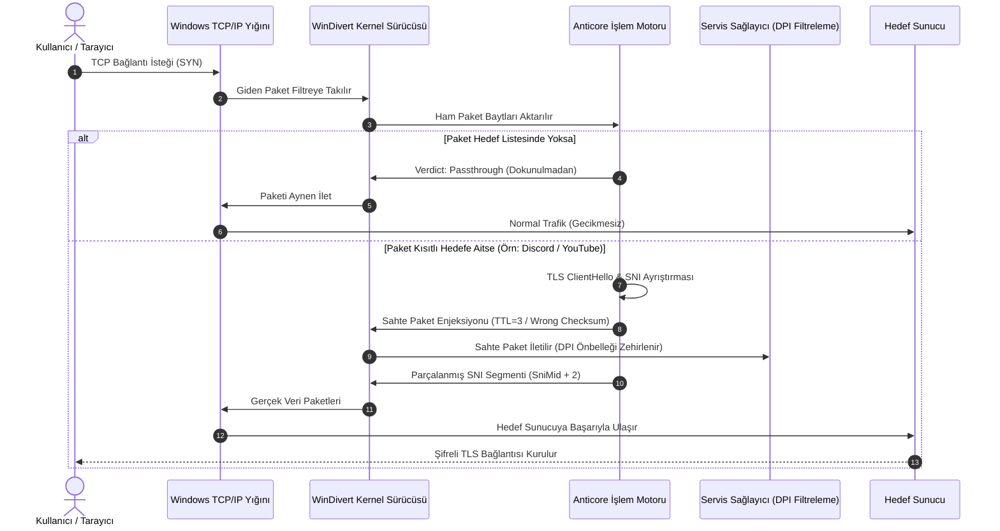

# Mimari Şema: Paket Yakalama ve Dağıtım Akışı

Aşağıdaki diyagram, ağ paketlerinin kernel seviyesinden uygulamaya ve internete akışını göstermektedir.

```mermaid
sequenceDiagram
    autonumber
    actor User as Kullanıcı / Tarayıcı
    participant OS as Windows TCP/IP Yığını
    participant WD as WinDivert Kernel Sürücüsü
    participant Core as Anticore İşlem Motoru
    participant ISP as Servis Sağlayıcı (DPI Filtreleme)
    participant Dest as Hedef Sunucu

    User->>OS: TCP Bağlantı İsteği (SYN)
    OS->>WD: Giden Paket Filtreye Takılır
    WD->>Core: Ham Paket Baytları Aktarılır
    
    alt Paket Hedef Listesinde Yoksa
        Core->>WD: Verdict: Passthrough (Dokunulmadan)
        WD->>OS: Paketi Aynen İlet
        OS->>Dest: Normal Trafik (Gecikmesiz)
    else Paket Kısıtlı Hedefe Aitse (Örn: Discord / YouTube)
        Core->>Core: TLS ClientHello & SNI Ayrıştırması
        Core->>WD: Sahte Paket Enjeksiyonu (TTL=3 / Wrong Checksum)
        WD->>ISP: Sahte Paket İletilir (DPI Önbelleği Zehirlenir)
        Core->>WD: Parçalanmış SNI Segmenti (SniMid + 2)
        WD->>OS: Gerçek Veri Paketleri
        OS->>Dest: Hedef Sunucuya Başarıyla Ulaşır
        Dest-->>User: Şifreli TLS Bağlantısı Kurulur
    end
```
